Analyzing dyadic data using linear mixed-effects models
================
Ginette Lafit (<ginette.lafit@kuleuven.be>)
26 april, 2022

-   [1 Preliminaries](#1-preliminaries)
    -   [1.1 Preliminaries - Installing libraries used in this script
        (whenever is
        necessary).](#11-preliminaries---installing-libraries-used-in-this-script-whenever-is-necessary)
    -   [1.2 Preliminaries - Loading libraries used in this
        script.](#12-preliminaries---loading-libraries-used-in-this-script)
-   [2 Data preprocessing for single intensive longitudinal
    analyses](#2-data-preprocessing-for-single-intensive-longitudinal-analyses)
-   [3 Visulations and descriptive
    statistics](#3-visulations-and-descriptive-statistics)
-   [4 Data preprocessing for dyadic intensive longitudinal
    analyses](#4-data-preprocessing-for-dyadic-intensive-longitudinal-analyses)
-   [5 Create person-mean centered time-varying
    predictors](#5-create-person-mean-centered-time-varying-predictors)
-   [6 Estimate linear models for average of person-level data
    (cross-sectional
    data)](#6-estimate-linear-models-for-average-of-person-level-data-cross-sectional-data)
    -   [6.1 Estimate linear model for male
        partners](#61-estimate-linear-model-for-male-partners)
    -   [6.2 Estimate linear model for male partners with moderation
        effects](#62-estimate-linear-model-for-male-partners-with-moderation-effects)
    -   [6.3 Estimate APIM for distinguishable
        partners](#63-estimate-apim-for-distinguishable-partners)
    -   [6.4 Estimate APIM for indistinguishable
        partners](#64-estimate-apim-for-indistinguishable-partners)
    -   [6.5 Estimate APIM for distinguishable partners with moderation
        effects](#65-estimate-apim-for-distinguishable-partners-with-moderation-effects)
    -   [6.6 Estimate APIM for indistinguishable partners with
        moderation
        effects](#66-estimate-apim-for-indistinguishable-partners-with-moderation-effects)
-   [7 Estimate linear models for a single person (time series
    data)](#7-estimate-linear-models-for-a-single-person-time-series-data)
    -   [7.1 Linear model to estimate the effect of enacted response on
        happy](#71-linear-model-to-estimate-the-effect-of-enacted-response-on-happy)
    -   [7.2 Linear model to estimate the autoregressive effect of
        happiness](#72-linear-model-to-estimate-the-autoregressive-effect-of-happiness)
-   [8 Estimate linear mixed-effect models for single persons
    design](#8-estimate-linear-mixed-effect-models-for-single-persons-design)
    -   [8.1 Linear mixed-effects model to estimate the effect of
        enacted response on happy assuming Level 1 errors are
        independent](#81-linear-mixed-effects-model-to-estimate-the-effect-of-enacted-response-on-happy-assuming-level-1-errors-are-independent)
    -   [8.2 Linear mixed-effects model to estimate the effect of
        enacted response on happy assuming Level 1 errors follow an
        Autorregressive (AR(1))
        model](#82-linear-mixed-effects-model-to-estimate-the-effect-of-enacted-response-on-happy-assuming-level-1-errors-follow-an-autorregressive-ar1-model)
    -   [8.3 Linear mixed-effects model to estimate the effect of
        enacted response on happy assuming Level 1 errors are
        independent including moderation
        effects](#83-linear-mixed-effects-model-to-estimate-the-effect-of-enacted-response-on-happy-assuming-level-1-errors-are-independent-including-moderation-effects)
    -   [8.4 Linear mixed-effects model to estimate the autoregressive
        effect of
        happiness](#84-linear-mixed-effects-model-to-estimate-the-autoregressive-effect-of-happiness)
-   [9 Estimate longitudinal actor and partner interdependence model
    (L-APIM)](#9-estimate-longitudinal-actor-and-partner-interdependence-model-l-apim)
    -   [9.1 L-APIM for distinguishable
        partners](#91-l-apim-for-distinguishable-partners)
    -   [9.2 L-APIM for indistinguishable
        partners](#92-l-apim-for-indistinguishable-partners)
-   [10 Estimate L-APIM with moderation
    effects](#10-estimate-l-apim-with-moderation-effects)
    -   [10.1 L-APIM for indistinguishable dyads with moderation
        effects](#101-l-apim-for-indistinguishable-dyads-with-moderation-effects)
-   [11 Estimate vector autoregressive model (VAR(1)) for dyadic
    partners](#11-estimate-vector-autoregressive-model-var1-for-dyadic-partners)
    -   [11.1 VAR(1) for distinguishable
        dyads](#111-var1-for-distinguishable-dyads)
    -   [11.2 VAR(1) Model for indistinguishable
        dyads](#112-var1-model-for-indistinguishable-dyads)
    -   [11.3 VAR(1) for distinguishable dyads with moderation
        effects](#113-var1-for-distinguishable-dyads-with-moderation-effects)
    -   [11.4 VAR(1) Model for indistinguishable dyads with moderation
        effects](#114-var1-model-for-indistinguishable-dyads-with-moderation-effects)
-   [12 References](#12-references)

# 1 Preliminaries

## 1.1 Preliminaries - Installing libraries used in this script (whenever is necessary).

``` r
# This code chunk simply makes sure that all the 
# libraries used here are installed.
packages <- c("nlme", "tidyverse", "foreign", "data.table", "ggeffects", "psych", "sjPlot", "sjmisc", "sjlabelled")
if ( length(missing_pkgs <- setdiff(packages, 
  rownames(installed.packages()))) > 0) {
  message("Installing missing package(s): ", 
          paste(missing_pkgs, collapse = ", "))
  install.packages(missing_pkgs)
}
```

## 1.2 Preliminaries - Loading libraries used in this script.

``` r
library(nlme) # to estimate linear-mixed effect models
library(tidyverse) # reshaped data and variable transformation
```

    ## -- Attaching packages --------------------------------------- tidyverse 1.3.1 --

    ## v ggplot2 3.3.5     v purrr   0.3.4
    ## v tibble  3.1.6     v dplyr   1.0.8
    ## v tidyr   1.2.0     v stringr 1.4.0
    ## v readr   2.1.2     v forcats 0.5.1

    ## -- Conflicts ------------------------------------------ tidyverse_conflicts() --
    ## x dplyr::collapse() masks nlme::collapse()
    ## x dplyr::filter()   masks stats::filter()
    ## x dplyr::lag()      masks stats::lag()

``` r
library(foreign) # load .sav data set
library(data.table) # to create lagged outcome
```

    ## 
    ## Attaching package: 'data.table'

    ## The following objects are masked from 'package:dplyr':
    ## 
    ##     between, first, last

    ## The following object is masked from 'package:purrr':
    ## 
    ##     transpose

``` r
library(ggeffects) # to create plots for the estimated effects
library(psych) # to compute descriptive statistics & some psychometrics
```

    ## 
    ## Attaching package: 'psych'

    ## The following objects are masked from 'package:ggplot2':
    ## 
    ##     %+%, alpha

``` r
library(sjPlot) # to create html tables
```

    ## Registered S3 method overwritten by 'parameters':
    ##   method                         from      
    ##   format.parameters_distribution datawizard

``` r
library(sjmisc) # to create html tables
```

    ## 
    ## Attaching package: 'sjmisc'

    ## The following object is masked from 'package:purrr':
    ## 
    ##     is_empty

    ## The following object is masked from 'package:tidyr':
    ## 
    ##     replace_na

    ## The following object is masked from 'package:tibble':
    ## 
    ##     add_case

``` r
library(sjlabelled) # to create html tables
```

    ## 
    ## Attaching package: 'sjlabelled'

    ## The following object is masked from 'package:forcats':
    ## 
    ##     as_factor

    ## The following object is masked from 'package:dplyr':
    ## 
    ##     as_label

    ## The following object is masked from 'package:ggplot2':
    ## 
    ##     as_label

``` r
set.seed(1235) # Set a seed to reproduce analyses

# Get the session info (also for reproducibility)
sessionInfo()
```

    ## R version 4.1.2 (2021-11-01)
    ## Platform: x86_64-w64-mingw32/x64 (64-bit)
    ## Running under: Windows 10 x64 (build 19044)
    ## 
    ## Matrix products: default
    ## 
    ## locale:
    ## [1] LC_COLLATE=Dutch_Belgium.1252  LC_CTYPE=Dutch_Belgium.1252   
    ## [3] LC_MONETARY=Dutch_Belgium.1252 LC_NUMERIC=C                  
    ## [5] LC_TIME=Dutch_Belgium.1252    
    ## 
    ## attached base packages:
    ## [1] stats     graphics  grDevices utils     datasets  methods   base     
    ## 
    ## other attached packages:
    ##  [1] sjlabelled_1.1.8  sjmisc_2.8.9      sjPlot_2.8.10     psych_2.1.9      
    ##  [5] ggeffects_1.1.1   data.table_1.14.2 foreign_0.8-81    forcats_0.5.1    
    ##  [9] stringr_1.4.0     dplyr_1.0.8       purrr_0.3.4       readr_2.1.2      
    ## [13] tidyr_1.2.0       tibble_3.1.6      ggplot2_3.3.5     tidyverse_1.3.1  
    ## [17] nlme_3.1-155     
    ## 
    ## loaded via a namespace (and not attached):
    ##  [1] fs_1.5.2           lubridate_1.8.0    insight_0.17.0     httr_1.4.2        
    ##  [5] tools_4.1.2        backports_1.4.1    utf8_1.2.2         R6_2.5.1          
    ##  [9] DBI_1.1.2          colorspace_2.0-3   withr_2.5.0        tidyselect_1.1.2  
    ## [13] mnormt_2.0.2       emmeans_1.7.3      compiler_4.1.2     performance_0.9.0 
    ## [17] cli_3.2.0          rvest_1.0.2        xml2_1.3.3         sandwich_3.0-1    
    ## [21] bayestestR_0.11.5  scales_1.1.1       mvtnorm_1.1-3      digest_0.6.29     
    ## [25] minqa_1.2.4        rmarkdown_2.12     pkgconfig_2.0.3    htmltools_0.5.2   
    ## [29] lme4_1.1-28        dbplyr_2.1.1       fastmap_1.1.0      rlang_1.0.1       
    ## [33] readxl_1.3.1       rstudioapi_0.13    generics_0.1.2     zoo_1.8-9         
    ## [37] jsonlite_1.8.0     magrittr_2.0.2     parameters_0.17.0  Matrix_1.3-4      
    ## [41] Rcpp_1.0.8         munsell_0.5.0      fansi_1.0.2        lifecycle_1.0.1   
    ## [45] stringi_1.7.6      multcomp_1.4-18    yaml_2.3.5         MASS_7.3-54       
    ## [49] grid_4.1.2         parallel_4.1.2     crayon_1.5.0       lattice_0.20-45   
    ## [53] haven_2.4.3        splines_4.1.2      sjstats_0.18.1     hms_1.1.1         
    ## [57] tmvnsim_1.0-2      knitr_1.37         pillar_1.7.0       boot_1.3-28       
    ## [61] estimability_1.3   effectsize_0.6.0.1 codetools_0.2-18   reprex_2.0.1      
    ## [65] glue_1.6.2         evaluate_0.15      modelr_0.1.8       nloptr_2.0.0      
    ## [69] vctrs_0.3.8        tzdb_0.2.0         cellranger_1.1.0   gtable_0.3.0      
    ## [73] assertthat_0.2.1   datawizard_0.4.0   xfun_0.30          xtable_1.8-4      
    ## [77] broom_0.7.12       coda_0.19-4        survival_3.2-13    TH.data_1.1-0     
    ## [81] ellipsis_0.3.2

# 2 Data preprocessing for single intensive longitudinal analyses

We use the data from The Dyadic Interaction Study used in Sels,
Ceulemans, and Kuppens (2019). The Dyadic Interaction Study includes 101
couples that self-identified as heterosexual which were in a
relationship for at least 2 months and of which both partners were over
the age of 18. Participants were recruited in the context of a larger
study on emotion dynamics in intimate relationships, from which only the
ESM part is relevant to this study. Participants were on average 26
years old (SD = 5 years, Min = 18, Max = 53), and had been in a
relationship for 4.5 years (SD = 2.8, min = 7 months, max = 21 years).
The majority of these couples were living together (n = 96) and did not
have children yet (n = 5). The nationality of most participants was
Belgian (n = 187). The other participants had a Dutch (n = 9), German (n
= 3), Armenian (n = 1), Chinese (n = 1), or Ukrainian nationality (n =
1). Among half of the participants (n = 102) had a University degree,
one-fourth had completed higher education (n = 43), and the remainder
had a primary school (n = 1) or secondary school education level (n =
56). Participants were recruited through social media platforms, and
flyers and posters that were distributed in public places in Leuven,
Belgium. The study was approved by the ethics committee of the Faculty
of Psychology and Educational Sciences of the KU Leuven.

During the ESM period of 7 days, each partner reported on their feelings
and other experiences several times a day. Specifically, partners
reported whether they were together at a given moment (resulting in a
dyad level Presence of the Partner variable when one of the partners
said yes), how happy they were, and how much they had tried to make
their partner feel understood and appreciated (i.e., enacted
responsiveness). While the first item was dichotomous (0 = no, 1 = yes),
the other items were answered by a sliding scale ranging from ‘not at
all’ (0) to ‘very much’ (100). Both partners were considered together
when one of the partners said so. Partners were prompted simultaneously,
but the items were ordered randomly to avoid cooperation. During
weekdays, partners were prompted 6 times a day, from 5 PM until 10 PM.
On weekend days, partners were assessed 14 times a day, from 10 AM until
10 PM. These time spans were selected because partners were more likely
to be together during these hours. Each time span was divided into equal
intervals, and each signal was programmed randomly in each interval.
Participants received a minimum of 47 and a maximum of 72 beeps.
Participants for which data were missing due to practical and technical
issues were excluded. The final sample includes 94 heterosexual couples.

We first load the data set including the baseline questionnaire.

``` r
# Load in background (or baseline) questionnaires
data.baseline = read.csv("background.csv", header = TRUE, sep = ';', dec = ".", stringsAsFactors = FALSE)

# Re-name dyad identification number
names(data.baseline)[names(data.baseline) == "ï..couple"] = "couple"

# Create variable Couple Satisfaction
data.baseline$couple_satisf = rowMeans(data.baseline[,c("PRQCI_satisfaction1","PRQCI_satisfaction2","PRQCI_satisfaction3" )], na.rm = TRUE)

# Change the level of the variable sex (F = vrouw, M = man)
data.baseline$sex = ifelse(data.baseline$sex == "vrouw", "F", "M")

# Find the dimensions
dim(data.baseline)
```

    ## [1] 202 180

``` r
# Find the structure
str(data.baseline)
```

    ## 'data.frame':    202 obs. of  180 variables:
    ##  $ couple                           : int  1 1 2 2 3 3 4 4 5 5 ...
    ##  $ starttijd                        : chr  "3/1/2016" "2/29/2016" "3/2/2016" "3/3/2016" ...
    ##  $ informed_consent                 : chr  "akkoord" "akkoord" "akkoord" "akkoord" ...
    ##  $ sex                              : chr  "M" "F" "M" "F" ...
    ##  $ age                              : int  24 24 20 20 20 19 20 20 22 22 ...
    ##  $ nationality                      : chr  "Belg" "belg" "belg" "Belg" ...
    ##  $ education                        : chr  "universitair onderwijs" "middelbaar" "middelbaar" "universitair onderwijs" ...
    ##  $ profession                       : chr  "Werkzoekend" "student" "student" "Student" ...
    ##  $ breaks                           : chr  "nee" "nee" "nee" "nee" ...
    ##  $ children                         : chr  "nee" "nee" "nee" "nee" ...
    ##  $ total_children                   : int  NA NA NA NA NA NA NA NA NA NA ...
    ##  $ status_rel                       : chr  "niet-samenwonend" "niet-samenwonend" "niet-samenwonend" "niet-samenwonend" ...
    ##  $ hours_together                   : int  16 24 20 10 20 35 56 35 40 28 ...
    ##  $ sit                              : chr  "ja" "nee" "nee" "ja" ...
    ##  $ cont_sit                         : chr  "relatieproblemen" " " " " "ziekte/overlijden van iemand in naaste omgeving" ...
    ##  $ sev_sit                          : int  4 NA NA 7 9 7 NA NA 8 NA ...
    ##  $ PRQCI_satisfaction1              : int  5 5 6 6 5 4 5 6 5 6 ...
    ##  $ PRQCI_satisfaction2              : int  5 5 6 6 6 5 5 7 6 6 ...
    ##  $ PRQCI_satisfaction3              : int  5 5 6 6 6 6 5 6 6 7 ...
    ##  $ PRQCI_commitment1                : int  5 6 7 7 6 7 4 7 6 7 ...
    ##  $ PRQCI_commitment2                : int  4 6 5 6 5 6 5 7 6 7 ...
    ##  $ PRQCI_commitment3                : int  4 4 5 7 6 7 5 6 6 7 ...
    ##  $ PRQCI_intimacy1                  : int  5 5 6 6 6 6 4 7 6 7 ...
    ##  $ PRQCI_intimacy2                  : int  5 6 6 6 6 6 6 7 6 7 ...
    ##  $ PRQCI_intimacy3                  : int  5 6 7 6 6 4 5 7 5 7 ...
    ##  $ PRQCI_trust1                     : int  7 6 7 7 6 6 7 7 7 6 ...
    ##  $ PRQCI_trust2                     : int  5 7 7 6 4 5 7 7 6 7 ...
    ##  $ PRQCI_trust3                     : int  7 6 7 7 7 6 7 7 7 6 ...
    ##  $ PRQCI_passion1                   : int  5 5 5 5 3 3 4 5 5 5 ...
    ##  $ PRQCI_passion2                   : int  4 5 6 6 2 3 4 5 5 6 ...
    ##  $ PRQCI_passion3                   : int  4 6 6 6 2 4 5 5 5 5 ...
    ##  $ PRQCI_love1                      : int  5 5 7 7 6 7 6 7 7 7 ...
    ##  $ PRQCI_love2                      : int  5 6 6 7 6 5 5 7 7 7 ...
    ##  $ PRQCI_love3                      : int  5 5 6 6 5 7 6 7 6 7 ...
    ##  $ KMS_1                            : int  6 5 6 6 6 5 5 6 6 6 ...
    ##  $ KMS_2                            : int  6 6 6 7 5 6 5 7 6 6 ...
    ##  $ KMS_3                            : int  6 6 6 6 6 5 5 6 6 7 ...
    ##  $ rel_interdependence              : int  4 6 6 5 5 6 6 7 4 5 ...
    ##  $ com1                             : int  7 6 7 8 8 7 8 9 8 9 ...
    ##  $ com2                             : int  7 6 9 6 8 9 7 9 8 9 ...
    ##  $ com3_R                           : int  4 4 1 8 2 1 4 1 2 2 ...
    ##  $ com4_R                           : int  2 3 2 2 6 9 1 1 2 2 ...
    ##  $ com5                             : int  6 6 8 8 7 8 6 9 7 8 ...
    ##  $ com6                             : int  7 5 5 7 7 5 7 9 7 8 ...
    ##  $ com7                             : int  6 7 7 7 7 7 7 9 5 8 ...
    ##  $ ICQ_NA1                          : int  2 4 4 4 3 3 3 3 3 4 ...
    ##  $ ICQ_NA2                          : int  3 4 3 4 2 4 2 3 3 3 ...
    ##  $ ICQ_NA3                          : int  3 4 3 4 3 4 2 2 3 4 ...
    ##  $ ICQ_ES1                          : int  2 3 4 4 3 3 2 3 3 3 ...
    ##  $ ICQ_ES2                          : int  2 3 3 4 3 2 3 2 4 3 ...
    ##  $ ICQ_ES3                          : int  3 3 4 3 3 3 2 3 3 3 ...
    ##  $ ICQ_D1                           : int  3 4 4 4 4 4 2 3 3 4 ...
    ##  $ ICQ_D2                           : int  3 4 4 4 4 3 1 3 3 4 ...
    ##  $ ICQ_D3                           : int  4 4 4 3 2 3 2 3 3 4 ...
    ##  $ ICQ_CM1                          : int  2 2 3 2 2 3 4 1 2 2 ...
    ##  $ ICQ_CM2                          : int  2 3 3 3 4 4 3 2 2 3 ...
    ##  $ ICQ_CM3                          : int  2 3 1 1 4 1 4 1 3 2 ...
    ##  $ attachavoid1_R                   : int  5 6 7 7 5 5 5 6 5 7 ...
    ##  $ attachanx1                       : int  2 5 6 5 3 7 2 4 2 5 ...
    ##  $ attachavoid2                     : int  1 5 1 2 4 6 1 4 2 2 ...
    ##  $ attachanx2                       : int  3 2 1 4 1 7 6 5 1 2 ...
    ##  $ attachavoid3_R                   : int  5 7 7 6 6 7 4 6 5 6 ...
    ##  $ attachanx3                       : int  3 3 1 3 4 7 1 4 1 3 ...
    ##  $ attachavoid4                     : int  2 5 2 5 5 6 5 5 4 1 ...
    ##  $ attachanx4_R                     : int  2 4 6 5 6 1 5 3 7 2 ...
    ##  $ attachavoid5_R                   : int  5 7 6 7 5 7 4 6 5 7 ...
    ##  $ attachanx5                       : int  2 7 3 5 3 6 1 7 2 6 ...
    ##  $ attachavoid6                     : int  5 6 3 2 2 7 3 4 4 2 ...
    ##  $ attachanx6                       : int  2 3 1 5 1 7 2 2 2 2 ...
    ##  $ CESD1                            : chr  "zelden of nooit (minder dan 1 dag)" "zelden of nooit (minder dan 1 dag)" "zelden of nooit (minder dan 1 dag)" "zelden of nooit (minder dan 1 dag)" ...
    ##  $ CESD2                            : chr  "zelden of nooit (minder dan 1 dag)" "zelden of nooit (minder dan 1 dag)" "zelden of nooit (minder dan 1 dag)" "zelden of nooit (minder dan 1 dag)" ...
    ##  $ CESD3                            : chr  "zelden of nooit (minder dan 1 dag)" "zelden of nooit (minder dan 1 dag)" "zelden of nooit (minder dan 1 dag)" "zelden of nooit (minder dan 1 dag)" ...
    ##  $ CESD4_R                          : chr  "meestal of altijd (5 tot 7 dagen)" "meestal of altijd (5 tot 7 dagen)" "meestal of altijd (5 tot 7 dagen)" "regelmatig (3 tot 4 dagen)" ...
    ##  $ CESD5                            : chr  "zelden of nooit (minder dan 1 dag)" "soms of weinig (1 tot 2 dagen)" "zelden of nooit (minder dan 1 dag)" "regelmatig (3 tot 4 dagen)" ...
    ##  $ CESD6                            : chr  "zelden of nooit (minder dan 1 dag)" "zelden of nooit (minder dan 1 dag)" "zelden of nooit (minder dan 1 dag)" "zelden of nooit (minder dan 1 dag)" ...
    ##  $ CESD7                            : chr  "zelden of nooit (minder dan 1 dag)" "zelden of nooit (minder dan 1 dag)" "zelden of nooit (minder dan 1 dag)" "zelden of nooit (minder dan 1 dag)" ...
    ##  $ CESD8_R                          : chr  "regelmatig (3 tot 4 dagen)" "regelmatig (3 tot 4 dagen)" "meestal of altijd (5 tot 7 dagen)" "meestal of altijd (5 tot 7 dagen)" ...
    ##  $ CESD9                            : chr  "zelden of nooit (minder dan 1 dag)" "zelden of nooit (minder dan 1 dag)" "zelden of nooit (minder dan 1 dag)" "zelden of nooit (minder dan 1 dag)" ...
    ##  $ CESD10                           : chr  "zelden of nooit (minder dan 1 dag)" "zelden of nooit (minder dan 1 dag)" "zelden of nooit (minder dan 1 dag)" "zelden of nooit (minder dan 1 dag)" ...
    ##  $ CESD11                           : chr  "zelden of nooit (minder dan 1 dag)" "zelden of nooit (minder dan 1 dag)" "zelden of nooit (minder dan 1 dag)" "zelden of nooit (minder dan 1 dag)" ...
    ##  $ CESD12_R                         : chr  "regelmatig (3 tot 4 dagen)" "meestal of altijd (5 tot 7 dagen)" "meestal of altijd (5 tot 7 dagen)" "meestal of altijd (5 tot 7 dagen)" ...
    ##  $ CESD13                           : chr  "soms of weinig (1 tot 2 dagen)" "zelden of nooit (minder dan 1 dag)" "zelden of nooit (minder dan 1 dag)" "soms of weinig (1 tot 2 dagen)" ...
    ##  $ CESD14                           : chr  "zelden of nooit (minder dan 1 dag)" "zelden of nooit (minder dan 1 dag)" "zelden of nooit (minder dan 1 dag)" "zelden of nooit (minder dan 1 dag)" ...
    ##  $ CESD15                           : chr  "zelden of nooit (minder dan 1 dag)" "zelden of nooit (minder dan 1 dag)" "zelden of nooit (minder dan 1 dag)" "zelden of nooit (minder dan 1 dag)" ...
    ##  $ CESD16_R                         : chr  "regelmatig (3 tot 4 dagen)" "regelmatig (3 tot 4 dagen)" "meestal of altijd (5 tot 7 dagen)" "meestal of altijd (5 tot 7 dagen)" ...
    ##  $ CESD17                           : chr  "zelden of nooit (minder dan 1 dag)" "zelden of nooit (minder dan 1 dag)" "zelden of nooit (minder dan 1 dag)" "zelden of nooit (minder dan 1 dag)" ...
    ##  $ CESD18                           : chr  "zelden of nooit (minder dan 1 dag)" "zelden of nooit (minder dan 1 dag)" "zelden of nooit (minder dan 1 dag)" "soms of weinig (1 tot 2 dagen)" ...
    ##  $ CESD19                           : chr  "zelden of nooit (minder dan 1 dag)" "zelden of nooit (minder dan 1 dag)" "zelden of nooit (minder dan 1 dag)" "zelden of nooit (minder dan 1 dag)" ...
    ##  $ CESD20                           : chr  "zelden of nooit (minder dan 1 dag)" "soms of weinig (1 tot 2 dagen)" "zelden of nooit (minder dan 1 dag)" "soms of weinig (1 tot 2 dagen)" ...
    ##  $ EC1                              : int  2 3 3 4 3 3 2 3 2 3 ...
    ##  $ EC2_R                            : int  1 0 0 0 3 1 1 0 1 1 ...
    ##  $ EC3                              : int  2 4 4 4 3 4 3 4 3 4 ...
    ##  $ EC4_R                            : int  2 1 1 1 1 1 1 1 1 1 ...
    ##  $ EC5_R                            : int  1 1 0 0 3 0 1 1 1 0 ...
    ##  $ EC6                              : int  1 2 2 1 3 4 1 2 2 3 ...
    ##  $ EC7                              : int  2 2 2 3 2 2 3 3 3 3 ...
    ##  $ PT1                              : int  2 3 3 2 2 3 3 2 1 3 ...
    ##  $ PT2                              : int  2 2 3 3 3 4 3 3 2 3 ...
    ##  $ PT3_R                            : int  3 1 1 3 1 1 1 1 4 1 ...
    ##   [list output truncated]

``` r
# See the first 6 rows
head(data.baseline)
```

    ##   couple starttijd informed_consent sex age nationality              education
    ## 1      1  3/1/2016          akkoord   M  24        Belg universitair onderwijs
    ## 2      1 2/29/2016          akkoord   F  24        belg             middelbaar
    ## 3      2  3/2/2016          akkoord   M  20        belg             middelbaar
    ## 4      2  3/3/2016          akkoord   F  20        Belg universitair onderwijs
    ## 5      3  3/5/2016          akkoord   M  20        Belg             middelbaar
    ## 6      3  3/5/2016          akkoord   F  19        Belg             middelbaar
    ##    profession breaks children total_children       status_rel hours_together
    ## 1 Werkzoekend    nee      nee             NA niet-samenwonend             16
    ## 2     student    nee      nee             NA niet-samenwonend             24
    ## 3     student    nee      nee             NA niet-samenwonend             20
    ## 4     Student    nee      nee             NA niet-samenwonend             10
    ## 5     Student    nee      nee             NA niet-samenwonend             20
    ## 6     Student    nee      nee             NA niet-samenwonend             35
    ##   sit
    ## 1  ja
    ## 2 nee
    ## 3 nee
    ## 4  ja
    ## 5  ja
    ## 6  ja
    ##                                                                              cont_sit
    ## 1                                                                    relatieproblemen
    ## 2                                                                                    
    ## 3                                                                                    
    ## 4                                     ziekte/overlijden van iemand in naaste omgeving
    ## 5 niet nagekomen belofte:ziekte/ongeval van 1 van de partners:relatieproblemen:andere
    ## 6                                                                   samenwonen:andere
    ##   sev_sit PRQCI_satisfaction1 PRQCI_satisfaction2 PRQCI_satisfaction3
    ## 1       4                   5                   5                   5
    ## 2      NA                   5                   5                   5
    ## 3      NA                   6                   6                   6
    ## 4       7                   6                   6                   6
    ## 5       9                   5                   6                   6
    ## 6       7                   4                   5                   6
    ##   PRQCI_commitment1 PRQCI_commitment2 PRQCI_commitment3 PRQCI_intimacy1
    ## 1                 5                 4                 4               5
    ## 2                 6                 6                 4               5
    ## 3                 7                 5                 5               6
    ## 4                 7                 6                 7               6
    ## 5                 6                 5                 6               6
    ## 6                 7                 6                 7               6
    ##   PRQCI_intimacy2 PRQCI_intimacy3 PRQCI_trust1 PRQCI_trust2 PRQCI_trust3
    ## 1               5               5            7            5            7
    ## 2               6               6            6            7            6
    ## 3               6               7            7            7            7
    ## 4               6               6            7            6            7
    ## 5               6               6            6            4            7
    ## 6               6               4            6            5            6
    ##   PRQCI_passion1 PRQCI_passion2 PRQCI_passion3 PRQCI_love1 PRQCI_love2
    ## 1              5              4              4           5           5
    ## 2              5              5              6           5           6
    ## 3              5              6              6           7           6
    ## 4              5              6              6           7           7
    ## 5              3              2              2           6           6
    ## 6              3              3              4           7           5
    ##   PRQCI_love3 KMS_1 KMS_2 KMS_3 rel_interdependence com1 com2 com3_R com4_R
    ## 1           5     6     6     6                   4    7    7      4      2
    ## 2           5     5     6     6                   6    6    6      4      3
    ## 3           6     6     6     6                   6    7    9      1      2
    ## 4           6     6     7     6                   5    8    6      8      2
    ## 5           5     6     5     6                   5    8    8      2      6
    ## 6           7     5     6     5                   6    7    9      1      9
    ##   com5 com6 com7 ICQ_NA1 ICQ_NA2 ICQ_NA3 ICQ_ES1 ICQ_ES2 ICQ_ES3 ICQ_D1 ICQ_D2
    ## 1    6    7    6       2       3       3       2       2       3      3      3
    ## 2    6    5    7       4       4       4       3       3       3      4      4
    ## 3    8    5    7       4       3       3       4       3       4      4      4
    ## 4    8    7    7       4       4       4       4       4       3      4      4
    ## 5    7    7    7       3       2       3       3       3       3      4      4
    ## 6    8    5    7       3       4       4       3       2       3      4      3
    ##   ICQ_D3 ICQ_CM1 ICQ_CM2 ICQ_CM3 attachavoid1_R attachanx1 attachavoid2
    ## 1      4       2       2       2              5          2            1
    ## 2      4       2       3       3              6          5            5
    ## 3      4       3       3       1              7          6            1
    ## 4      3       2       3       1              7          5            2
    ## 5      2       2       4       4              5          3            4
    ## 6      3       3       4       1              5          7            6
    ##   attachanx2 attachavoid3_R attachanx3 attachavoid4 attachanx4_R attachavoid5_R
    ## 1          3              5          3            2            2              5
    ## 2          2              7          3            5            4              7
    ## 3          1              7          1            2            6              6
    ## 4          4              6          3            5            5              7
    ## 5          1              6          4            5            6              5
    ## 6          7              7          7            6            1              7
    ##   attachanx5 attachavoid6 attachanx6                              CESD1
    ## 1          2            5          2 zelden of nooit (minder dan 1 dag)
    ## 2          7            6          3 zelden of nooit (minder dan 1 dag)
    ## 3          3            3          1 zelden of nooit (minder dan 1 dag)
    ## 4          5            2          5 zelden of nooit (minder dan 1 dag)
    ## 5          3            2          1     soms of weinig (1 tot 2 dagen)
    ## 6          6            7          7     soms of weinig (1 tot 2 dagen)
    ##                                CESD2                              CESD3
    ## 1 zelden of nooit (minder dan 1 dag) zelden of nooit (minder dan 1 dag)
    ## 2 zelden of nooit (minder dan 1 dag) zelden of nooit (minder dan 1 dag)
    ## 3 zelden of nooit (minder dan 1 dag) zelden of nooit (minder dan 1 dag)
    ## 4 zelden of nooit (minder dan 1 dag) zelden of nooit (minder dan 1 dag)
    ## 5 zelden of nooit (minder dan 1 dag) zelden of nooit (minder dan 1 dag)
    ## 6 zelden of nooit (minder dan 1 dag) zelden of nooit (minder dan 1 dag)
    ##                             CESD4_R                              CESD5
    ## 1 meestal of altijd (5 tot 7 dagen) zelden of nooit (minder dan 1 dag)
    ## 2 meestal of altijd (5 tot 7 dagen)     soms of weinig (1 tot 2 dagen)
    ## 3 meestal of altijd (5 tot 7 dagen) zelden of nooit (minder dan 1 dag)
    ## 4        regelmatig (3 tot 4 dagen)         regelmatig (3 tot 4 dagen)
    ## 5 meestal of altijd (5 tot 7 dagen)     soms of weinig (1 tot 2 dagen)
    ## 6        regelmatig (3 tot 4 dagen)     soms of weinig (1 tot 2 dagen)
    ##                                CESD6                              CESD7
    ## 1 zelden of nooit (minder dan 1 dag) zelden of nooit (minder dan 1 dag)
    ## 2 zelden of nooit (minder dan 1 dag) zelden of nooit (minder dan 1 dag)
    ## 3 zelden of nooit (minder dan 1 dag) zelden of nooit (minder dan 1 dag)
    ## 4 zelden of nooit (minder dan 1 dag) zelden of nooit (minder dan 1 dag)
    ## 5 zelden of nooit (minder dan 1 dag) zelden of nooit (minder dan 1 dag)
    ## 6         regelmatig (3 tot 4 dagen)     soms of weinig (1 tot 2 dagen)
    ##                             CESD8_R                              CESD9
    ## 1        regelmatig (3 tot 4 dagen) zelden of nooit (minder dan 1 dag)
    ## 2        regelmatig (3 tot 4 dagen) zelden of nooit (minder dan 1 dag)
    ## 3 meestal of altijd (5 tot 7 dagen) zelden of nooit (minder dan 1 dag)
    ## 4 meestal of altijd (5 tot 7 dagen) zelden of nooit (minder dan 1 dag)
    ## 5        regelmatig (3 tot 4 dagen) zelden of nooit (minder dan 1 dag)
    ## 6        regelmatig (3 tot 4 dagen) zelden of nooit (minder dan 1 dag)
    ##                               CESD10                             CESD11
    ## 1 zelden of nooit (minder dan 1 dag) zelden of nooit (minder dan 1 dag)
    ## 2 zelden of nooit (minder dan 1 dag) zelden of nooit (minder dan 1 dag)
    ## 3 zelden of nooit (minder dan 1 dag) zelden of nooit (minder dan 1 dag)
    ## 4 zelden of nooit (minder dan 1 dag) zelden of nooit (minder dan 1 dag)
    ## 5 zelden of nooit (minder dan 1 dag)     soms of weinig (1 tot 2 dagen)
    ## 6     soms of weinig (1 tot 2 dagen) zelden of nooit (minder dan 1 dag)
    ##                            CESD12_R                             CESD13
    ## 1        regelmatig (3 tot 4 dagen)     soms of weinig (1 tot 2 dagen)
    ## 2 meestal of altijd (5 tot 7 dagen) zelden of nooit (minder dan 1 dag)
    ## 3 meestal of altijd (5 tot 7 dagen) zelden of nooit (minder dan 1 dag)
    ## 4 meestal of altijd (5 tot 7 dagen)     soms of weinig (1 tot 2 dagen)
    ## 5 meestal of altijd (5 tot 7 dagen) zelden of nooit (minder dan 1 dag)
    ## 6    soms of weinig (1 tot 2 dagen)     soms of weinig (1 tot 2 dagen)
    ##                               CESD14                             CESD15
    ## 1 zelden of nooit (minder dan 1 dag) zelden of nooit (minder dan 1 dag)
    ## 2 zelden of nooit (minder dan 1 dag) zelden of nooit (minder dan 1 dag)
    ## 3 zelden of nooit (minder dan 1 dag) zelden of nooit (minder dan 1 dag)
    ## 4 zelden of nooit (minder dan 1 dag) zelden of nooit (minder dan 1 dag)
    ## 5 zelden of nooit (minder dan 1 dag) zelden of nooit (minder dan 1 dag)
    ## 6 zelden of nooit (minder dan 1 dag) zelden of nooit (minder dan 1 dag)
    ##                            CESD16_R                             CESD17
    ## 1        regelmatig (3 tot 4 dagen) zelden of nooit (minder dan 1 dag)
    ## 2        regelmatig (3 tot 4 dagen) zelden of nooit (minder dan 1 dag)
    ## 3 meestal of altijd (5 tot 7 dagen) zelden of nooit (minder dan 1 dag)
    ## 4 meestal of altijd (5 tot 7 dagen) zelden of nooit (minder dan 1 dag)
    ## 5 meestal of altijd (5 tot 7 dagen) zelden of nooit (minder dan 1 dag)
    ## 6    soms of weinig (1 tot 2 dagen)     soms of weinig (1 tot 2 dagen)
    ##                               CESD18                             CESD19
    ## 1 zelden of nooit (minder dan 1 dag) zelden of nooit (minder dan 1 dag)
    ## 2 zelden of nooit (minder dan 1 dag) zelden of nooit (minder dan 1 dag)
    ## 3 zelden of nooit (minder dan 1 dag) zelden of nooit (minder dan 1 dag)
    ## 4     soms of weinig (1 tot 2 dagen) zelden of nooit (minder dan 1 dag)
    ## 5 zelden of nooit (minder dan 1 dag) zelden of nooit (minder dan 1 dag)
    ## 6     soms of weinig (1 tot 2 dagen) zelden of nooit (minder dan 1 dag)
    ##                               CESD20 EC1 EC2_R EC3 EC4_R EC5_R EC6 EC7 PT1 PT2
    ## 1 zelden of nooit (minder dan 1 dag)   2     1   2     2     1   1   2   2   2
    ## 2     soms of weinig (1 tot 2 dagen)   3     0   4     1     1   2   2   3   2
    ## 3 zelden of nooit (minder dan 1 dag)   3     0   4     1     0   2   2   3   3
    ## 4     soms of weinig (1 tot 2 dagen)   4     0   4     1     0   1   3   2   3
    ## 5 zelden of nooit (minder dan 1 dag)   3     3   3     1     3   3   2   2   3
    ## 6         regelmatig (3 tot 4 dagen)   3     1   4     1     0   4   2   3   4
    ##   PT3_R PT4 PT5 PT6 SWL1 SWL2 SWL3 SWL4 SWL5 dci7_NC dci10_NC dci11_NC dci15_NC
    ## 1     3   2   1   2    7    6    6    7    6       2        2        3        3
    ## 2     1   2   1   1    5    5    6    5    5       2        3        3        2
    ## 3     1   2   1   3    6    7    7    5    6       1        1        1        1
    ## 4     3   2   1   2    4    6    6    5    5       3        2        2        2
    ## 5     1   4   3   1    5    7    6    6    4       1        1        1        4
    ## 6     1   3   2   0    3    2    4    2    2       3        4        5        4
    ##   dci22_NC dci25_NC dci26_NC dci27_NC RS1 RS1_w RS1_e RS2 RS2_w RS2_e RS3 RS3_w
    ## 1        2        2        3        2   1     3     5   1     2     5   1     2
    ## 2        1        1        2        2   1     3     5   1     4     4   1     2
    ## 3        1        2        1        1   1     4     3   1     4     5   1     2
    ## 4        1        2        1        2   1     2     5   1     4     4   1     1
    ## 5        1        1        3        3   1     3     4   1     2     5   1     1
    ## 6        1        1        3        2   1     2     6   1     5     5   1     1
    ##   RS3_e RJS4 RS4_w RS4_e RS5 RS5_w RS5_e RS6 RS6_w RS6_e RS7 RS7_w RS7_e RS8
    ## 1     6    1     2     4   1     3     4   1     4     4   1     2     5   1
    ## 2     5    1     3     5   1     3     4   1     1     6   1     2     5   1
    ## 3     6    1     2     6   1     2     6   1     1     6   1     2     4   1
    ## 4     6    1     2     5   1     1     5   1     1     6   1     2     5   1
    ## 5     5    1     3     4   1     2     5   1     1     5   1     2     4   1
    ## 6     6    1     6     4   1     6     2   1     4     5   1     6     2   1
    ##   RS8_w RS8_e RS9 RS9_w RS9_e clarity_5_R clarity_6 clarity_11_R clarity_13_R
    ## 1     2     4   1     2     5           3         3            3            1
    ## 2     4     4   1     1     5           4         2            3            4
    ## 3     4     4   1     1     6           1         4            1            3
    ## 4     5     5   1     1     6           4         3            2            3
    ## 5     2     4   1     1     5           4         4            2            3
    ## 6     6     3   1     5     2           5         1            4            5
    ##   clarity_14 clarity_15 clarity_19 clarity_21_R clarity_25 clarity_28
    ## 1          3          3          4            3          3          3
    ## 2          5          4          2            3          2          4
    ## 3          3          2          5            1          3          4
    ## 4          4          2          3            2          4          4
    ## 5          4          2          4            3          4          4
    ## 6          2          5          1            5          1          2
    ##   clarity_30 expressive1 expressive2_R expressive3 maudsley_1 maudsley_2
    ## 1          3           3             4           3         NA         NA
    ## 2          3           5             2           4         NA         NA
    ## 3          4           4             2           5         NA         NA
    ## 4          4           4             2           4         NA         NA
    ## 5          3           4             3           4         NA         NA
    ## 6          1           4             2           3         NA         NA
    ##   maudsley_3 maudsley_4 maudsley_5 aspectenonderzoek begeleidingvan
    ## 1         NA         NA         NA          volledig          Laura
    ## 2         NA         NA         NA          volledig          Laura
    ## 3         NA         NA         NA         labsessie          Laura
    ## 4         NA         NA         NA         labsessie          Laura
    ## 5         NA         NA         NA         labsessie          Laura
    ## 6         NA         NA         NA         labsessie          Laura
    ##                                                                                                                                                                                                                                Opmerkingenoververloop
    ## 1                                                                      Pilotering- BIJ koppel klopt vraag "geef aan hoe je jezelf voelt mbt je partner" na negatieve conversatie & positieve conversatie niet , hebben nog lange vragenlijst gekregen
    ## 2                                                                      Pilotering- BIJ koppel klopt vraag "geef aan hoe je jezelf voelt mbt je partner" na negatieve conversatie & positieve conversatie niet , hebben nog lange vragenlijst gekregen
    ## 3                                                                       Pilotering-BIJ koppel klopt vraag "geef aan hoe je jezelf voelt mbt je partner" na negatieve conversatie & positieve conversatie niet , hebben nog lange vragenlijst gekregen
    ## 4                                                                       Pilotering-BIJ koppel klopt vraag "geef aan hoe je jezelf voelt mbt je partner" na negatieve conversatie & positieve conversatie niet , hebben nog lange vragenlijst gekregen
    ## 5 Pilotering-BIJ koppel klopt vraag "geef aan hoe je jezelf voelt mbt je partner" na negatieve conversatie & positieve conversatie niet , hebben nog lange vragenlijst gekregen, wonen eigenlijk gedurende de week samen, meisje gaat naar psycholoog
    ## 6 Pilotering-BIJ koppel klopt vraag "geef aan hoe je jezelf voelt mbt je partner" na negatieve conversatie & positieve conversatie niet , hebben nog lange vragenlijst gekregen, wonen eigenlijk gedurende de week samen, meisje gaat naar psycholoog
    ##   male female ppnr relationship_duration total_months_together
    ## 1    1      0  701               2:02:00                    26
    ## 2    0      1    1               2:02:00                    26
    ## 3    1      0  702               1:09:00                    21
    ## 4    0      1    2               1:09:00                    21
    ## 5    1      0  703               1:07:00                    19
    ## 6    0      1    3               1:07:00                    19
    ##   total_years_together partnumber call_status_rel Extra
    ## 1     2,16666666666667          1                      
    ## 2     2,16666666666667          2                      
    ## 3                 1,75          1                      
    ## 4                 1,75          2                      
    ## 5     1,58333333333333          1                      
    ## 6     1,58333333333333          2                      
    ##   aangeduidinachtergrondvragenlijst new_status_rel PRQCI_commitment com3 com4
    ## 1                                     niet-samenwo 4,33333333333333    6    8
    ## 2                                     niet-samenwo 5,33333333333333    6    7
    ## 3                                     niet-samenwo 5,66666666666667    9    8
    ## 4                                     niet-samenwo 6,66666666666667    2    8
    ## 5                                     niet-samenwo 5,66666666666667    8    4
    ## 6                                     niet-samenwo 6,66666666666667    9    1
    ##      RUScomm_total couple_satisf
    ## 1 6,71428571428571      5.000000
    ## 2 6,14285714285714      5.000000
    ## 3 7,57142857142857      6.000000
    ## 4 6,57142857142857      6.000000
    ## 5                7      5.666667
    ## 6 6,57142857142857      5.000000

``` r
# See the last 6 rows
tail(data.baseline)
```

    ##     couple starttijd informed_consent sex age nationality
    ## 197    115 8/10/2016          akkoord   M  25        Belg
    ## 198    115 8/31/2016          akkoord   F  26        Belg
    ## 199    116 8/31/2016          akkoord   M  36        Belg
    ## 200    116  8/8/2016          akkoord   F  33        Belg
    ## 201    117  8/9/2016          akkoord   M  30        belg
    ## 202    117 8/11/2016          akkoord   F  27        Belg
    ##                  education                  profession breaks children
    ## 197 universitair onderwijs                  Consultant    nee      nee
    ## 198 universitair onderwijs Leraar Nederlands-Frans-NT2    nee      nee
    ## 199 universitair onderwijs         Compliance Engineer    nee      nee
    ## 200        hoger onderwijs                        Geen    nee      nee
    ## 201 universitair onderwijs       assistent geneeskunde    nee      nee
    ## 202 universitair onderwijs                    Huisarts    nee      nee
    ##     total_children       status_rel hours_together sit
    ## 197             NA      samenwonend             40 nee
    ## 198             NA      samenwonend             49 nee
    ## 199             NA         getrouwd             70 nee
    ## 200             NA         getrouwd             70  ja
    ## 201             NA niet-samenwonend             35 nee
    ## 202             NA      samenwonend             30 nee
    ##                                                                                        cont_sit
    ## 197                                                                                            
    ## 198                                                                                            
    ## 199                                                                                            
    ## 200 verandering van werk van 1 van de partners:problemen met schoonouders:financiële problemen
    ## 201                                                                                            
    ## 202                                                                                            
    ##     sev_sit PRQCI_satisfaction1 PRQCI_satisfaction2 PRQCI_satisfaction3
    ## 197      NA                   6                   6                   7
    ## 198      NA                   5                   5                   6
    ## 199      NA                   7                   6                   7
    ## 200      10                   6                   6                   6
    ## 201      NA                   7                   6                   7
    ## 202      NA                   6                   6                   6
    ##     PRQCI_commitment1 PRQCI_commitment2 PRQCI_commitment3 PRQCI_intimacy1
    ## 197                 6                 6                 6               5
    ## 198                 6                 5                 4               5
    ## 199                 7                 7                 7               7
    ## 200                 7                 7                 7               7
    ## 201                 6                 6                 6               7
    ## 202                 6                 6                 6               6
    ##     PRQCI_intimacy2 PRQCI_intimacy3 PRQCI_trust1 PRQCI_trust2 PRQCI_trust3
    ## 197               6               6            7            7            7
    ## 198               6               6            7            7            7
    ## 199               7               7            7            7            7
    ## 200               7               7            7            6            7
    ## 201               6               6            7            7            7
    ## 202               6               6            7            6            7
    ##     PRQCI_passion1 PRQCI_passion2 PRQCI_passion3 PRQCI_love1 PRQCI_love2
    ## 197              4              4              4           7           6
    ## 198              4              5              4           5           5
    ## 199              4              5              2           7           7
    ## 200              4              5              5           7           7
    ## 201              6              6              6           7           6
    ## 202              6              6              6           6           6
    ##     PRQCI_love3 KMS_1 KMS_2 KMS_3 rel_interdependence com1 com2 com3_R com4_R
    ## 197           6     6     6     6                   7    8    8      2      1
    ## 198           7     6     6     6                   6    9    8      2      1
    ## 199           7     6     7     6                   7    9    9      1      1
    ## 200           7     6     6     6                   6    9    9      1      1
    ## 201           7     6     7     7                   6    9    9      1      2
    ## 202           6     6     6     6                   6    8    8      1      2
    ##     com5 com6 com7 ICQ_NA1 ICQ_NA2 ICQ_NA3 ICQ_ES1 ICQ_ES2 ICQ_ES3 ICQ_D1
    ## 197    8    8    8       2       2       3       3       3       4      4
    ## 198    7    8    8       3       3       3       2       3       2      4
    ## 199    9    9    9       1       1       1       4       4       4      4
    ## 200    9    9    9       3       3       3       4       4       4      4
    ## 201    8    7    8       1       3       2       3       3       3      4
    ## 202    8    8    8       3       3       3       3       3       3      4
    ##     ICQ_D2 ICQ_D3 ICQ_CM1 ICQ_CM2 ICQ_CM3 attachavoid1_R attachanx1
    ## 197      4      3       3       4       4              5          4
    ## 198      2      3       3       3       2              7          3
    ## 199      3      4       2       4       3              7          7
    ## 200      3      3       2       4       1              7          7
    ## 201      3      3       2       2       3              6          6
    ## 202      4      4       3       3       2              6          5
    ##     attachavoid2 attachanx2 attachavoid3_R attachanx3 attachavoid4 attachanx4_R
    ## 197            1          2              4          2            1            5
    ## 198            2          5              7          5            2            2
    ## 199            1          1              7          1            1            2
    ## 200            2          6              7          3            3            7
    ## 201            2          1              7          2            2            2
    ## 202            2          2              6          2            2            3
    ##     attachavoid5_R attachanx5 attachavoid6 attachanx6
    ## 197              3          5            1          4
    ## 198              7          5            5          3
    ## 199              7          5            1          5
    ## 200              7          2            6          6
    ## 201              6          4            3          3
    ## 202              6          5            2          2
    ##                                  CESD1                              CESD2
    ## 197 zelden of nooit (minder dan 1 dag) zelden of nooit (minder dan 1 dag)
    ## 198     soms of weinig (1 tot 2 dagen) zelden of nooit (minder dan 1 dag)
    ## 199     soms of weinig (1 tot 2 dagen) zelden of nooit (minder dan 1 dag)
    ## 200     soms of weinig (1 tot 2 dagen) zelden of nooit (minder dan 1 dag)
    ## 201     soms of weinig (1 tot 2 dagen) zelden of nooit (minder dan 1 dag)
    ## 202 zelden of nooit (minder dan 1 dag) zelden of nooit (minder dan 1 dag)
    ##                                  CESD3                            CESD4_R
    ## 197 zelden of nooit (minder dan 1 dag)  meestal of altijd (5 tot 7 dagen)
    ## 198 zelden of nooit (minder dan 1 dag)  meestal of altijd (5 tot 7 dagen)
    ## 199 zelden of nooit (minder dan 1 dag)         regelmatig (3 tot 4 dagen)
    ## 200 zelden of nooit (minder dan 1 dag) zelden of nooit (minder dan 1 dag)
    ## 201 zelden of nooit (minder dan 1 dag)     soms of weinig (1 tot 2 dagen)
    ## 202 zelden of nooit (minder dan 1 dag)  meestal of altijd (5 tot 7 dagen)
    ##                                  CESD5                              CESD6
    ## 197  meestal of altijd (5 tot 7 dagen)     soms of weinig (1 tot 2 dagen)
    ## 198     soms of weinig (1 tot 2 dagen)     soms of weinig (1 tot 2 dagen)
    ## 199         regelmatig (3 tot 4 dagen)         regelmatig (3 tot 4 dagen)
    ## 200 zelden of nooit (minder dan 1 dag)     soms of weinig (1 tot 2 dagen)
    ## 201 zelden of nooit (minder dan 1 dag) zelden of nooit (minder dan 1 dag)
    ## 202 zelden of nooit (minder dan 1 dag) zelden of nooit (minder dan 1 dag)
    ##                                 CESD7                           CESD8_R
    ## 197        regelmatig (3 tot 4 dagen)        regelmatig (3 tot 4 dagen)
    ## 198    soms of weinig (1 tot 2 dagen)        regelmatig (3 tot 4 dagen)
    ## 199 meestal of altijd (5 tot 7 dagen) meestal of altijd (5 tot 7 dagen)
    ## 200    soms of weinig (1 tot 2 dagen) meestal of altijd (5 tot 7 dagen)
    ## 201    soms of weinig (1 tot 2 dagen) meestal of altijd (5 tot 7 dagen)
    ## 202    soms of weinig (1 tot 2 dagen)        regelmatig (3 tot 4 dagen)
    ##                                  CESD9                             CESD10
    ## 197 zelden of nooit (minder dan 1 dag) zelden of nooit (minder dan 1 dag)
    ## 198 zelden of nooit (minder dan 1 dag) zelden of nooit (minder dan 1 dag)
    ## 199     soms of weinig (1 tot 2 dagen)         regelmatig (3 tot 4 dagen)
    ## 200  meestal of altijd (5 tot 7 dagen) zelden of nooit (minder dan 1 dag)
    ## 201 zelden of nooit (minder dan 1 dag) zelden of nooit (minder dan 1 dag)
    ## 202 zelden of nooit (minder dan 1 dag) zelden of nooit (minder dan 1 dag)
    ##                                 CESD11                          CESD12_R
    ## 197         regelmatig (3 tot 4 dagen)        regelmatig (3 tot 4 dagen)
    ## 198         regelmatig (3 tot 4 dagen) meestal of altijd (5 tot 7 dagen)
    ## 199     soms of weinig (1 tot 2 dagen)        regelmatig (3 tot 4 dagen)
    ## 200 zelden of nooit (minder dan 1 dag)        regelmatig (3 tot 4 dagen)
    ## 201 zelden of nooit (minder dan 1 dag) meestal of altijd (5 tot 7 dagen)
    ## 202 zelden of nooit (minder dan 1 dag)        regelmatig (3 tot 4 dagen)
    ##                                 CESD13                             CESD14
    ## 197     soms of weinig (1 tot 2 dagen) zelden of nooit (minder dan 1 dag)
    ## 198 zelden of nooit (minder dan 1 dag)     soms of weinig (1 tot 2 dagen)
    ## 199 zelden of nooit (minder dan 1 dag) zelden of nooit (minder dan 1 dag)
    ## 200     soms of weinig (1 tot 2 dagen)     soms of weinig (1 tot 2 dagen)
    ## 201     soms of weinig (1 tot 2 dagen) zelden of nooit (minder dan 1 dag)
    ## 202 zelden of nooit (minder dan 1 dag) zelden of nooit (minder dan 1 dag)
    ##                                 CESD15                          CESD16_R
    ## 197 zelden of nooit (minder dan 1 dag)        regelmatig (3 tot 4 dagen)
    ## 198 zelden of nooit (minder dan 1 dag) meestal of altijd (5 tot 7 dagen)
    ## 199 zelden of nooit (minder dan 1 dag)    soms of weinig (1 tot 2 dagen)
    ## 200         regelmatig (3 tot 4 dagen)        regelmatig (3 tot 4 dagen)
    ## 201 zelden of nooit (minder dan 1 dag) meestal of altijd (5 tot 7 dagen)
    ## 202     soms of weinig (1 tot 2 dagen)        regelmatig (3 tot 4 dagen)
    ##                                 CESD17                             CESD18
    ## 197 zelden of nooit (minder dan 1 dag)     soms of weinig (1 tot 2 dagen)
    ## 198 zelden of nooit (minder dan 1 dag)     soms of weinig (1 tot 2 dagen)
    ## 199     soms of weinig (1 tot 2 dagen)         regelmatig (3 tot 4 dagen)
    ## 200 zelden of nooit (minder dan 1 dag)     soms of weinig (1 tot 2 dagen)
    ## 201 zelden of nooit (minder dan 1 dag) zelden of nooit (minder dan 1 dag)
    ## 202 zelden of nooit (minder dan 1 dag)     soms of weinig (1 tot 2 dagen)
    ##                                 CESD19                         CESD20 EC1 EC2_R
    ## 197 zelden of nooit (minder dan 1 dag)     regelmatig (3 tot 4 dagen)   2     0
    ## 198 zelden of nooit (minder dan 1 dag) soms of weinig (1 tot 2 dagen)   3     1
    ## 199 zelden of nooit (minder dan 1 dag)     regelmatig (3 tot 4 dagen)   4     0
    ## 200     soms of weinig (1 tot 2 dagen) soms of weinig (1 tot 2 dagen)   4     1
    ## 201 zelden of nooit (minder dan 1 dag) soms of weinig (1 tot 2 dagen)   3     1
    ## 202 zelden of nooit (minder dan 1 dag)     regelmatig (3 tot 4 dagen)   4     1
    ##     EC3 EC4_R EC5_R EC6 EC7 PT1 PT2 PT3_R PT4 PT5 PT6 SWL1 SWL2 SWL3 SWL4 SWL5
    ## 197   2     1     0   2   4   3   3     2   3   1   1    5    7    5    6    6
    ## 198   3     0     1   3   3   3   2     1   3   1   3    6    6    6    4    1
    ## 199   4     0     0   4   4   4   4     2   3   4   2    1    2    2    4    5
    ## 200   4     0     0   3   4   3   3     1   3   4   4    2    3    3    2    1
    ## 201   3     1     1   3   3   3   3     2   3   3   3    4    5    6    3    4
    ## 202   4     0     0   3   2   3   3     2   3   3   3    5    5    5    6    5
    ##     dci7_NC dci10_NC dci11_NC dci15_NC dci22_NC dci25_NC dci26_NC dci27_NC RS1
    ## 197       1        1        2        1        1        1        2        1   1
    ## 198       1        2        3        3        1        1        3        3   1
    ## 199       5        4        1        4        2        4        3        1   1
    ## 200       1        2        2        2        3        1        1        1   1
    ## 201       2        1        1        1        3        3        2        3   1
    ## 202       2        2        1        2        2        1        1        2   1
    ##     RS1_w RS1_e RS2 RS2_w RS2_e RS3 RS3_w RS3_e RJS4 RS4_w RS4_e RS5 RS5_w
    ## 197     2     4   1     2     5   1     1     6    1     3     4   1     1
    ## 198     4     3   1     6     5   1     4     6    1     4     5   1     5
    ## 199     6     1   1     3     3   1     5     2    1     1     6   1     5
    ## 200     6     4   1     6     5   1     3     5    1     6     2   1     1
    ## 201     4     4   1     4     4   1     1     6    1     4     4   1     2
    ## 202     2     5   1     2     5   1     3     5    1     2     4   1     3
    ##     RS5_e RS6 RS6_w RS6_e RS7 RS7_w RS7_e RS8 RS8_w RS8_e RS9 RS9_w RS9_e
    ## 197     5   1     1     6   1     4     4   1     4     3   1     3     4
    ## 198     5   1     2     6   1     5     5   1     6     4   1     3     5
    ## 199     2   1     1     6   1     5     4   1     5     6   1     5     4
    ## 200     6   1     2     5   1     6     1   1     5     5   1     4     5
    ## 201     6   1     2     5   1     4     3   1     5     3   1     5     4
    ## 202     5   1     1     5   1     4     4   1     2     5   1     1     5
    ##     clarity_5_R clarity_6 clarity_11_R clarity_13_R clarity_14 clarity_15
    ## 197           5         3            3            2          3          4
    ## 198           4         2            2            2          4          2
    ## 199           5         1            1            1          3          4
    ## 200           5         4            2            2          5          2
    ## 201           4         4            2            2          4          2
    ## 202           1         4            1            3          4          2
    ##     clarity_19 clarity_21_R clarity_25 clarity_28 clarity_30 expressive1
    ## 197          3            3          3          5          3           4
    ## 198          4            2          3          4          2           3
    ## 199          1            2          3          4          1           2
    ## 200          5            1          3          5          4           4
    ## 201          4            3          3          4          4           3
    ## 202          4            1          5          4          4           4
    ##     expressive2_R expressive3 maudsley_1 maudsley_2 maudsley_3 maudsley_4
    ## 197             3           4          1          4          2          0
    ## 198             4           3          3          3          4          0
    ## 199             5           2          0          8          6          0
    ## 200             3           5          0          4          2          0
    ## 201             4           3          1          0          1          0
    ## 202             2           4          1          1          1          1
    ##     maudsley_5 aspectenonderzoek begeleidingvan
    ## 197          0          volledig        Joachim
    ## 198          1          volledig        Joachim
    ## 199          0          volledig        Joachim
    ## 200          3          volledig        Joachim
    ## 201          0          volledig            Kay
    ## 202          1          volledig            Kay
    ##                                                                                                                                                                                            Opmerkingenoververloop
    ## 197                                                                                                                                                                                                              
    ## 198                                                                                                                                                                                                              
    ## 199                                                                                                                                                                          Ander mailadres: Oomsgeert@gmail.com
    ## 200                                                                                                                                                                          Ander mailadres: Oomsgeert@gmail.com
    ## 201 Hebben hun betalingsinfo op papier gegeven, het meisje heeft op zondag 4 september om 18 u 30 foutief geantwoord op het blij item, en diezelfde dag om 20 u 45 bij "inleven in partner" foutief op geantwoord
    ## 202 Hebben hun betalingsinfo op papier gegeven, het meisje heeft op zondag 4 september om 18 u 30 foutief geantwoord op het blij item, en diezelfde dag om 20 u 45 bij "inleven in partner" foutief op geantwoord
    ##     male female ppnr relationship_duration total_months_together
    ## 197    1      0  815               6:03:00                    75
    ## 198    0      1  115               6:04:00                    76
    ## 199    1      0  816               9:04:00                   112
    ## 200    0      1  116               9:04:00                   112
    ## 201    1      0  817               3:07:00                    43
    ## 202    0      1  117               3:07:00                    43
    ##     total_years_together partnumber call_status_rel Extra
    ## 197                 6,25          1                      
    ## 198     6,33333333333333          2                      
    ## 199     9,33333333333333          1                      
    ## 200     9,33333333333333          2                      
    ## 201     3,58333333333333          1 Wel_Samenwonend      
    ## 202     3,58333333333333          2 Wel_Samenwonend      
    ##     aangeduidinachtergrondvragenlijst new_status_rel PRQCI_commitment com3 com4
    ## 197                                      samenwonend                6    8    9
    ## 198                                      samenwonend                5    8    9
    ## 199                                         getrouwd                7    9    9
    ## 200                                         getrouwd                7    9    9
    ## 201                      inconsistent    samenwonend                6    9    8
    ## 202                      inconsistent    samenwonend                6    9    8
    ##        RUScomm_total couple_satisf
    ## 197 8,14285714285714      6.333333
    ## 198 8,14285714285714      5.333333
    ## 199                9      6.666667
    ## 200                9      6.000000
    ## 201 8,28571428571429      6.666667
    ## 202 8,14285714285714      6.000000

``` r
# Find the column names
names(data.baseline)
```

    ##   [1] "couple"                            "starttijd"                        
    ##   [3] "informed_consent"                  "sex"                              
    ##   [5] "age"                               "nationality"                      
    ##   [7] "education"                         "profession"                       
    ##   [9] "breaks"                            "children"                         
    ##  [11] "total_children"                    "status_rel"                       
    ##  [13] "hours_together"                    "sit"                              
    ##  [15] "cont_sit"                          "sev_sit"                          
    ##  [17] "PRQCI_satisfaction1"               "PRQCI_satisfaction2"              
    ##  [19] "PRQCI_satisfaction3"               "PRQCI_commitment1"                
    ##  [21] "PRQCI_commitment2"                 "PRQCI_commitment3"                
    ##  [23] "PRQCI_intimacy1"                   "PRQCI_intimacy2"                  
    ##  [25] "PRQCI_intimacy3"                   "PRQCI_trust1"                     
    ##  [27] "PRQCI_trust2"                      "PRQCI_trust3"                     
    ##  [29] "PRQCI_passion1"                    "PRQCI_passion2"                   
    ##  [31] "PRQCI_passion3"                    "PRQCI_love1"                      
    ##  [33] "PRQCI_love2"                       "PRQCI_love3"                      
    ##  [35] "KMS_1"                             "KMS_2"                            
    ##  [37] "KMS_3"                             "rel_interdependence"              
    ##  [39] "com1"                              "com2"                             
    ##  [41] "com3_R"                            "com4_R"                           
    ##  [43] "com5"                              "com6"                             
    ##  [45] "com7"                              "ICQ_NA1"                          
    ##  [47] "ICQ_NA2"                           "ICQ_NA3"                          
    ##  [49] "ICQ_ES1"                           "ICQ_ES2"                          
    ##  [51] "ICQ_ES3"                           "ICQ_D1"                           
    ##  [53] "ICQ_D2"                            "ICQ_D3"                           
    ##  [55] "ICQ_CM1"                           "ICQ_CM2"                          
    ##  [57] "ICQ_CM3"                           "attachavoid1_R"                   
    ##  [59] "attachanx1"                        "attachavoid2"                     
    ##  [61] "attachanx2"                        "attachavoid3_R"                   
    ##  [63] "attachanx3"                        "attachavoid4"                     
    ##  [65] "attachanx4_R"                      "attachavoid5_R"                   
    ##  [67] "attachanx5"                        "attachavoid6"                     
    ##  [69] "attachanx6"                        "CESD1"                            
    ##  [71] "CESD2"                             "CESD3"                            
    ##  [73] "CESD4_R"                           "CESD5"                            
    ##  [75] "CESD6"                             "CESD7"                            
    ##  [77] "CESD8_R"                           "CESD9"                            
    ##  [79] "CESD10"                            "CESD11"                           
    ##  [81] "CESD12_R"                          "CESD13"                           
    ##  [83] "CESD14"                            "CESD15"                           
    ##  [85] "CESD16_R"                          "CESD17"                           
    ##  [87] "CESD18"                            "CESD19"                           
    ##  [89] "CESD20"                            "EC1"                              
    ##  [91] "EC2_R"                             "EC3"                              
    ##  [93] "EC4_R"                             "EC5_R"                            
    ##  [95] "EC6"                               "EC7"                              
    ##  [97] "PT1"                               "PT2"                              
    ##  [99] "PT3_R"                             "PT4"                              
    ## [101] "PT5"                               "PT6"                              
    ## [103] "SWL1"                              "SWL2"                             
    ## [105] "SWL3"                              "SWL4"                             
    ## [107] "SWL5"                              "dci7_NC"                          
    ## [109] "dci10_NC"                          "dci11_NC"                         
    ## [111] "dci15_NC"                          "dci22_NC"                         
    ## [113] "dci25_NC"                          "dci26_NC"                         
    ## [115] "dci27_NC"                          "RS1"                              
    ## [117] "RS1_w"                             "RS1_e"                            
    ## [119] "RS2"                               "RS2_w"                            
    ## [121] "RS2_e"                             "RS3"                              
    ## [123] "RS3_w"                             "RS3_e"                            
    ## [125] "RJS4"                              "RS4_w"                            
    ## [127] "RS4_e"                             "RS5"                              
    ## [129] "RS5_w"                             "RS5_e"                            
    ## [131] "RS6"                               "RS6_w"                            
    ## [133] "RS6_e"                             "RS7"                              
    ## [135] "RS7_w"                             "RS7_e"                            
    ## [137] "RS8"                               "RS8_w"                            
    ## [139] "RS8_e"                             "RS9"                              
    ## [141] "RS9_w"                             "RS9_e"                            
    ## [143] "clarity_5_R"                       "clarity_6"                        
    ## [145] "clarity_11_R"                      "clarity_13_R"                     
    ## [147] "clarity_14"                        "clarity_15"                       
    ## [149] "clarity_19"                        "clarity_21_R"                     
    ## [151] "clarity_25"                        "clarity_28"                       
    ## [153] "clarity_30"                        "expressive1"                      
    ## [155] "expressive2_R"                     "expressive3"                      
    ## [157] "maudsley_1"                        "maudsley_2"                       
    ## [159] "maudsley_3"                        "maudsley_4"                       
    ## [161] "maudsley_5"                        "aspectenonderzoek"                
    ## [163] "begeleidingvan"                    "Opmerkingenoververloop"           
    ## [165] "male"                              "female"                           
    ## [167] "ppnr"                              "relationship_duration"            
    ## [169] "total_months_together"             "total_years_together"             
    ## [171] "partnumber"                        "call_status_rel"                  
    ## [173] "Extra"                             "aangeduidinachtergrondvragenlijst"
    ## [175] "new_status_rel"                    "PRQCI_commitment"                 
    ## [177] "com3"                              "com4"                             
    ## [179] "RUScomm_total"                     "couple_satisf"

``` r
# View the data set
View(data.baseline)
```

Subsequently, we load the ESM data set.

``` r
# Load ESM person period data set
data.person = read.spss("ESM_8.sav", to.data.frame=TRUE)
```

    ## re-encoding from UTF-8

``` r
data.person = data.frame(data.person)

# Find the dimensions
dim(data.person)
```

    ## [1] 11638    89

``` r
# Find the structure
str(data.person)
```

    ## 'data.frame':    11638 obs. of  89 variables:
    ##  $ couple                  : num  1 1 1 1 1 1 1 1 1 1 ...
    ##  $ ppnr                    : num  1 1 1 1 1 1 1 1 1 1 ...
    ##  $ MonthESM                : num  3 3 3 3 3 3 3 3 3 3 ...
    ##  $ DayESM                  : num  3 3 3 3 3 4 4 4 4 4 ...
    ##  $ launchTime              : num  1.37e+10 1.37e+10 1.37e+10 1.37e+10 1.37e+10 ...
    ##  $ triggerId               : num  0 2 3 4 5 6 7 8 9 10 ...
    ##  $ angry                   : num  100 42 9 8 4 3 2 2 1 4 ...
    ##  $ sad                     : num  70 26 6 5 4 5 6 3 2 2 ...
    ##  $ anxiety                 : num  76 6 5 3 2 2 4 2 2 1 ...
    ##  $ relaxed                 : num  64 62 76 100 76 74 62 51 59 55 ...
    ##  $ happy                   : num  74 47 68 66 48 57 68 47 51 50 ...
    ##  $ lonely                  : num  70 8 1 3 4 4 2 6 1 1 ...
    ##  $ aff_grid                : chr  "[7,3]" "[5,7]" "[7,4]" "[6,6]" ...
    ##  $ contact_0               : num  NA NA NA NA NA 1 1 1 NA NA ...
    ##  $ contact_1               : num  NA NA NA NA NA NA NA NA 1 1 ...
    ##  $ contact_2               : num  NA NA NA NA NA NA NA NA NA NA ...
    ##  $ contact_3               : num  1 1 1 1 1 NA NA NA NA NA ...
    ##  $ aff_grid_partner        : chr  "[6,3]" "[4,7]" "[6,2]" "[4,6]" ...
    ##  $ together_0              : num  NA NA 1 NA NA 1 1 1 1 1 ...
    ##  $ together_1              : num  1 1 NA 1 1 NA NA NA NA NA ...
    ##  $ perc_respons            : num  69 22 54 43 60 59 55 50 46 57 ...
    ##  $ enact_respons           : num  76 38 54 44 73 53 41 51 55 46 ...
    ##  $ expres_emot_0           : num  NA NA NA NA NA 1 1 1 1 1 ...
    ##  $ expres_emot_1           : num  1 1 1 1 1 NA NA NA NA NA ...
    ##  $ expres_emot_1_A         : num  NA NA NA NA NA NA NA NA NA NA ...
    ##  $ partner_expr_0          : num  NA NA NA NA NA 1 1 1 1 1 ...
    ##  $ partner_expr_1          : num  NA 1 1 NA 1 NA NA NA NA NA ...
    ##  $ partner_expr_2          : num  1 NA NA NA NA NA NA NA NA NA ...
    ##  $ partner_expr_3          : num  NA NA NA 1 NA NA NA NA NA NA ...
    ##  $ rumination_relation     : num  76 24 41 50 6 14 7 17 22 7 ...
    ##  $ pos_thought_rel         : num  73 2 52 50 52 54 45 45 62 52 ...
    ##  $ conflict_0              : num  NA NA 1 1 1 1 1 1 1 1 ...
    ##  $ conflict_1              : num  1 1 NA NA NA NA NA NA NA NA ...
    ##  $ nice_sit_0              : num  NA 1 1 NA NA 1 1 1 1 1 ...
    ##  $ nice_sit_1              : num  1 NA NA 1 1 NA NA NA NA NA ...
    ##  $ enacted_f               : num  67 8 42 21 11 28 52 41 26 28 ...
    ##  $ perceived_neglect       : num  68 29 28 31 16 22 14 50 24 20 ...
    ##  $ perceived_threat        : num  73 49 71 55 9 16 16 42 24 2 ...
    ##  $ sex_arousal             : num  66 9 5 5 47 15 12 22 11 28 ...
    ##  $ enacted_h               : num  71 54 8 38 12 13 13 35 18 4 ...
    ##  $ expect                  : num  72 60 10 23 1 16 12 11 5 1 ...
    ##  $ YearESM                 : num  2016 2016 2016 2016 2016 ...
    ##  $ beeptime                : num  64005 68594 72098 73301 76281 ...
    ##  $ hourESM                 : num  17 19 20 20 21 17 18 19 20 21 ...
    ##  $ minuteESM               : num  46 3 1 21 11 24 14 10 2 2 ...
    ##  $ secESM                  : num  45 14 38 41 21 ...
    ##  $ angry_mean              : num  32.6 32.6 32.6 32.6 32.6 2.5 2.5 2.5 2.5 2.5 ...
    ##  $ sad_mean                : num  22.2 22.2 22.2 22.2 22.2 ...
    ##  $ anxiety_mean            : num  18.4 18.4 18.4 18.4 18.4 ...
    ##  $ relaxed_mean            : num  75.6 75.6 75.6 75.6 75.6 ...
    ##  $ happy_mean              : num  60.6 60.6 60.6 60.6 60.6 ...
    ##  $ lonely_mean             : num  17.2 17.2 17.2 17.2 17.2 ...
    ##  $ aff_grid_first_1        : chr  "[7,3]" "[7,3]" "[7,3]" "[7,3]" ...
    ##  $ contact_0_sum           : num  NA NA NA NA NA 4 4 4 4 4 ...
    ##  $ contact_1_sum           : num  NA NA NA NA NA 2 2 2 2 2 ...
    ##  $ contact_2_sum           : num  NA NA NA NA NA NA NA NA NA NA ...
    ##  $ contact_3_sum           : num  5 5 5 5 5 NA NA NA NA NA ...
    ##  $ aff_grid_partner_first  : chr  "[6,3]" "[6,3]" "[6,3]" "[6,3]" ...
    ##  $ together_0_sum          : num  1 1 1 1 1 6 6 6 6 6 ...
    ##  $ together_1_sum          : num  4 4 4 4 4 NA NA NA NA NA ...
    ##  $ perc_respons_mean       : num  49.6 49.6 49.6 49.6 49.6 ...
    ##  $ enact_respons_mean      : num  57 57 57 57 57 ...
    ##  $ expres_emot_0_sum       : num  NA NA NA NA NA 6 6 6 6 6 ...
    ##  $ expres_emot_1_sum       : num  5 5 5 5 5 NA NA NA NA NA ...
    ##  $ expres_emot_1_A_sum     : num  NA NA NA NA NA NA NA NA NA NA ...
    ##  $ partner_expr_0_sum      : num  NA NA NA NA NA 6 6 6 6 6 ...
    ##  $ partner_expr_1_sum      : num  3 3 3 3 3 NA NA NA NA NA ...
    ##  $ partner_expr_2_sum      : num  1 1 1 1 1 NA NA NA NA NA ...
    ##  $ partner_expr_3_sum      : num  1 1 1 1 1 NA NA NA NA NA ...
    ##  $ rumination_relation_mean: num  39.4 39.4 39.4 39.4 39.4 ...
    ##  $ pos_thought_rel_mean    : num  45.8 45.8 45.8 45.8 45.8 ...
    ##  $ conflict_0_sum          : num  3 3 3 3 3 6 6 6 6 6 ...
    ##  $ conflict_1_sum          : num  2 2 2 2 2 NA NA NA NA NA ...
    ##  $ nice_sit_0_sum          : num  2 2 2 2 2 6 6 6 6 6 ...
    ##  $ nice_sit_1_sum          : num  3 3 3 3 3 NA NA NA NA NA ...
    ##  $ enacted_f_mean          : num  29.8 29.8 29.8 29.8 29.8 32 32 32 32 32 ...
    ##  $ perceived_neglect_mean  : num  34.4 34.4 34.4 34.4 34.4 ...
    ##  $ perceived_threat_mean   : num  51.4 51.4 51.4 51.4 51.4 19.5 19.5 19.5 19.5 19.5 ...
    ##  $ sex_arousal_mean        : num  26.4 26.4 26.4 26.4 26.4 ...
    ##  $ enacted_h_mean          : num  36.6 36.6 36.6 36.6 36.6 ...
    ##  $ expect_mean             : num  33.2 33.2 33.2 33.2 33.2 ...
    ##  $ Daynr                   : num  1 1 1 1 1 2 2 2 2 2 ...
    ##  $ startdate_lab           : chr  "3/03/2016 " "3/03/2016 " "3/03/2016 " "3/03/2016 " ...
    ##  $ starthour_lab           : num  59400 59400 59400 59400 59400 59400 59400 59400 59400 59400 ...
    ##  $ enddate                 : chr  "11/03/2016" "11/03/2016" "11/03/2016" "11/03/2016" ...
    ##  $ ESM_starthour           : num  64800 64800 64800 64800 64800 64800 64800 64800 64800 64800 ...
    ##  $ partnumber              : num  2 2 2 2 2 2 2 2 2 2 ...
    ##  $ beepnr                  : num  1 2 3 4 5 6 7 8 9 10 ...
    ##  $ valid                   : num  1 2 3 4 5 6 7 8 9 10 ...

``` r
# See the first 6 rows
head(data.person)
```

    ##   couple ppnr MonthESM DayESM  launchTime triggerId angry sad anxiety relaxed
    ## 1      1    1        3      3 13676406405         0   100  70      76      64
    ## 2      1    1        3      3 13676410994         2    42  26       6      62
    ## 3      1    1        3      3 13676414498         3     9   6       5      76
    ## 4      1    1        3      3 13676415701         4     8   5       3     100
    ## 5      1    1        3      3 13676418681         5     4   4       2      76
    ## 6      1    1        3      4 13676491493         6     3   5       2      74
    ##   happy lonely aff_grid contact_0 contact_1 contact_2 contact_3
    ## 1    74     70    [7,3]        NA        NA        NA         1
    ## 2    47      8    [5,7]        NA        NA        NA         1
    ## 3    68      1    [7,4]        NA        NA        NA         1
    ## 4    66      3    [6,6]        NA        NA        NA         1
    ## 5    48      4    [7,7]        NA        NA        NA         1
    ## 6    57      4    [5,3]         1        NA        NA        NA
    ##   aff_grid_partner together_0 together_1 perc_respons enact_respons
    ## 1            [6,3]         NA          1           69            76
    ## 2            [4,7]         NA          1           22            38
    ## 3            [6,2]          1         NA           54            54
    ## 4            [4,6]         NA          1           43            44
    ## 5            [6,7]         NA          1           60            73
    ## 6            [4,6]          1         NA           59            53
    ##   expres_emot_0 expres_emot_1 expres_emot_1_A partner_expr_0 partner_expr_1
    ## 1            NA             1              NA             NA             NA
    ## 2            NA             1              NA             NA              1
    ## 3            NA             1              NA             NA              1
    ## 4            NA             1              NA             NA             NA
    ## 5            NA             1              NA             NA              1
    ## 6             1            NA              NA              1             NA
    ##   partner_expr_2 partner_expr_3 rumination_relation pos_thought_rel conflict_0
    ## 1              1             NA                  76              73         NA
    ## 2             NA             NA                  24               2         NA
    ## 3             NA             NA                  41              52          1
    ## 4             NA              1                  50              50          1
    ## 5             NA             NA                   6              52          1
    ## 6             NA             NA                  14              54          1
    ##   conflict_1 nice_sit_0 nice_sit_1 enacted_f perceived_neglect perceived_threat
    ## 1          1         NA          1        67                68               73
    ## 2          1          1         NA         8                29               49
    ## 3         NA          1         NA        42                28               71
    ## 4         NA         NA          1        21                31               55
    ## 5         NA         NA          1        11                16                9
    ## 6         NA          1         NA        28                22               16
    ##   sex_arousal enacted_h expect YearESM beeptime hourESM minuteESM secESM
    ## 1          66        71     72    2016    64005      17        46     45
    ## 2           9        54     60    2016    68594      19         3     14
    ## 3           5         8     10    2016    72098      20         1     38
    ## 4           5        38     23    2016    73301      20        21     41
    ## 5          47        12      1    2016    76281      21        11     21
    ## 6          15        13     16    2016    62693      17        24     53
    ##   angry_mean  sad_mean anxiety_mean relaxed_mean happy_mean lonely_mean
    ## 1       32.6 22.200000    18.400000     75.60000   60.60000   17.200000
    ## 2       32.6 22.200000    18.400000     75.60000   60.60000   17.200000
    ## 3       32.6 22.200000    18.400000     75.60000   60.60000   17.200000
    ## 4       32.6 22.200000    18.400000     75.60000   60.60000   17.200000
    ## 5       32.6 22.200000    18.400000     75.60000   60.60000   17.200000
    ## 6        2.5  3.166667     2.333333     59.33333   54.83333    2.666667
    ##   aff_grid_first_1 contact_0_sum contact_1_sum contact_2_sum contact_3_sum
    ## 1            [7,3]            NA            NA            NA             5
    ## 2            [7,3]            NA            NA            NA             5
    ## 3            [7,3]            NA            NA            NA             5
    ## 4            [7,3]            NA            NA            NA             5
    ## 5            [7,3]            NA            NA            NA             5
    ## 6            [5,3]             4             2            NA            NA
    ##   aff_grid_partner_first together_0_sum together_1_sum perc_respons_mean
    ## 1                  [6,3]              1              4          49.60000
    ## 2                  [6,3]              1              4          49.60000
    ## 3                  [6,3]              1              4          49.60000
    ## 4                  [6,3]              1              4          49.60000
    ## 5                  [6,3]              1              4          49.60000
    ## 6                  [4,6]              6             NA          53.33333
    ##   enact_respons_mean expres_emot_0_sum expres_emot_1_sum expres_emot_1_A_sum
    ## 1           57.00000                NA                 5                  NA
    ## 2           57.00000                NA                 5                  NA
    ## 3           57.00000                NA                 5                  NA
    ## 4           57.00000                NA                 5                  NA
    ## 5           57.00000                NA                 5                  NA
    ## 6           49.66667                 6                NA                  NA
    ##   partner_expr_0_sum partner_expr_1_sum partner_expr_2_sum partner_expr_3_sum
    ## 1                 NA                  3                  1                  1
    ## 2                 NA                  3                  1                  1
    ## 3                 NA                  3                  1                  1
    ## 4                 NA                  3                  1                  1
    ## 5                 NA                  3                  1                  1
    ## 6                  6                 NA                 NA                 NA
    ##   rumination_relation_mean pos_thought_rel_mean conflict_0_sum conflict_1_sum
    ## 1                 39.40000             45.80000              3              2
    ## 2                 39.40000             45.80000              3              2
    ## 3                 39.40000             45.80000              3              2
    ## 4                 39.40000             45.80000              3              2
    ## 5                 39.40000             45.80000              3              2
    ## 6                 12.33333             51.16667              6             NA
    ##   nice_sit_0_sum nice_sit_1_sum enacted_f_mean perceived_neglect_mean
    ## 1              2              3           29.8               34.40000
    ## 2              2              3           29.8               34.40000
    ## 3              2              3           29.8               34.40000
    ## 4              2              3           29.8               34.40000
    ## 5              2              3           29.8               34.40000
    ## 6              6             NA           32.0               24.33333
    ##   perceived_threat_mean sex_arousal_mean enacted_h_mean expect_mean Daynr
    ## 1                  51.4         26.40000       36.60000   33.200000     1
    ## 2                  51.4         26.40000       36.60000   33.200000     1
    ## 3                  51.4         26.40000       36.60000   33.200000     1
    ## 4                  51.4         26.40000       36.60000   33.200000     1
    ## 5                  51.4         26.40000       36.60000   33.200000     1
    ## 6                  19.5         16.66667       15.83333    8.666667     2
    ##   startdate_lab starthour_lab    enddate ESM_starthour partnumber beepnr valid
    ## 1    3/03/2016          59400 11/03/2016         64800          2      1     1
    ## 2    3/03/2016          59400 11/03/2016         64800          2      2     2
    ## 3    3/03/2016          59400 11/03/2016         64800          2      3     3
    ## 4    3/03/2016          59400 11/03/2016         64800          2      4     4
    ## 5    3/03/2016          59400 11/03/2016         64800          2      5     5
    ## 6    3/03/2016          59400 11/03/2016         64800          2      6     6

``` r
# See the last 6 rows
tail(data.person)
```

    ##       couple ppnr MonthESM DayESM  launchTime triggerId angry sad anxiety
    ## 11633    117  817        9     10 13692907077        66     4   2       2
    ## 11634    117  817        9     10 13692909172        67     3   8      11
    ## 11635    117  817        9     10 13692913346        68     8  14       8
    ## 11636    117  817        9     10 13692915397        69     8   9      12
    ## 11637    117  817        9     10 13692920833        70     4   9      10
    ## 11638    117  817        9     10 13692921643        71     7   6       7
    ##       relaxed happy lonely aff_grid contact_0 contact_1 contact_2 contact_3
    ## 11633      44    39      5    [5,5]         1        NA        NA        NA
    ## 11634      47    47      5    [5,5]         1        NA        NA        NA
    ## 11635      38    33     29    [2,3]        NA        NA        NA         1
    ## 11636      29    15     38    [3,4]        NA        NA        NA         1
    ## 11637      63    62      3    [6,6]        NA        NA        NA         1
    ## 11638      59    62      6    [7,6]        NA        NA        NA         1
    ##       aff_grid_partner together_0 together_1 perc_respons enact_respons
    ## 11633            [6,6]          1         NA           68            67
    ## 11634            [7,6]          1         NA           76            80
    ## 11635            [1,2]         NA          1           65            18
    ## 11636            [1,2]         NA          1           76            50
    ## 11637            [5,6]         NA          1           70            62
    ## 11638            [6,6]         NA          1           68            70
    ##       expres_emot_0 expres_emot_1 expres_emot_1_A partner_expr_0 partner_expr_1
    ## 11633             1            NA              NA              1             NA
    ## 11634             1            NA              NA              1             NA
    ## 11635             1            NA              NA             NA             NA
    ## 11636            NA            NA               1             NA             NA
    ## 11637            NA             1              NA             NA              1
    ## 11638            NA             1              NA             NA              1
    ##       partner_expr_2 partner_expr_3 rumination_relation pos_thought_rel
    ## 11633             NA             NA                   2              42
    ## 11634             NA             NA                  10              52
    ## 11635             NA              1                  12              20
    ## 11636             NA              1                  41              27
    ## 11637             NA             NA                   9              35
    ## 11638             NA             NA                   7              43
    ##       conflict_0 conflict_1 nice_sit_0 nice_sit_1 enacted_f perceived_neglect
    ## 11633          1         NA          1         NA         1                 6
    ## 11634          1         NA          1         NA         7                 9
    ## 11635         NA          1          1         NA        14                10
    ## 11636         NA          1          1         NA         8                15
    ## 11637          1         NA         NA          1         8                 9
    ## 11638          1         NA         NA          1         6                12
    ##       perceived_threat sex_arousal enacted_h expect YearESM beeptime hourESM
    ## 11633               13          25         3      4    2016    62277      17
    ## 11634               12          32        11      2    2016    64372      17
    ## 11635               53          17         8     10    2016    68546      19
    ## 11636               46          14        16     39    2016    70597      19
    ## 11637               11          50        12     13    2016    76033      21
    ## 11638                9          58         6      8    2016    76843      21
    ##       minuteESM secESM angry_mean sad_mean anxiety_mean relaxed_mean happy_mean
    ## 11633        17     57   5.071429 5.428571     6.285714     45.92857   44.85714
    ## 11634        52     52   5.071429 5.428571     6.285714     45.92857   44.85714
    ## 11635         2     26   5.071429 5.428571     6.285714     45.92857   44.85714
    ## 11636        36     37   5.071429 5.428571     6.285714     45.92857   44.85714
    ## 11637         7     13   5.071429 5.428571     6.285714     45.92857   44.85714
    ## 11638        20     43   5.071429 5.428571     6.285714     45.92857   44.85714
    ##       lonely_mean aff_grid_first_1 contact_0_sum contact_1_sum contact_2_sum
    ## 11633    9.357143            [5,2]             7             2            NA
    ## 11634    9.357143            [5,2]             7             2            NA
    ## 11635    9.357143            [5,2]             7             2            NA
    ## 11636    9.357143            [5,2]             7             2            NA
    ## 11637    9.357143            [5,2]             7             2            NA
    ## 11638    9.357143            [5,2]             7             2            NA
    ##       contact_3_sum aff_grid_partner_first together_0_sum together_1_sum
    ## 11633             5                  [7,7]              8              6
    ## 11634             5                  [7,7]              8              6
    ## 11635             5                  [7,7]              8              6
    ## 11636             5                  [7,7]              8              6
    ## 11637             5                  [7,7]              8              6
    ## 11638             5                  [7,7]              8              6
    ##       perc_respons_mean enact_respons_mean expres_emot_0_sum expres_emot_1_sum
    ## 11633              70.5           69.92857                10                 3
    ## 11634              70.5           69.92857                10                 3
    ## 11635              70.5           69.92857                10                 3
    ## 11636              70.5           69.92857                10                 3
    ## 11637              70.5           69.92857                10                 3
    ## 11638              70.5           69.92857                10                 3
    ##       expres_emot_1_A_sum partner_expr_0_sum partner_expr_1_sum
    ## 11633                   1                  9                  3
    ## 11634                   1                  9                  3
    ## 11635                   1                  9                  3
    ## 11636                   1                  9                  3
    ## 11637                   1                  9                  3
    ## 11638                   1                  9                  3
    ##       partner_expr_2_sum partner_expr_3_sum rumination_relation_mean
    ## 11633                 NA                  2                 9.142857
    ## 11634                 NA                  2                 9.142857
    ## 11635                 NA                  2                 9.142857
    ## 11636                 NA                  2                 9.142857
    ## 11637                 NA                  2                 9.142857
    ## 11638                 NA                  2                 9.142857
    ##       pos_thought_rel_mean conflict_0_sum conflict_1_sum nice_sit_0_sum
    ## 11633             38.14286             12              2             11
    ## 11634             38.14286             12              2             11
    ## 11635             38.14286             12              2             11
    ## 11636             38.14286             12              2             11
    ## 11637             38.14286             12              2             11
    ## 11638             38.14286             12              2             11
    ##       nice_sit_1_sum enacted_f_mean perceived_neglect_mean
    ## 11633              3       6.857143               8.785714
    ## 11634              3       6.857143               8.785714
    ## 11635              3       6.857143               8.785714
    ## 11636              3       6.857143               8.785714
    ## 11637              3       6.857143               8.785714
    ## 11638              3       6.857143               8.785714
    ##       perceived_threat_mean sex_arousal_mean enacted_h_mean expect_mean Daynr
    ## 11633              15.14286         32.35714       7.571429    10.21429     8
    ## 11634              15.14286         32.35714       7.571429    10.21429     8
    ## 11635              15.14286         32.35714       7.571429    10.21429     8
    ## 11636              15.14286         32.35714       7.571429    10.21429     8
    ## 11637              15.14286         32.35714       7.571429    10.21429     8
    ## 11638              15.14286         32.35714       7.571429    10.21429     8
    ##       startdate_lab starthour_lab    enddate ESM_starthour partnumber beepnr
    ## 11633    3/09/2016          63000 11/09/2016         68400          1     56
    ## 11634    3/09/2016          63000 11/09/2016         68400          1     57
    ## 11635    3/09/2016          63000 11/09/2016         68400          1     58
    ## 11636    3/09/2016          63000 11/09/2016         68400          1     59
    ## 11637    3/09/2016          63000 11/09/2016         68400          1     60
    ## 11638    3/09/2016          63000 11/09/2016         68400          1     61
    ##       valid
    ## 11633    49
    ## 11634    50
    ## 11635    51
    ## 11636    52
    ## 11637    53
    ## 11638    54

``` r
# Find the column names
names(data.person)
```

    ##  [1] "couple"                   "ppnr"                    
    ##  [3] "MonthESM"                 "DayESM"                  
    ##  [5] "launchTime"               "triggerId"               
    ##  [7] "angry"                    "sad"                     
    ##  [9] "anxiety"                  "relaxed"                 
    ## [11] "happy"                    "lonely"                  
    ## [13] "aff_grid"                 "contact_0"               
    ## [15] "contact_1"                "contact_2"               
    ## [17] "contact_3"                "aff_grid_partner"        
    ## [19] "together_0"               "together_1"              
    ## [21] "perc_respons"             "enact_respons"           
    ## [23] "expres_emot_0"            "expres_emot_1"           
    ## [25] "expres_emot_1_A"          "partner_expr_0"          
    ## [27] "partner_expr_1"           "partner_expr_2"          
    ## [29] "partner_expr_3"           "rumination_relation"     
    ## [31] "pos_thought_rel"          "conflict_0"              
    ## [33] "conflict_1"               "nice_sit_0"              
    ## [35] "nice_sit_1"               "enacted_f"               
    ## [37] "perceived_neglect"        "perceived_threat"        
    ## [39] "sex_arousal"              "enacted_h"               
    ## [41] "expect"                   "YearESM"                 
    ## [43] "beeptime"                 "hourESM"                 
    ## [45] "minuteESM"                "secESM"                  
    ## [47] "angry_mean"               "sad_mean"                
    ## [49] "anxiety_mean"             "relaxed_mean"            
    ## [51] "happy_mean"               "lonely_mean"             
    ## [53] "aff_grid_first_1"         "contact_0_sum"           
    ## [55] "contact_1_sum"            "contact_2_sum"           
    ## [57] "contact_3_sum"            "aff_grid_partner_first"  
    ## [59] "together_0_sum"           "together_1_sum"          
    ## [61] "perc_respons_mean"        "enact_respons_mean"      
    ## [63] "expres_emot_0_sum"        "expres_emot_1_sum"       
    ## [65] "expres_emot_1_A_sum"      "partner_expr_0_sum"      
    ## [67] "partner_expr_1_sum"       "partner_expr_2_sum"      
    ## [69] "partner_expr_3_sum"       "rumination_relation_mean"
    ## [71] "pos_thought_rel_mean"     "conflict_0_sum"          
    ## [73] "conflict_1_sum"           "nice_sit_0_sum"          
    ## [75] "nice_sit_1_sum"           "enacted_f_mean"          
    ## [77] "perceived_neglect_mean"   "perceived_threat_mean"   
    ## [79] "sex_arousal_mean"         "enacted_h_mean"          
    ## [81] "expect_mean"              "Daynr"                   
    ## [83] "startdate_lab"            "starthour_lab"           
    ## [85] "enddate"                  "ESM_starthour"           
    ## [87] "partnumber"               "beepnr"                  
    ## [89] "valid"

``` r
# View the data set
View(data.person)

# Select variable to use 
data.person = data.person[,c("couple","ppnr","beepnr","DayESM","launchTime","happy","relaxed","enact_respons","together_0","together_1")]

# View a few rows of the data 
head(data.person)
```

    ##   couple ppnr beepnr DayESM  launchTime happy relaxed enact_respons together_0
    ## 1      1    1      1      3 13676406405    74      64            76         NA
    ## 2      1    1      2      3 13676410994    47      62            38         NA
    ## 3      1    1      3      3 13676414498    68      76            54          1
    ## 4      1    1      4      3 13676415701    66     100            44         NA
    ## 5      1    1      5      3 13676418681    48      76            73         NA
    ## 6      1    1      6      4 13676491493    57      74            53          1
    ##   together_1
    ## 1          1
    ## 2          1
    ## 3         NA
    ## 4          1
    ## 5          1
    ## 6         NA

``` r
# Add variable number of observation per person
data.person$obs = rep(0,nrow(data.person))
for (i in unique(data.person$ppnr)){
data.person$obs[which(data.person$ppnr==i)] = 1:length(which(data.person$ppnr==i))    
}

# Create presence of partner variable 
data.person$together = rowSums(cbind(1-data.person$together_0,data.person$together_1), na.rm=TRUE)

data.person$together = ifelse(is.na(data.person$together_0) & is.na(data.person$together_1),NA,data.person$together)

data.person = data.person[,c("couple","ppnr","beepnr","DayESM","launchTime","obs","happy","relaxed","enact_respons","together")]

# create variable Gender
data.person$gender = ifelse(data.person$ppnr == data.person$couple,"F","M")
```

The baseline data set includes more participants than the ESM data set.
Thus, for the participants included in the ESM data set, we append the
person-level or time-invariant variables *Age* and *couple
satisfaction*.

``` r
# Get the identification number of each participant
ID.dyad = unique(data.person$ppnr)

# Add variables Age and items related to couple satisfaction to the ESM data set
data.person$age = rep(0,nrow(data.person))
data.person$couple_satisf = rep(0,nrow(data.person))
for (i in ID.dyad){
ID.couple.i = unique(data.person$couple[which(data.person$ppnr==i)])  
Gender.i = unique(data.person$gender[which(data.person$ppnr==i)])    
data.person$age[which(data.person$ppnr==i)] = data.baseline$age[which(c(data.baseline$couple==ID.couple.i & 
                                                                      data.baseline$sex==Gender.i) == TRUE)]
data.person$couple_satisf[which(data.person$ppnr==i)] = data.baseline$couple_satisf[which(c(data.baseline$couple==ID.couple.i & 
                                                                      data.baseline$sex==Gender.i) == TRUE)]
}

# Find the structure
str(data.person)
```

    ## 'data.frame':    11638 obs. of  13 variables:
    ##  $ couple       : num  1 1 1 1 1 1 1 1 1 1 ...
    ##  $ ppnr         : num  1 1 1 1 1 1 1 1 1 1 ...
    ##  $ beepnr       : num  1 2 3 4 5 6 7 8 9 10 ...
    ##  $ DayESM       : num  3 3 3 3 3 4 4 4 4 4 ...
    ##  $ launchTime   : num  1.37e+10 1.37e+10 1.37e+10 1.37e+10 1.37e+10 ...
    ##  $ obs          : num  1 2 3 4 5 6 7 8 9 10 ...
    ##  $ happy        : num  74 47 68 66 48 57 68 47 51 50 ...
    ##  $ relaxed      : num  64 62 76 100 76 74 62 51 59 55 ...
    ##  $ enact_respons: num  76 38 54 44 73 53 41 51 55 46 ...
    ##  $ together     : num  1 1 0 1 1 0 0 0 0 0 ...
    ##  $ gender       : chr  "F" "F" "F" "F" ...
    ##  $ age          : num  24 24 24 24 24 24 24 24 24 24 ...
    ##  $ couple_satisf: num  5 5 5 5 5 5 5 5 5 5 ...

``` r
# summary of the data
summary(data.person)
```

    ##      couple            ppnr           beepnr         DayESM     
    ##  Min.   :  1.00   Min.   :  1.0   Min.   : 1.0   Min.   : 1.00  
    ##  1st Qu.: 29.00   1st Qu.: 58.0   1st Qu.:16.0   1st Qu.: 6.00  
    ##  Median : 58.00   Median :117.0   Median :31.0   Median :14.00  
    ##  Mean   : 59.13   Mean   :408.8   Mean   :31.6   Mean   :14.57  
    ##  3rd Qu.: 86.00   3rd Qu.:758.0   3rd Qu.:47.0   3rd Qu.:23.00  
    ##  Max.   :117.00   Max.   :817.0   Max.   :72.0   Max.   :31.00  
    ##                                                                 
    ##    launchTime             obs           happy           relaxed      
    ##  Min.   :1.368e+10   Min.   : 1.0   Min.   :  0.00   Min.   :  0.00  
    ##  1st Qu.:1.368e+10   1st Qu.:16.0   1st Qu.: 50.00   1st Qu.: 50.00  
    ##  Median :1.368e+10   Median :31.0   Median : 64.00   Median : 66.00  
    ##  Mean   :1.369e+10   Mean   :31.6   Mean   : 62.64   Mean   : 63.63  
    ##  3rd Qu.:1.369e+10   3rd Qu.:47.0   3rd Qu.: 78.00   3rd Qu.: 80.00  
    ##  Max.   :1.369e+10   Max.   :72.0   Max.   :100.00   Max.   :100.00  
    ##                                     NA's   :816      NA's   :816     
    ##  enact_respons       together         gender               age       
    ##  Min.   :  0.00   Min.   :0.0000   Length:11638       Min.   :18.00  
    ##  1st Qu.: 63.00   1st Qu.:0.0000   Class :character   1st Qu.:23.00  
    ##  Median : 77.00   Median :1.0000   Mode  :character   Median :25.00  
    ##  Mean   : 74.57   Mean   :0.5937                      Mean   :26.33  
    ##  3rd Qu.: 89.00   3rd Qu.:1.0000                      3rd Qu.:28.00  
    ##  Max.   :100.00   Max.   :1.0000                      Max.   :53.00  
    ##  NA's   :816      NA's   :816                                        
    ##  couple_satisf  
    ##  Min.   :3.000  
    ##  1st Qu.:5.667  
    ##  Median :6.000  
    ##  Mean   :5.971  
    ##  3rd Qu.:6.333  
    ##  Max.   :7.000  
    ##  NA's   :69

``` r
# See the first 6 rows
head(data.person)
```

    ##   couple ppnr beepnr DayESM  launchTime obs happy relaxed enact_respons
    ## 1      1    1      1      3 13676406405   1    74      64            76
    ## 2      1    1      2      3 13676410994   2    47      62            38
    ## 3      1    1      3      3 13676414498   3    68      76            54
    ## 4      1    1      4      3 13676415701   4    66     100            44
    ## 5      1    1      5      3 13676418681   5    48      76            73
    ## 6      1    1      6      4 13676491493   6    57      74            53
    ##   together gender age couple_satisf
    ## 1        1      F  24             5
    ## 2        1      F  24             5
    ## 3        0      F  24             5
    ## 4        1      F  24             5
    ## 5        1      F  24             5
    ## 6        0      F  24             5

``` r
# See the last 6 rows
tail(data.person)
```

    ##       couple ppnr beepnr DayESM  launchTime obs happy relaxed enact_respons
    ## 11633    117  817     56     10 13692907077  56    39      44            67
    ## 11634    117  817     57     10 13692909172  57    47      47            80
    ## 11635    117  817     58     10 13692913346  58    33      38            18
    ## 11636    117  817     59     10 13692915397  59    15      29            50
    ## 11637    117  817     60     10 13692920833  60    62      63            62
    ## 11638    117  817     61     10 13692921643  61    62      59            70
    ##       together gender age couple_satisf
    ## 11633        0      M  30      6.666667
    ## 11634        0      M  30      6.666667
    ## 11635        1      M  30      6.666667
    ## 11636        1      M  30      6.666667
    ## 11637        1      M  30      6.666667
    ## 11638        1      M  30      6.666667

``` r
# Order the variables 
data.person = data.person[,c("couple","ppnr","beepnr","DayESM","launchTime","obs","gender","age","couple_satisf","happy","relaxed","enact_respons","together")]
```

# 3 Visulations and descriptive statistics

We first obtain some descriptive statistics including number of dyads,
number of participant, number of observations per day, and compliance.

``` r
# Get number of dyads
length(unique(data.person$couple)) 
```

    ## [1] 94

``` r
# Get number of participants
length(unique(data.person$ppnr))
```

    ## [1] 188

``` r
# Get the number of assessment per day
table(data.person$DayESM)
```

    ## 
    ##   1   2   3   4   5   6   7   8   9  10  11  12  13  14  15  16  17  18  19  20 
    ## 518 694 728 532 410 406 356 386 492 532 238 220 224 304 228 392 294 284 288 342 
    ##  21  22  23  24  25  26  27  28  29  30  31 
    ## 356 292 324 268 228 320 404 448 416 422 292

``` r
# Get the number of assessment per day for each participant
beeps.person = lapply(data.person$ppnr, function(i) table(data.person$DayESM[which(data.person$ppnr==i)]))
# Show results for some of the participants
beeps.person[1:6]
```

    ## [[1]]
    ## 
    ##  3  4  5  6  7  8  9 10 
    ##  5  6 14 14  6  6  6  6 
    ## 
    ## [[2]]
    ## 
    ##  3  4  5  6  7  8  9 10 
    ##  5  6 14 14  6  6  6  6 
    ## 
    ## [[3]]
    ## 
    ##  3  4  5  6  7  8  9 10 
    ##  5  6 14 14  6  6  6  6 
    ## 
    ## [[4]]
    ## 
    ##  3  4  5  6  7  8  9 10 
    ##  5  6 14 14  6  6  6  6 
    ## 
    ## [[5]]
    ## 
    ##  3  4  5  6  7  8  9 10 
    ##  5  6 14 14  6  6  6  6 
    ## 
    ## [[6]]
    ## 
    ##  3  4  5  6  7  8  9 10 
    ##  5  6 14 14  6  6  6  6

``` r
# Distribution of the launch time per participant
data.table.dt = setDT(data.person)
data.table.dt[, as.list(summary(launchTime)), by = ppnr]
```

    ##      ppnr        Min.     1st Qu.      Median        Mean     3rd Qu.
    ##   1:    1 13676406405 13676566935 13676656215 13676692409 13676842366
    ##   2:    6 13678377036 13678473304 13678660596 13678684000 13678918188
    ##   3:    7 13678383054 13678476192 13678662141 13678693123 13678918723
    ##   4:    8 13678392519 13678484439 13678701730 13678707464 13678921309
    ##   5:    9 13678741947 13678923940 13679058602 13679047034 13679174527
    ##  ---                                                                 
    ## 184:  813 13692140520 13692299272 13692386874 13692431255 13692569267
    ## 185:  814 13692278708 13692376817 13692565339 13692581148 13692825274
    ## 186:  815 13692283668 13692381288 13692568804 13692589924 13692826042
    ## 187:  816 13692290058 13692384836 13692571955 13692598896 13692827314
    ## 188:  817 13692310342 13692401141 13692652563 13692633398 13692834504
    ##             Max.
    ##   1: 13677025725
    ##   2: 13679010539
    ##   3: 13679011501
    ##   4: 13679011453
    ##   5: 13679356460
    ##  ---            
    ## 184: 13692750135
    ## 185: 13692922061
    ## 186: 13692923745
    ## 187: 13692922052
    ## 188: 13692921643

``` r
# Plot the distribution of launch time per participant (we sample 10 participants)
n.ID.sample = sample(unique(data.person$ppnr),10)
data.person.sample = data.person[which(data.person$ppnr %in% n.ID.sample),]
ggplot(data.person.sample, aes(x=obs, launchTime)) + geom_point() + facet_wrap(~ppnr)
```

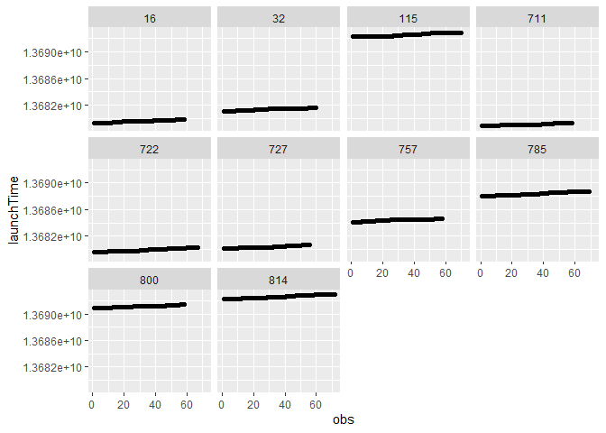<!-- -->

``` r
# Compute a binary variable indicating if a participant answered a beep. We take the ESM item Happy as reference
data.person$Compliance = ifelse(is.na(data.person$happy)==FALSE, 1, 0)

# Mean, median of the compliance across all participants
describe(data.person$Compliance)
```

    ##    vars     n mean   sd median trimmed mad min max range  skew kurtosis se
    ## X1    1 11638 0.93 0.26      1       1   0   0   1     1 -3.37     9.34  0

``` r
# Compliance per participant
data.compliance.person = aggregate(data.person$Compliance, by = list(data.person$ppnr), mean, na.rm = TRUE)

# See the first 6 rows
head(data.compliance.person)
```

    ##   Group.1         x
    ## 1       1 0.6984127
    ## 2       6 0.9565217
    ## 3       7 0.9552239
    ## 4       8 0.9687500
    ## 5       9 0.9523810
    ## 6      10 0.8852459

``` r
# See the last 6 rows
tail(data.compliance.person)
```

    ##     Group.1         x
    ## 183     812 0.9354839
    ## 184     813 0.9500000
    ## 185     814 0.9027778
    ## 186     815 0.8000000
    ## 187     816 0.9558824
    ## 188     817 0.8852459

``` r
# Obtain descriptive statistics of person's average compliance 
describe(data.compliance.person$x)
```

    ##    vars   n mean   sd median trimmed  mad min max range  skew kurtosis se
    ## X1    1 188 0.93 0.06   0.95    0.94 0.05 0.7   1   0.3 -1.28     1.58  0

Next, we obtain visualizations and statistics of the distribution of the
person-level or time-invariant variables variables

``` r
# We create a variable including the Gender (1 = F, 2 = M), Age and Couple Satisfaction of each participant
dt.person = aggregate(cbind(as.numeric(as.factor(data.person$gender)),data.person$happy), by = list(data.person$ppnr), mean, na.rm = TRUE)
colnames(dt.person) = c("Group.1","gender","happy")

# See the first 6 rows
head(dt.person)
```

    ##   Group.1 gender    happy
    ## 1       1      1 59.20455
    ## 2       6      1 61.86364
    ## 3       7      1 53.29688
    ## 4       8      1 55.14516
    ## 5       9      1 82.78333
    ## 6      10      1 78.16667

``` r
# See the last 6 rows
tail(dt.person)
```

    ##     Group.1 gender    happy
    ## 183     812      2 84.63793
    ## 184     813      2 52.38596
    ## 185     814      2 65.83077
    ## 186     815      2 58.37500
    ## 187     816      2 49.29231
    ## 188     817      2 62.96296

``` r
# Descriptive statistics for person's means of time-varying variable happy
describe(dt.person$happy)
```

    ##    vars   n mean    sd median trimmed   mad   min   max range skew kurtosis
    ## X1    1 188 62.6 12.07  62.26   62.38 12.23 26.65 97.47 70.82  0.1    -0.01
    ##      se
    ## X1 0.88

``` r
# Descriptive statistics for person's means of time-varying variable happy for women
describe(dt.person$happy[dt.person$gender==1])
```

    ##    vars  n  mean    sd median trimmed   mad   min   max range  skew kurtosis
    ## X1    1 94 62.23 12.16  62.05   62.34 11.73 26.65 89.09 62.45 -0.19    -0.06
    ##      se
    ## X1 1.25

``` r
# Descriptive statistics for person's means of time-varying variable happy for men
describe(dt.person$happy[dt.person$gender==2])
```

    ##    vars  n  mean    sd median trimmed   mad   min   max range skew kurtosis
    ## X1    1 94 62.97 12.04  62.39   62.39 12.94 36.98 97.47 60.48  0.4    -0.09
    ##      se
    ## X1 1.24

We now focus on time-varying variables, we obtain visualization and
descriptive statistics

``` r
# Histogram for the time-varying variable happy
ggplot(data.person, aes(happy)) + geom_histogram(color="black", fill="white",bins=30) 
```

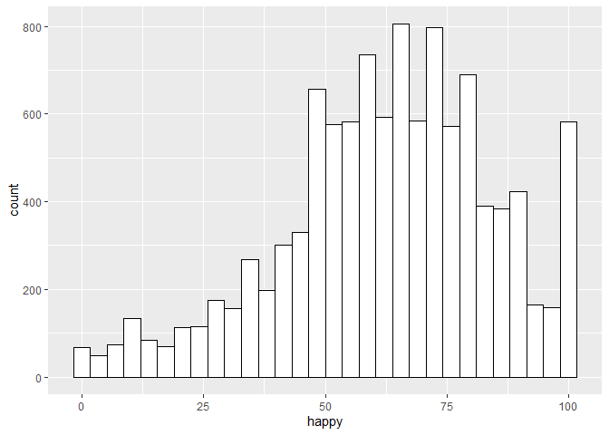<!-- -->

``` r
# Histogram for the time-varying variable happy by gender
ggplot(data.person, aes(happy)) + geom_histogram(color="black", fill="white",bins=30) +
  facet_wrap(~gender)
```

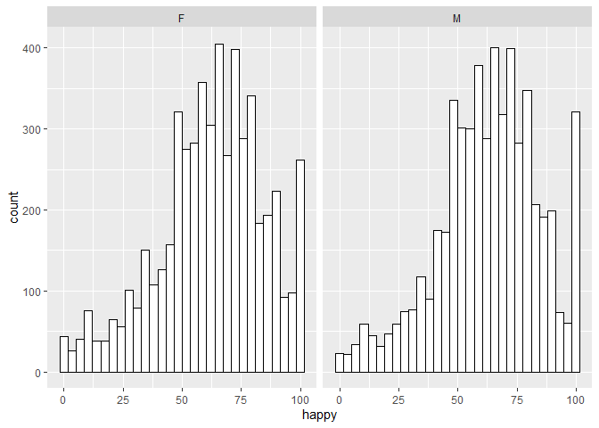<!-- -->

``` r
# Descriptive statistics for happy
describe(data.person$happy)
```

    ##    vars     n  mean    sd median trimmed   mad min max range skew kurtosis   se
    ## X1    1 10822 62.64 21.78     64    63.8 20.76   0 100   100 -0.5     0.06 0.21

``` r
# Descriptive statistics for happy for women
describe(data.person$happy[data.person$gender=='F'])
```

    ##    vars    n  mean    sd median trimmed   mad min max range  skew kurtosis  se
    ## X1    1 5394 62.24 22.25     64   63.53 20.76   0 100   100 -0.52     0.02 0.3

``` r
# Descriptive statistics for happy for men
describe(data.person$happy[data.person$gender=='M'])
```

    ##    vars    n  mean   sd median trimmed   mad min max range  skew kurtosis   se
    ## X1    1 5428 63.05 21.3     64   64.06 20.76   0 100   100 -0.46     0.08 0.29

``` r
# Distribution of happy per participant
data.table.dt = setDT(na.omit(data.person))
data.table.dt[, as.list(summary(happy, na.omit = TRUE)), by = ppnr]
```

    ##      ppnr Min. 1st Qu. Median     Mean 3rd Qu. Max.
    ##   1:    1    2   55.00   60.5 59.20455   66.50   84
    ##   2:    6   32   50.25   59.5 61.86364   74.75   91
    ##   3:    7    1   28.75   60.5 53.29688   75.00  100
    ##   4:    8   25   42.25   59.0 55.14516   65.75   82
    ##   5:    9   46   74.00   82.5 82.78333   96.75  100
    ##  ---                                               
    ## 183:  813   13   41.00   57.0 52.38596   64.00   79
    ## 184:  814    4   57.00   66.0 65.83077   77.00  100
    ## 185:  815   23   42.00   57.5 58.37500   71.00  100
    ## 186:  816    5   42.00   49.0 49.29231   54.00  100
    ## 187:  817   15   47.25   65.5 62.96296   75.00   94

``` r
# We randomly select 10 participants for plotting the distribution of the time-varying variable happy 
n.ID.sample = sample(unique(data.person$ppnr),10)
data.person.sample = data.person[which(data.person$ppnr %in% n.ID.sample),]

# Histogram for the time-varying variable happy by person
ggplot(data.person.sample, aes(happy)) + geom_histogram(color="black", fill="white",bins=30) +
  facet_wrap(~ppnr)
```

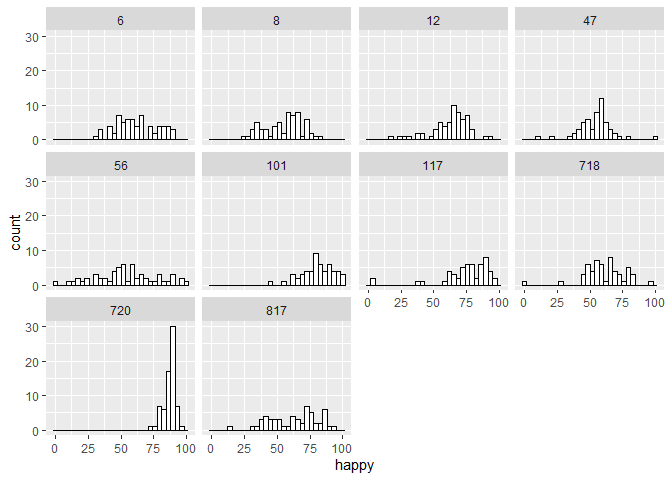<!-- -->

``` r
# Plot the trajectories of the time-varying variable happy by person
data.person.sample %>% 
  ggplot(aes(x = obs, y = happy)) + 
  geom_point() + 
  geom_line() +  # add lines to connect the data for each person 
  facet_wrap( ~ ppnr)
```

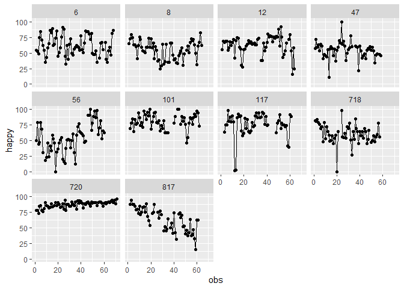<!-- -->

``` r
# We create a variable including the Gender (1 = F, 2 = M), and person's means of the time-varying variable happy
dt.person = aggregate(cbind(as.numeric(as.factor(data.person$gender)),data.person$happy), by = list(data.person$ppnr), mean, na.rm = TRUE)
colnames(dt.person) = c("Group.1","gender","happy")

# See the first 6 rows
head(dt.person)
```

    ##   Group.1 gender    happy
    ## 1       1      1 59.20455
    ## 2       6      1 61.86364
    ## 3       7      1 53.29688
    ## 4       8      1 55.14516
    ## 5       9      1 82.78333
    ## 6      10      1 78.16667

``` r
# See the last 6 rows
tail(dt.person)
```

    ##     Group.1 gender    happy
    ## 183     812      2 84.63793
    ## 184     813      2 52.38596
    ## 185     814      2 65.83077
    ## 186     815      2 58.37500
    ## 187     816      2 49.29231
    ## 188     817      2 62.96296

``` r
# Descriptive statistics for person's means of the time-varying variable happy
describe(dt.person$happy)
```

    ##    vars   n mean    sd median trimmed   mad   min   max range skew kurtosis
    ## X1    1 188 62.6 12.07  62.26   62.38 12.23 26.65 97.47 70.82  0.1    -0.01
    ##      se
    ## X1 0.88

``` r
# Descriptive statistics for person's means of the time-varying variable happy for women
describe(dt.person$happy[dt.person$gender==1])
```

    ##    vars  n  mean    sd median trimmed   mad   min   max range  skew kurtosis
    ## X1    1 94 62.23 12.16  62.05   62.34 11.73 26.65 89.09 62.45 -0.19    -0.06
    ##      se
    ## X1 1.25

``` r
# Descriptive statistics for person's means of the time-varying variable happy for men
describe(dt.person$happy[dt.person$gender==2])
```

    ##    vars  n  mean    sd median trimmed   mad   min   max range skew kurtosis
    ## X1    1 94 62.97 12.04  62.39   62.39 12.94 36.98 97.47 60.48  0.4    -0.09
    ##      se
    ## X1 1.24

``` r
# We create a variable including the Gender (1 = F, 2 = M), and person's standard deviation of the time-varying variable happy
dt.person = aggregate(data.person$happy, by = list(data.person$ppnr), sd, na.rm = TRUE)
colnames(dt.person) = c("Group.1","happy")

# See the first 6 rows
head(dt.person)
```

    ##   Group.1    happy
    ## 1       1 15.51830
    ## 2       6 15.74400
    ## 3       7 28.39276
    ## 4       8 14.47762
    ## 5       9 14.15063
    ## 6      10 17.01026

``` r
# See the last 6 rows
tail(dt.person)
```

    ##     Group.1    happy
    ## 183     812 14.44250
    ## 184     813 17.07625
    ## 185     814 20.78128
    ## 186     815 19.97777
    ## 187     816 17.81215
    ## 188     817 18.31791

``` r
# Descriptive statistics for person's standard deviation of the time-varying variable happy
describe(dt.person$happy)
```

    ##    vars   n  mean   sd median trimmed  mad  min   max range skew kurtosis  se
    ## X1    1 188 17.49 5.43  16.62   17.24 5.01 4.66 38.75 34.09 0.65      0.9 0.4

``` r
# Visualization of the trajectories for the members of a dyad
## We first randomly select a dyad  
dyad.ID.sample = sample(unique(data.person$couple),1)
data.dyad.sample = data.person[which(data.person$couple==dyad.ID.sample),]
# Add variable number of observation per person
data.dyad.sample$obs = rep(0,nrow(data.dyad.sample))
for (i in unique(data.dyad.sample$ppnr)){
data.dyad.sample$obs[which(data.dyad.sample$ppnr==i)] = 1:length(which(data.dyad.sample$ppnr==i))    
}

# Plot the trajectories of the time-varying variable happy by person
data.dyad.sample %>% 
  ggplot(aes(x = obs, y = happy)) + 
  geom_point() + 
  geom_line() +  # add lines to connect the data for each person 
  facet_wrap( ~ ppnr)
```

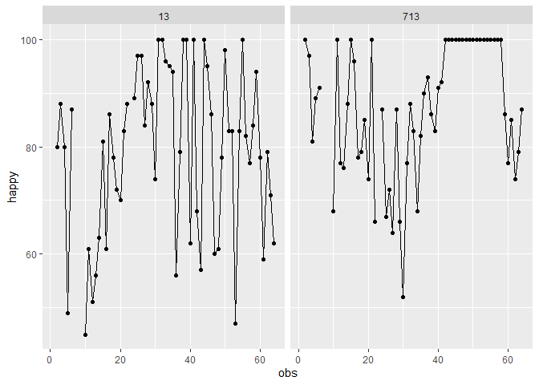<!-- -->

# 4 Data preprocessing for dyadic intensive longitudinal analyses

The ESM data set is in a long format. To estimate APIMs models and
VAR(1)-based models taking into account the dyadic structure using
linear mixed-effects models, we need to re-structure the data set (see
e.g., Laurenceau and Bolger (2012)).

``` r
# create variable Gender
data.person$Gender = ifelse(data.person$ppnr == data.person$couple,'F','M')

# Create lag outcome (happy): for each person lagged within days
data.person$happy.lag = rep(0,nrow(data.person))
n.subject = unique(data.person$ppnr)
for (j in n.subject){
n.day.j = unique(data.person$DayESM)
for (t in n.day.j){  
data.person$happy.lag[which(data.person$ppnr==j & data.person$DayESM==t)] = shift(data.person$happy[which(data.person$ppnr==j & data.person$DayESM==t)])
}}

# Re-shape the data into dyadic data set
data.dyad = data.person[,c('couple','ppnr','beepnr','DayESM','Gender','age','couple_satisf')]

# Re-name the variables 
colnames(data.dyad) = c('dyad.ID','subject.ID','Obs','Day','Gender','Age','couple_satisf')

# Create variable Female and Male
data.dyad$Female = ifelse(data.dyad$Gender == 'F',1,0)
data.dyad$Male = ifelse(data.dyad$Gender == 'M',1,0)

# Re-shape data set: Y (happy), X (enact_response)
data.dyad$Y.happy = rep(0,nrow(data.dyad))
data.dyad$Y.happy.lag = rep(0,nrow(data.dyad))
data.dyad$Y.Actor.lag = rep(0,nrow(data.dyad))
data.dyad$Y.Partner.lag = rep(0,nrow(data.dyad))
data.dyad$X.Actor = rep(0,nrow(data.dyad))
data.dyad$X.Partner = rep(0,nrow(data.dyad))
data.dyad$D.Actor = rep(0,nrow(data.dyad))
data.dyad$D.Partner = rep(0,nrow(data.dyad))

N.dyad = unique(data.dyad$dyad.ID)
for (i in N.dyad){
N.id = which(data.dyad$dyad.ID==i)

data.dyad$Y.happy[N.id[which(data.person[N.id,]$Gender=='F')]] = data.person$happy[N.id[which(data.person[N.id,]$Gender=='F')]]

data.dyad$Y.happy[N.id[which(data.dyad[N.id,]$Gender=='M')]] = data.person$happy[N.id[which(data.person[N.id,]$Gender=='M')]]

data.dyad$Y.happy.lag[N.id[which(data.person[N.id,]$Gender=='F')]] = data.person$happy.lag[N.id[which(data.person[N.id,]$Gender=='F')]]

data.dyad$Y.happy.lag[N.id[which(data.dyad[N.id,]$Gender=='M')]] = data.person$happy.lag[N.id[which(data.person[N.id,]$Gender=='M')]]

data.dyad$X.Actor[N.id[which(data.dyad[N.id,]$Gender=='F')]] = data.person$enact_respons[N.id[which(data.person[N.id,]$Gender=='F')]] 

data.dyad$X.Actor[N.id[which(data.dyad[N.id,]$Gender=='M')]] = data.person$enact_respons[N.id[which(data.person[N.id,]$Gender=='M')]] 

data.dyad$X.Partner[N.id[which(data.dyad[N.id,]$Gender=='F')]] = data.person$enact_respons[N.id[which(data.person[N.id,]$Gender=='M')]]

data.dyad$X.Partner[N.id[which(data.dyad[N.id,]$Gender=='M')]] = data.person$enact_respons[N.id[which(data.person[N.id,]$Gender=='F')]]

data.dyad$Y.Actor.lag[N.id[which(data.dyad[N.id,]$Gender=='F')]] = data.person$happy.lag[N.id[which(data.person[N.id,]$Gender=='F')]] 

data.dyad$Y.Actor.lag[N.id[which(data.dyad[N.id,]$Gender=='M')]] = data.person$happy.lag[N.id[which(data.person[N.id,]$Gender=='M')]] 

data.dyad$Y.Partner.lag[N.id[which(data.dyad[N.id,]$Gender=='F')]] = data.person$happy.lag[N.id[which(data.person[N.id,]$Gender=='M')]]

data.dyad$Y.Partner.lag[N.id[which(data.dyad[N.id,]$Gender=='M')]] = data.person$happy.lag[N.id[which(data.person[N.id,]$Gender=='F')]]

data.dyad$D.Actor[N.id[which(data.dyad[N.id,]$Gender=='F')]] = data.person$together[N.id[which(data.person[N.id,]$Gender=='F')]] 

data.dyad$D.Actor[N.id[which(data.dyad[N.id,]$Gender=='M')]] = data.person$together[N.id[which(data.person[N.id,]$Gender=='M')]] 

data.dyad$D.Partner[N.id[which(data.dyad[N.id,]$Gender=='F')]] = data.person$together[N.id[which(data.person[N.id,]$Gender=='M')]]

data.dyad$D.Partner[N.id[which(data.dyad[N.id,]$Gender=='M')]] = data.person$together[N.id[which(data.person[N.id,]$Gender=='F')]]
}

# Create variable dyad variable together
data.dyad$D = data.dyad$D.Actor + data.dyad$D.Partner

# Number of beeps where the both partners said they were together
length(which(data.dyad$D==2))
```

    ## [1] 6067

``` r
# Proportion of beeps where the both partners said they were together
length(which(data.dyad$D==2))/length(data.dyad$D.Partner)
```

    ## [1] 0.5213095

``` r
# Number of beeps where the both partners said they were not together
length(which(data.dyad$D==0))
```

    ## [1] 3782

``` r
# Proportion of beeps where the both partners said they were not together
length(which(data.dyad$D==0))/length(data.dyad$D.Partner)
```

    ## [1] 0.3249699

``` r
# Number of beeps where the both partners said they were disagree of being together
length(which(data.dyad$D==1))
```

    ## [1] 454

``` r
# Proportion of beeps where the both partners said they were disagree of being together
length(which(data.dyad$D==1))/length(data.dyad$D.Partner)
```

    ## [1] 0.03901014

``` r
# Select beeps where at least one of the dyad members said that they were together
data.dyad$D = ifelse(data.dyad$D==2, 1, data.dyad$D)

# Number of beeps where the both partners said they were at least one of the partners were together
length(which(data.dyad$D==1))
```

    ## [1] 6521

``` r
# Proportion of beeps where the both partners said they were at least one of the partners were together
length(which(data.dyad$D==1))/length(data.dyad$D.Partner)
```

    ## [1] 0.5603196

# 5 Create person-mean centered time-varying predictors

Next, we are going to create variable with person-mean centered
predictors:

``` r
# Person-mean centered the predictors and create a variable with person's mean
data.dyad <- data.dyad %>% 
group_by(subject.ID,dyad.ID) %>% 
mutate(X.Actor.c = X.Actor - mean(X.Actor,na.rm = TRUE),
       X.Partner.c = X.Partner - mean(X.Partner,na.rm = TRUE),
       X.Actor.mean = mean(X.Actor,na.rm = TRUE),
       X.Partner.mean = mean(X.Partner,na.rm = TRUE))

# See the first 6 rows
head(data.dyad)
```

    ## # A tibble: 6 x 22
    ## # Groups:   subject.ID, dyad.ID [1]
    ##   dyad.ID subject.ID   Obs   Day Gender   Age couple_satisf Female  Male Y.happy
    ##     <dbl>      <dbl> <dbl> <dbl> <chr>  <dbl>         <dbl>  <dbl> <dbl>   <dbl>
    ## 1       1          1     1     3 F         24             5      1     0      74
    ## 2       1          1     2     3 F         24             5      1     0      47
    ## 3       1          1     3     3 F         24             5      1     0      68
    ## 4       1          1     4     3 F         24             5      1     0      66
    ## 5       1          1     5     3 F         24             5      1     0      48
    ## 6       1          1     6     4 F         24             5      1     0      57
    ## # ... with 12 more variables: Y.happy.lag <dbl>, Y.Actor.lag <dbl>,
    ## #   Y.Partner.lag <dbl>, X.Actor <dbl>, X.Partner <dbl>, D.Actor <dbl>,
    ## #   D.Partner <dbl>, D <dbl>, X.Actor.c <dbl>, X.Partner.c <dbl>,
    ## #   X.Actor.mean <dbl>, X.Partner.mean <dbl>

``` r
# See the last 6 rows
tail(data.dyad)
```

    ## # A tibble: 6 x 22
    ## # Groups:   subject.ID, dyad.ID [1]
    ##   dyad.ID subject.ID   Obs   Day Gender   Age couple_satisf Female  Male Y.happy
    ##     <dbl>      <dbl> <dbl> <dbl> <chr>  <dbl>         <dbl>  <dbl> <dbl>   <dbl>
    ## 1     117        817    56    10 M         30          6.67      0     1      39
    ## 2     117        817    57    10 M         30          6.67      0     1      47
    ## 3     117        817    58    10 M         30          6.67      0     1      33
    ## 4     117        817    59    10 M         30          6.67      0     1      15
    ## 5     117        817    60    10 M         30          6.67      0     1      62
    ## 6     117        817    61    10 M         30          6.67      0     1      62
    ## # ... with 12 more variables: Y.happy.lag <dbl>, Y.Actor.lag <dbl>,
    ## #   Y.Partner.lag <dbl>, X.Actor <dbl>, X.Partner <dbl>, D.Actor <dbl>,
    ## #   D.Partner <dbl>, D <dbl>, X.Actor.c <dbl>, X.Partner.c <dbl>,
    ## #   X.Actor.mean <dbl>, X.Partner.mean <dbl>

# 6 Estimate linear models for average of person-level data (cross-sectional data)

We first illustrate how to estimate a linear model for cross-sectional
data. Thus, we are going to compute the persons’ means of the variables
included in the data set *data.dyad*.

``` r
# First, we re-code the variable Gender from a categorical to numerical variable
# in the new data set 'data.dyad.num' Gender =  0 for female partner and Gender = 1 for male partner
data.dyad.num = data.dyad
data.dyad.num$Gender = as.numeric(as.factor(data.dyad.num$Gender))-1

# Create a data set by computing the person's mean.
data.dyad.mean = aggregate(data.dyad.num, by = list(data.person$ppnr), mean, na.rm = TRUE)
```

## 6.1 Estimate linear model for male partners

We estimate a linear model to investigate the effect of persons’ mean
enacted response on the person’s happiness for male partners using a
linear model estimates by least squares.

``` r
# Estimate the linear model
fit.Model.1 = lm(Y.happy ~ 1 + X.Actor,
                  data = data.dyad.mean[which(data.dyad.mean$Gender==1),]) 

summary(fit.Model.1)
```

    ## 
    ## Call:
    ## lm(formula = Y.happy ~ 1 + X.Actor, data = data.dyad.mean[which(data.dyad.mean$Gender == 
    ##     1), ])
    ## 
    ## Residuals:
    ##      Min       1Q   Median       3Q      Max 
    ## -23.9688  -5.0747   0.5112   6.9238  27.1168 
    ## 
    ## Coefficients:
    ##             Estimate Std. Error t value Pr(>|t|)    
    ## (Intercept) 30.02305    5.61808   5.344 6.56e-07 ***
    ## X.Actor      0.44197    0.07401   5.972 4.37e-08 ***
    ## ---
    ## Signif. codes:  0 '***' 0.001 '**' 0.01 '*' 0.05 '.' 0.1 ' ' 1
    ## 
    ## Residual standard error: 10.28 on 92 degrees of freedom
    ## Multiple R-squared:  0.2793, Adjusted R-squared:  0.2715 
    ## F-statistic: 35.66 on 1 and 92 DF,  p-value: 4.366e-08

``` r
tab_model(fit.Model.1)
```

<table style="border-collapse:collapse; border:none;">
<tr>
<th style="border-top: double; text-align:center; font-style:normal; font-weight:bold; padding:0.2cm;  text-align:left; ">

 

</th>
<th colspan="3" style="border-top: double; text-align:center; font-style:normal; font-weight:bold; padding:0.2cm; ">

Y.happy

</th>
</tr>
<tr>
<td style=" text-align:center; border-bottom:1px solid; font-style:italic; font-weight:normal;  text-align:left; ">

Predictors

</td>
<td style=" text-align:center; border-bottom:1px solid; font-style:italic; font-weight:normal;  ">

Estimates

</td>
<td style=" text-align:center; border-bottom:1px solid; font-style:italic; font-weight:normal;  ">

CI

</td>
<td style=" text-align:center; border-bottom:1px solid; font-style:italic; font-weight:normal;  ">

p

</td>
</tr>
<tr>
<td style=" padding:0.2cm; text-align:left; vertical-align:top; text-align:left; ">

(Intercept)

</td>
<td style=" padding:0.2cm; text-align:left; vertical-align:top; text-align:center;  ">

30.02

</td>
<td style=" padding:0.2cm; text-align:left; vertical-align:top; text-align:center;  ">

18.87 – 41.18

</td>
<td style=" padding:0.2cm; text-align:left; vertical-align:top; text-align:center;  ">

<strong>\<0.001</strong>

</td>
</tr>
<tr>
<td style=" padding:0.2cm; text-align:left; vertical-align:top; text-align:left; ">

X Actor

</td>
<td style=" padding:0.2cm; text-align:left; vertical-align:top; text-align:center;  ">

0.44

</td>
<td style=" padding:0.2cm; text-align:left; vertical-align:top; text-align:center;  ">

0.29 – 0.59

</td>
<td style=" padding:0.2cm; text-align:left; vertical-align:top; text-align:center;  ">

<strong>\<0.001</strong>

</td>
</tr>
<tr>
<td style=" padding:0.2cm; text-align:left; vertical-align:top; text-align:left; padding-top:0.1cm; padding-bottom:0.1cm; border-top:1px solid;">

Observations

</td>
<td style=" padding:0.2cm; text-align:left; vertical-align:top; padding-top:0.1cm; padding-bottom:0.1cm; text-align:left; border-top:1px solid;" colspan="3">

94

</td>
</tr>
<tr>
<td style=" padding:0.2cm; text-align:left; vertical-align:top; text-align:left; padding-top:0.1cm; padding-bottom:0.1cm;">

R<sup>2</sup> / R<sup>2</sup> adjusted

</td>
<td style=" padding:0.2cm; text-align:left; vertical-align:top; padding-top:0.1cm; padding-bottom:0.1cm; text-align:left;" colspan="3">

0.279 / 0.272

</td>
</tr>
</table>

``` r
# Plot predictions for the person-mean enacted response for male partners
ggpredict(fit.Model.1, terms = c("X.Actor")) |> plot()
```

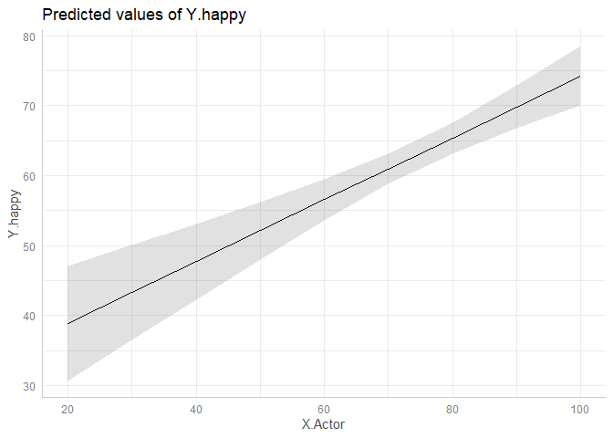<!-- -->

## 6.2 Estimate linear model for male partners with moderation effects

We estimate a linear model to investigate if the effect of persons’ mean
enacted response on the person’s happiness for male partners is
moderated by the averate time in which participants are together during
the ESM period. We use a linear model estimated by least squares.

``` r
# Estimate the linear model
fit.Model.2 = lm(Y.happy ~ 1 + X.Actor + X.Actor*D,
                  data = data.dyad.mean[which(data.dyad.mean$Gender==1),]) 

summary(fit.Model.2)
```

    ## 
    ## Call:
    ## lm(formula = Y.happy ~ 1 + X.Actor + X.Actor * D, data = data.dyad.mean[which(data.dyad.mean$Gender == 
    ##     1), ])
    ## 
    ## Residuals:
    ##     Min      1Q  Median      3Q     Max 
    ## -23.650  -4.983   1.214   6.379  25.423 
    ## 
    ## Coefficients:
    ##             Estimate Std. Error t value Pr(>|t|)   
    ## (Intercept)   8.6630    18.1307   0.478  0.63395   
    ## X.Actor       0.6793     0.2485   2.734  0.00754 **
    ## D            34.3404    26.2715   1.307  0.19450   
    ## X.Actor:D    -0.3781     0.3548  -1.066  0.28940   
    ## ---
    ## Signif. codes:  0 '***' 0.001 '**' 0.01 '*' 0.05 '.' 0.1 ' ' 1
    ## 
    ## Residual standard error: 10.23 on 90 degrees of freedom
    ## Multiple R-squared:  0.3024, Adjusted R-squared:  0.2791 
    ## F-statistic:    13 on 3 and 90 DF,  p-value: 3.952e-07

``` r
tab_model(fit.Model.2)
```

<table style="border-collapse:collapse; border:none;">
<tr>
<th style="border-top: double; text-align:center; font-style:normal; font-weight:bold; padding:0.2cm;  text-align:left; ">

 

</th>
<th colspan="3" style="border-top: double; text-align:center; font-style:normal; font-weight:bold; padding:0.2cm; ">

Y.happy

</th>
</tr>
<tr>
<td style=" text-align:center; border-bottom:1px solid; font-style:italic; font-weight:normal;  text-align:left; ">

Predictors

</td>
<td style=" text-align:center; border-bottom:1px solid; font-style:italic; font-weight:normal;  ">

Estimates

</td>
<td style=" text-align:center; border-bottom:1px solid; font-style:italic; font-weight:normal;  ">

CI

</td>
<td style=" text-align:center; border-bottom:1px solid; font-style:italic; font-weight:normal;  ">

p

</td>
</tr>
<tr>
<td style=" padding:0.2cm; text-align:left; vertical-align:top; text-align:left; ">

(Intercept)

</td>
<td style=" padding:0.2cm; text-align:left; vertical-align:top; text-align:center;  ">

8.66

</td>
<td style=" padding:0.2cm; text-align:left; vertical-align:top; text-align:center;  ">

-27.36 – 44.68

</td>
<td style=" padding:0.2cm; text-align:left; vertical-align:top; text-align:center;  ">

0.634

</td>
</tr>
<tr>
<td style=" padding:0.2cm; text-align:left; vertical-align:top; text-align:left; ">

X Actor

</td>
<td style=" padding:0.2cm; text-align:left; vertical-align:top; text-align:center;  ">

0.68

</td>
<td style=" padding:0.2cm; text-align:left; vertical-align:top; text-align:center;  ">

0.19 – 1.17

</td>
<td style=" padding:0.2cm; text-align:left; vertical-align:top; text-align:center;  ">

<strong>0.008</strong>

</td>
</tr>
<tr>
<td style=" padding:0.2cm; text-align:left; vertical-align:top; text-align:left; ">

D

</td>
<td style=" padding:0.2cm; text-align:left; vertical-align:top; text-align:center;  ">

34.34

</td>
<td style=" padding:0.2cm; text-align:left; vertical-align:top; text-align:center;  ">

-17.85 – 86.53

</td>
<td style=" padding:0.2cm; text-align:left; vertical-align:top; text-align:center;  ">

0.194

</td>
</tr>
<tr>
<td style=" padding:0.2cm; text-align:left; vertical-align:top; text-align:left; ">

X Actor \* D

</td>
<td style=" padding:0.2cm; text-align:left; vertical-align:top; text-align:center;  ">

-0.38

</td>
<td style=" padding:0.2cm; text-align:left; vertical-align:top; text-align:center;  ">

-1.08 – 0.33

</td>
<td style=" padding:0.2cm; text-align:left; vertical-align:top; text-align:center;  ">

0.289

</td>
</tr>
<tr>
<td style=" padding:0.2cm; text-align:left; vertical-align:top; text-align:left; padding-top:0.1cm; padding-bottom:0.1cm; border-top:1px solid;">

Observations

</td>
<td style=" padding:0.2cm; text-align:left; vertical-align:top; padding-top:0.1cm; padding-bottom:0.1cm; text-align:left; border-top:1px solid;" colspan="3">

94

</td>
</tr>
<tr>
<td style=" padding:0.2cm; text-align:left; vertical-align:top; text-align:left; padding-top:0.1cm; padding-bottom:0.1cm;">

R<sup>2</sup> / R<sup>2</sup> adjusted

</td>
<td style=" padding:0.2cm; text-align:left; vertical-align:top; padding-top:0.1cm; padding-bottom:0.1cm; text-align:left;" colspan="3">

0.302 / 0.279

</td>
</tr>
</table>

``` r
# Plot predictions for the person-mean enacted response for male partners
ggpredict(fit.Model.2, terms = c("X.Actor", "D")) |> plot()
```

<!-- -->

## 6.3 Estimate APIM for distinguishable partners

We estimate a linear model to investigate the actor and partner effect
of persons’ mean enacted response on the person’s happiness for dyadic
partners using a generalized linear models.

``` r
# Estimate APIM model for distinguishable partners

fit.Model.3 = gls(Y.happy ~ -1 + Female + Female:X.Actor + Female:X.Partner  + 
                  Male + Male:X.Actor + Male:X.Partner,
               correlation = corSymm(form= ~1|dyad.ID),
               weights = varIdent(form= ~1|Gender),    
               data = data.dyad.mean,
               na.action = na.exclude)

summary(fit.Model.3)
```

    ## Generalized least squares fit by REML
    ##   Model: Y.happy ~ -1 + Female + Female:X.Actor + Female:X.Partner + Male +      Male:X.Actor + Male:X.Partner 
    ##   Data: data.dyad.mean 
    ##        AIC      BIC    logLik
    ##   1422.227 1451.063 -702.1134
    ## 
    ## Correlation Structure: General
    ##  Formula: ~1 | dyad.ID 
    ##  Parameter estimate(s):
    ##  Correlation: 
    ##   1    
    ## 2 0.453
    ## Variance function:
    ##  Structure: Different standard deviations per stratum
    ##  Formula: ~1 | Gender 
    ##  Parameter estimates:
    ##         0         1 
    ## 1.0000000 0.9459012 
    ## 
    ## Coefficients:
    ##                     Value Std.Error   t-value p-value
    ## Female           39.14790  7.316104  5.350922  0.0000
    ## Male             31.32386  6.911166  4.532356  0.0000
    ## Female:X.Actor    0.38960  0.079333  4.910985  0.0000
    ## Female:X.Partner -0.08013  0.082122 -0.975710  0.3305
    ## X.Actor:Male      0.44969  0.077445  5.806576  0.0000
    ## X.Partner:Male   -0.02516  0.075068 -0.335196  0.7379
    ## 
    ##  Correlation: 
    ##                  Female Male   Fm:X.A Fm:X.P X.Ac:M
    ## Male              0.453                            
    ## Female:X.Actor   -0.575 -0.261                     
    ## Female:X.Partner -0.611 -0.276 -0.279              
    ## X.Actor:Male     -0.276 -0.609 -0.127  0.452       
    ## X.Partner:Male   -0.261 -0.577  0.453 -0.126 -0.279
    ## 
    ## Standardized residuals:
    ##         Min          Q1         Med          Q3         Max 
    ## -3.32428240 -0.55765150  0.05866253  0.69553659  2.67807664 
    ## 
    ## Residual standard error: 10.92056 
    ## Degrees of freedom: 188 total; 182 residual

## 6.4 Estimate APIM for indistinguishable partners

We estimate a linear model to investigate the actor and partner effect
of persons’ mean enacted response on the person’s happiness for dyadic
partners for dyadic partners using a generalized linear models.

``` r
# Estimate APIM model for indistinguishable partners

fit.Model.4 = gls(Y.happy ~ 1 + X.Actor + X.Partner,
               correlation = corSymm(form= ~1|dyad.ID),
               weights = varIdent(form= ~1|Gender),    
               data = data.dyad.mean,
               na.action = na.exclude)

summary(fit.Model.4)
```

    ## Generalized least squares fit by REML
    ##   Model: Y.happy ~ 1 + X.Actor + X.Partner 
    ##   Data: data.dyad.mean 
    ##        AIC      BIC    logLik
    ##   1414.702 1434.024 -701.3509
    ## 
    ## Correlation Structure: General
    ##  Formula: ~1 | dyad.ID 
    ##  Parameter estimate(s):
    ##  Correlation: 
    ##   1    
    ## 2 0.449
    ## Variance function:
    ##  Structure: Different standard deviations per stratum
    ##  Formula: ~1 | Gender 
    ##  Parameter estimates:
    ##        0        1 
    ## 1.000000 0.946108 
    ## 
    ## Coefficients:
    ##                Value Std.Error   t-value p-value
    ## (Intercept) 34.84114  6.014607  5.792755  0.0000
    ## X.Actor      0.42124  0.051589  8.165284  0.0000
    ## X.Partner   -0.04844  0.051583 -0.939027  0.3489
    ## 
    ##  Correlation: 
    ##           (Intr) X.Actr
    ## X.Actor   -0.763       
    ## X.Partner -0.763  0.193
    ## 
    ## Standardized residuals:
    ##         Min          Q1         Med          Q3         Max 
    ## -3.46479841 -0.58192499  0.03848442  0.63937833  2.78917115 
    ## 
    ## Residual standard error: 10.87274 
    ## Degrees of freedom: 188 total; 185 residual

## 6.5 Estimate APIM for distinguishable partners with moderation effects

We estimate a linear model to investigate if the actor and partner
effect of persons’ mean enacted response on the person’s happiness is
moderated by the average number of beeps that dyadic partners spend
together.

``` r
# Create the interaction variable between enacted response and the average number of beeps that dyadic partners spend together
data.dyad.mean$D.X.Actor = data.dyad.mean$D*data.dyad.mean$X.Actor
data.dyad.mean$D.X.Partner = data.dyad.mean$D*data.dyad.mean$X.Partner

# Estimate APIM model for distinguishable partners with moderation effects

fit.Model.5 = gls(Y.happy ~ -1 + Female + Female:X.Actor + Female:X.Partner  + 
                  + Female:D + Female:D.X.Actor + Female:D.X.Partner +  
                  Male + Male:X.Actor + Male:X.Partner + 
                  Male:D + Male:D.X.Actor + Male:D.X.Partner,
               correlation = corSymm(form= ~1|dyad.ID),
               weights = varIdent(form= ~1|Gender),    
               data = data.dyad.mean,
               na.action = na.exclude)

summary(fit.Model.5)
```

    ## Generalized least squares fit by REML
    ##   Model: Y.happy ~ -1 + Female + Female:X.Actor + Female:X.Partner + +Female:D +      Female:D.X.Actor + Female:D.X.Partner + Male + Male:X.Actor +      Male:X.Partner + Male:D + Male:D.X.Actor + Male:D.X.Partner 
    ##   Data: data.dyad.mean 
    ##        AIC      BIC    logLik
    ##   1410.204 1457.761 -690.1019
    ## 
    ## Correlation Structure: General
    ##  Formula: ~1 | dyad.ID 
    ##  Parameter estimate(s):
    ##  Correlation: 
    ##   1    
    ## 2 0.469
    ## Variance function:
    ##  Structure: Different standard deviations per stratum
    ##  Formula: ~1 | Gender 
    ##  Parameter estimates:
    ##        0        1 
    ## 1.000000 0.963139 
    ## 
    ## Coefficients:
    ##                        Value Std.Error    t-value p-value
    ## Female              55.82284 20.635627  2.7051681  0.0075
    ## Male                20.52465 19.875107  1.0326814  0.3032
    ## Female:X.Actor       0.45259  0.271795  1.6652003  0.0977
    ## Female:X.Partner    -0.49232  0.309517 -1.5906196  0.1135
    ## Female:D           -21.53777 30.906109 -0.6968774  0.4868
    ## Female:D.X.Actor    -0.08078  0.402414 -0.2007503  0.8411
    ## Female:D.X.Partner   0.56549  0.436848  1.2944815  0.1972
    ## X.Actor:Male         0.92063  0.298181  3.0874977  0.0023
    ## X.Partner:Male      -0.38209  0.261825 -1.4593229  0.1463
    ## D:Male              16.57777 29.761357  0.5570232  0.5782
    ## D.X.Actor:Male      -0.70516  0.420848 -1.6755715  0.0956
    ## D.X.Partner:Male     0.53753  0.387849  1.3859333  0.1675
    ## 
    ##  Correlation: 
    ##                    Female Male   Fm:X.A Fm:X.P Feml:D F:D.X.A F:D.X.P X.Ac:M
    ## Male                0.469                                                   
    ## Female:X.Actor     -0.411 -0.193                                            
    ## Female:X.Partner   -0.519 -0.243 -0.553                                     
    ## Female:D           -0.937 -0.439  0.416  0.451                              
    ## Female:D.X.Actor    0.397  0.186 -0.958  0.531 -0.462                       
    ## Female:D.X.Partner  0.504  0.236  0.534 -0.965 -0.493 -0.531                
    ## X.Actor:Male       -0.243 -0.519 -0.260  0.469  0.211  0.249  -0.453        
    ## X.Partner:Male     -0.193 -0.411  0.469 -0.260  0.195 -0.449   0.250  -0.554
    ## D:Male             -0.439 -0.937  0.195  0.212  0.469 -0.217  -0.231   0.451
    ## D.X.Actor:Male      0.236  0.504  0.251 -0.453 -0.231 -0.249   0.469  -0.965
    ## D.X.Partner:Male    0.186  0.397 -0.449  0.249 -0.217  0.469  -0.249   0.531
    ##                    X.Pr:M D:Male D.X.A:
    ## Male                                   
    ## Female:X.Actor                         
    ## Female:X.Partner                       
    ## Female:D                               
    ## Female:D.X.Actor                       
    ## Female:D.X.Partner                     
    ## X.Actor:Male                           
    ## X.Partner:Male                         
    ## D:Male              0.416              
    ## D.X.Actor:Male      0.535 -0.492       
    ## D.X.Partner:Male   -0.958 -0.462 -0.531
    ## 
    ## Standardized residuals:
    ##        Min         Q1        Med         Q3        Max 
    ## -3.4394734 -0.5035567  0.1594487  0.6236175  2.2589803 
    ## 
    ## Residual standard error: 10.61073 
    ## Degrees of freedom: 188 total; 176 residual

## 6.6 Estimate APIM for indistinguishable partners with moderation effects

We estimate a linear model to investigate if the actor and partner
effect of persons’ mean enacted response on the person’s happiness is
moderated by the average number of beeps that dyadic partners spend
together.

``` r
# Estimate APIM model for indistinguishable partners  with moderation effects

fit.Model.6 = gls(Y.happy ~ 1 + X.Actor + X.Partner +
                  D + D.X.Actor + D.X.Partner,
               correlation = corSymm(form= ~1|dyad.ID),
               weights = varIdent(form= ~1|Gender),    
               data = data.dyad.mean,
               na.action = na.exclude)

summary(fit.Model.6)
```

    ## Generalized least squares fit by REML
    ##   Model: Y.happy ~ 1 + X.Actor + X.Partner + D + D.X.Actor + D.X.Partner 
    ##   Data: data.dyad.mean 
    ##        AIC      BIC    logLik
    ##   1409.872 1438.708 -695.9358
    ## 
    ## Correlation Structure: General
    ##  Formula: ~1 | dyad.ID 
    ##  Parameter estimate(s):
    ##  Correlation: 
    ##   1    
    ## 2 0.441
    ## Variance function:
    ##  Structure: Different standard deviations per stratum
    ##  Formula: ~1 | Gender 
    ##  Parameter estimates:
    ##         0         1 
    ## 1.0000000 0.9661392 
    ## 
    ## Coefficients:
    ##                Value Std.Error   t-value p-value
    ## (Intercept) 37.59179 17.087024  2.200020  0.0291
    ## X.Actor      0.56331  0.168680  3.339541  0.0010
    ## X.Partner   -0.30904  0.167738 -1.842416  0.0670
    ## D           -1.56972 25.673801 -0.061141  0.9513
    ## D.X.Actor   -0.22589  0.245951 -0.918438  0.3596
    ## D.X.Partner  0.37661  0.245240  1.535692  0.1264
    ## 
    ##  Correlation: 
    ##             (Intr) X.Actr X.Prtn D      D.X.Ac
    ## X.Actor     -0.667                            
    ## X.Partner   -0.666 -0.086                     
    ## D           -0.937  0.619  0.620              
    ## D.X.Actor    0.640 -0.953  0.082 -0.676       
    ## D.X.Partner  0.638  0.083 -0.952 -0.677 -0.058
    ## 
    ## Standardized residuals:
    ##        Min         Q1        Med         Q3        Max 
    ## -3.5709077 -0.5288216  0.1101519  0.6349044  2.6867816 
    ## 
    ## Residual standard error: 10.59265 
    ## Degrees of freedom: 188 total; 182 residual

# 7 Estimate linear models for a single person (time series data)

We estimate a model for a single person. As an illustration, we select
the data for women participants and we investigate if enacted response
predicts happy.

## 7.1 Linear model to estimate the effect of enacted response on happy

``` r
# Estimate the model assuming errors are independent

fit.Model.7.A = lm(Y.happy ~ 1 + X.Actor,
                  data = data.dyad[which(data.dyad$subject.ID==6),]) 

summary(fit.Model.7.A)
```

    ## 
    ## Call:
    ## lm(formula = Y.happy ~ 1 + X.Actor, data = data.dyad[which(data.dyad$subject.ID == 
    ##     6), ])
    ## 
    ## Residuals:
    ##     Min      1Q  Median      3Q     Max 
    ## -28.350 -11.399  -2.109  13.239  27.810 
    ## 
    ## Coefficients:
    ##             Estimate Std. Error t value Pr(>|t|)
    ## (Intercept)  42.3042    29.4769   1.435    0.156
    ## X.Actor       0.2098     0.3155   0.665    0.508
    ## 
    ## Residual standard error: 15.81 on 64 degrees of freedom
    ##   (3 observations deleted due to missingness)
    ## Multiple R-squared:  0.006862,   Adjusted R-squared:  -0.008655 
    ## F-statistic: 0.4422 on 1 and 64 DF,  p-value: 0.5084

``` r
tab_model(fit.Model.7.A)
```

<table style="border-collapse:collapse; border:none;">
<tr>
<th style="border-top: double; text-align:center; font-style:normal; font-weight:bold; padding:0.2cm;  text-align:left; ">

 

</th>
<th colspan="3" style="border-top: double; text-align:center; font-style:normal; font-weight:bold; padding:0.2cm; ">

Y.happy

</th>
</tr>
<tr>
<td style=" text-align:center; border-bottom:1px solid; font-style:italic; font-weight:normal;  text-align:left; ">

Predictors

</td>
<td style=" text-align:center; border-bottom:1px solid; font-style:italic; font-weight:normal;  ">

Estimates

</td>
<td style=" text-align:center; border-bottom:1px solid; font-style:italic; font-weight:normal;  ">

CI

</td>
<td style=" text-align:center; border-bottom:1px solid; font-style:italic; font-weight:normal;  ">

p

</td>
</tr>
<tr>
<td style=" padding:0.2cm; text-align:left; vertical-align:top; text-align:left; ">

(Intercept)

</td>
<td style=" padding:0.2cm; text-align:left; vertical-align:top; text-align:center;  ">

42.30

</td>
<td style=" padding:0.2cm; text-align:left; vertical-align:top; text-align:center;  ">

-16.58 – 101.19

</td>
<td style=" padding:0.2cm; text-align:left; vertical-align:top; text-align:center;  ">

0.156

</td>
</tr>
<tr>
<td style=" padding:0.2cm; text-align:left; vertical-align:top; text-align:left; ">

X Actor

</td>
<td style=" padding:0.2cm; text-align:left; vertical-align:top; text-align:center;  ">

0.21

</td>
<td style=" padding:0.2cm; text-align:left; vertical-align:top; text-align:center;  ">

-0.42 – 0.84

</td>
<td style=" padding:0.2cm; text-align:left; vertical-align:top; text-align:center;  ">

0.508

</td>
</tr>
<tr>
<td style=" padding:0.2cm; text-align:left; vertical-align:top; text-align:left; padding-top:0.1cm; padding-bottom:0.1cm; border-top:1px solid;">

Observations

</td>
<td style=" padding:0.2cm; text-align:left; vertical-align:top; padding-top:0.1cm; padding-bottom:0.1cm; text-align:left; border-top:1px solid;" colspan="3">

66

</td>
</tr>
<tr>
<td style=" padding:0.2cm; text-align:left; vertical-align:top; text-align:left; padding-top:0.1cm; padding-bottom:0.1cm;">

R<sup>2</sup> / R<sup>2</sup> adjusted

</td>
<td style=" padding:0.2cm; text-align:left; vertical-align:top; padding-top:0.1cm; padding-bottom:0.1cm; text-align:left;" colspan="3">

0.007 / -0.009

</td>
</tr>
</table>

``` r
# Plot predictions for the person-mean centered enacted response for 5 persons
ggpredict(fit.Model.7.A, terms = c("X.Actor")) |> plot()
```

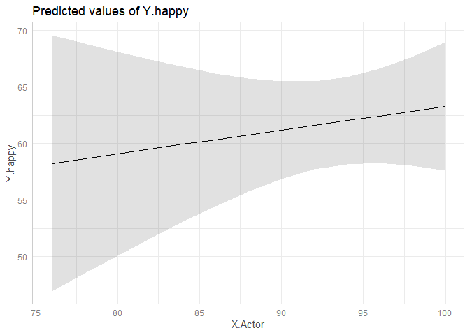<!-- -->

``` r
# Estimate the model assuming errors follow AR(1) process
fit.Model.7.B = gls(Y.happy ~ 1 + X.Actor, correlation = corAR1(form=~1), 
                    data = data.dyad[which(data.dyad$subject.ID==6),], na.action=na.omit)

summary(fit.Model.7.B)
```

    ## Generalized least squares fit by REML
    ##   Model: Y.happy ~ 1 + X.Actor 
    ##   Data: data.dyad[which(data.dyad$subject.ID == 6), ] 
    ##        AIC      BIC    logLik
    ##   535.2094 543.8449 -263.6047
    ## 
    ## Correlation Structure: AR(1)
    ##  Formula: ~1 
    ##  Parameter estimate(s):
    ##       Phi 
    ## 0.5352299 
    ## 
    ## Coefficients:
    ##                 Value Std.Error   t-value p-value
    ## (Intercept) 14.764857 25.771604 0.5729118  0.5687
    ## X.Actor      0.507076  0.273214 1.8559684  0.0681
    ## 
    ##  Correlation: 
    ##         (Intr)
    ## X.Actor -0.99 
    ## 
    ## Standardized residuals:
    ##         Min          Q1         Med          Q3         Max 
    ## -1.75784823 -0.76252586 -0.08924836  0.99728044  1.76737527 
    ## 
    ## Residual standard error: 16.18123 
    ## Degrees of freedom: 66 total; 64 residual

## 7.2 Linear model to estimate the autoregressive effect of happiness

We estimate an AR(1) model for a single participant.

``` r
fit.Model.8 = lm(Y.happy ~ 1 + Y.happy.lag,
                  data = data.dyad[which(data.dyad$subject.ID==6),]) 

summary(fit.Model.8)
```

    ## 
    ## Call:
    ## lm(formula = Y.happy ~ 1 + Y.happy.lag, data = data.dyad[which(data.dyad$subject.ID == 
    ##     6), ])
    ## 
    ## Residuals:
    ##     Min      1Q  Median      3Q     Max 
    ## -31.144  -8.304   0.894   9.760  26.397 
    ## 
    ## Coefficients:
    ##             Estimate Std. Error t value Pr(>|t|)    
    ## (Intercept)  27.9600     7.3525   3.803 0.000361 ***
    ## Y.happy.lag   0.5669     0.1167   4.856 1.03e-05 ***
    ## ---
    ## Signif. codes:  0 '***' 0.001 '**' 0.01 '*' 0.05 '.' 0.1 ' ' 1
    ## 
    ## Residual standard error: 13.57 on 55 degrees of freedom
    ##   (12 observations deleted due to missingness)
    ## Multiple R-squared:  0.3001, Adjusted R-squared:  0.2873 
    ## F-statistic: 23.58 on 1 and 55 DF,  p-value: 1.032e-05

``` r
tab_model(fit.Model.8)
```

<table style="border-collapse:collapse; border:none;">
<tr>
<th style="border-top: double; text-align:center; font-style:normal; font-weight:bold; padding:0.2cm;  text-align:left; ">

 

</th>
<th colspan="3" style="border-top: double; text-align:center; font-style:normal; font-weight:bold; padding:0.2cm; ">

Y.happy

</th>
</tr>
<tr>
<td style=" text-align:center; border-bottom:1px solid; font-style:italic; font-weight:normal;  text-align:left; ">

Predictors

</td>
<td style=" text-align:center; border-bottom:1px solid; font-style:italic; font-weight:normal;  ">

Estimates

</td>
<td style=" text-align:center; border-bottom:1px solid; font-style:italic; font-weight:normal;  ">

CI

</td>
<td style=" text-align:center; border-bottom:1px solid; font-style:italic; font-weight:normal;  ">

p

</td>
</tr>
<tr>
<td style=" padding:0.2cm; text-align:left; vertical-align:top; text-align:left; ">

(Intercept)

</td>
<td style=" padding:0.2cm; text-align:left; vertical-align:top; text-align:center;  ">

27.96

</td>
<td style=" padding:0.2cm; text-align:left; vertical-align:top; text-align:center;  ">

13.23 – 42.69

</td>
<td style=" padding:0.2cm; text-align:left; vertical-align:top; text-align:center;  ">

<strong>\<0.001</strong>

</td>
</tr>
<tr>
<td style=" padding:0.2cm; text-align:left; vertical-align:top; text-align:left; ">

Y happy lag

</td>
<td style=" padding:0.2cm; text-align:left; vertical-align:top; text-align:center;  ">

0.57

</td>
<td style=" padding:0.2cm; text-align:left; vertical-align:top; text-align:center;  ">

0.33 – 0.80

</td>
<td style=" padding:0.2cm; text-align:left; vertical-align:top; text-align:center;  ">

<strong>\<0.001</strong>

</td>
</tr>
<tr>
<td style=" padding:0.2cm; text-align:left; vertical-align:top; text-align:left; padding-top:0.1cm; padding-bottom:0.1cm; border-top:1px solid;">

Observations

</td>
<td style=" padding:0.2cm; text-align:left; vertical-align:top; padding-top:0.1cm; padding-bottom:0.1cm; text-align:left; border-top:1px solid;" colspan="3">

57

</td>
</tr>
<tr>
<td style=" padding:0.2cm; text-align:left; vertical-align:top; text-align:left; padding-top:0.1cm; padding-bottom:0.1cm;">

R<sup>2</sup> / R<sup>2</sup> adjusted

</td>
<td style=" padding:0.2cm; text-align:left; vertical-align:top; padding-top:0.1cm; padding-bottom:0.1cm; text-align:left;" colspan="3">

0.300 / 0.287

</td>
</tr>
</table>

``` r
# Plot predictions for the person-mean centered enacted response for 5 persons
ggpredict(fit.Model.8, terms = c("Y.happy.lag")) |> plot()
```

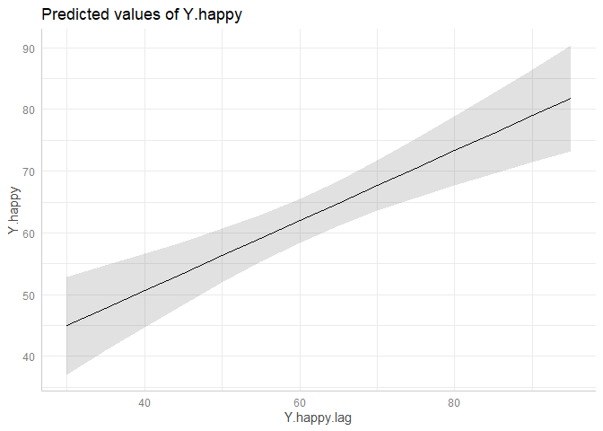<!-- -->

# 8 Estimate linear mixed-effect models for single persons design

Firstly, we estimate a model for a single persons intensive longitudinal
design. As an illustration, we select the data for women participants
and we investigate if enacted response predicts happy.

## 8.1 Linear mixed-effects model to estimate the effect of enacted response on happy assuming Level 1 errors are independent

We consider the women, and we estimate a linear mixed-effects model
assuming the Level 1 errors are independent.

``` r
fit.Model.9 = lme(fixed = Y.happy ~ 1 + X.Actor.c,
                  random = ~ 1 + X.Actor.c|subject.ID,
                  data = data.dyad[which(data.dyad$Gender=='M'),], na.action=na.omit, 
                  control=list(msVerbose=FALSE, maxIter=500, msMaxIter=500)) 

summary(fit.Model.9)
```

    ## Linear mixed-effects model fit by REML
    ##   Data: data.dyad[which(data.dyad$Gender == "M"), ] 
    ##        AIC      BIC    logLik
    ##   46494.16 46533.76 -23241.08
    ## 
    ## Random effects:
    ##  Formula: ~1 + X.Actor.c | subject.ID
    ##  Structure: General positive-definite, Log-Cholesky parametrization
    ##             StdDev    Corr  
    ## (Intercept) 11.841049 (Intr)
    ## X.Actor.c    0.229827 0.064 
    ## Residual    16.856556       
    ## 
    ## Fixed effects:  Y.happy ~ 1 + X.Actor.c 
    ##                Value Std.Error   DF  t-value p-value
    ## (Intercept) 62.97267 1.2427217 5333 50.67319       0
    ## X.Actor.c    0.31412 0.0310157 5333 10.12783       0
    ##  Correlation: 
    ##           (Intr)
    ## X.Actor.c 0.048 
    ## 
    ## Standardized Within-Group Residuals:
    ##         Min          Q1         Med          Q3         Max 
    ## -4.79330627 -0.49866163  0.09391017  0.60635013  3.80155090 
    ## 
    ## Number of Observations: 5428
    ## Number of Groups: 94

``` r
tab_model(fit.Model.9)
```

<table style="border-collapse:collapse; border:none;">
<tr>
<th style="border-top: double; text-align:center; font-style:normal; font-weight:bold; padding:0.2cm;  text-align:left; ">

 

</th>
<th colspan="3" style="border-top: double; text-align:center; font-style:normal; font-weight:bold; padding:0.2cm; ">

Y.happy

</th>
</tr>
<tr>
<td style=" text-align:center; border-bottom:1px solid; font-style:italic; font-weight:normal;  text-align:left; ">

Predictors

</td>
<td style=" text-align:center; border-bottom:1px solid; font-style:italic; font-weight:normal;  ">

Estimates

</td>
<td style=" text-align:center; border-bottom:1px solid; font-style:italic; font-weight:normal;  ">

CI

</td>
<td style=" text-align:center; border-bottom:1px solid; font-style:italic; font-weight:normal;  ">

p

</td>
</tr>
<tr>
<td style=" padding:0.2cm; text-align:left; vertical-align:top; text-align:left; ">

(Intercept)

</td>
<td style=" padding:0.2cm; text-align:left; vertical-align:top; text-align:center;  ">

62.97

</td>
<td style=" padding:0.2cm; text-align:left; vertical-align:top; text-align:center;  ">

60.54 – 65.41

</td>
<td style=" padding:0.2cm; text-align:left; vertical-align:top; text-align:center;  ">

<strong>\<0.001</strong>

</td>
</tr>
<tr>
<td style=" padding:0.2cm; text-align:left; vertical-align:top; text-align:left; ">

X Actor c

</td>
<td style=" padding:0.2cm; text-align:left; vertical-align:top; text-align:center;  ">

0.31

</td>
<td style=" padding:0.2cm; text-align:left; vertical-align:top; text-align:center;  ">

0.25 – 0.37

</td>
<td style=" padding:0.2cm; text-align:left; vertical-align:top; text-align:center;  ">

<strong>\<0.001</strong>

</td>
</tr>
<tr>
<td colspan="4" style="font-weight:bold; text-align:left; padding-top:.8em;">

Random Effects

</td>
</tr>
<tr>
<td style=" padding:0.2cm; text-align:left; vertical-align:top; text-align:left; padding-top:0.1cm; padding-bottom:0.1cm;">

σ<sup>2</sup>

</td>
<td style=" padding:0.2cm; text-align:left; vertical-align:top; padding-top:0.1cm; padding-bottom:0.1cm; text-align:left;" colspan="3">

284.14

</td>
</tr>
<tr>
<td style=" padding:0.2cm; text-align:left; vertical-align:top; text-align:left; padding-top:0.1cm; padding-bottom:0.1cm;">

τ<sub>00</sub> <sub>subject.ID</sub>

</td>
<td style=" padding:0.2cm; text-align:left; vertical-align:top; padding-top:0.1cm; padding-bottom:0.1cm; text-align:left;" colspan="3">

140.21

</td>
<tr>
<td style=" padding:0.2cm; text-align:left; vertical-align:top; text-align:left; padding-top:0.1cm; padding-bottom:0.1cm;">

τ<sub>11</sub> <sub>subject.ID.X.Actor.c</sub>

</td>
<td style=" padding:0.2cm; text-align:left; vertical-align:top; padding-top:0.1cm; padding-bottom:0.1cm; text-align:left;" colspan="3">

0.05

</td>
<tr>
<td style=" padding:0.2cm; text-align:left; vertical-align:top; text-align:left; padding-top:0.1cm; padding-bottom:0.1cm;">

ρ<sub>01</sub> <sub>subject.ID</sub>

</td>
<td style=" padding:0.2cm; text-align:left; vertical-align:top; padding-top:0.1cm; padding-bottom:0.1cm; text-align:left;" colspan="3">

0.06

</td>
<tr>
<td style=" padding:0.2cm; text-align:left; vertical-align:top; text-align:left; padding-top:0.1cm; padding-bottom:0.1cm;">

ICC

</td>
<td style=" padding:0.2cm; text-align:left; vertical-align:top; padding-top:0.1cm; padding-bottom:0.1cm; text-align:left;" colspan="3">

0.35

</td>
<tr>
<td style=" padding:0.2cm; text-align:left; vertical-align:top; text-align:left; padding-top:0.1cm; padding-bottom:0.1cm;">

N <sub>subject.ID</sub>

</td>
<td style=" padding:0.2cm; text-align:left; vertical-align:top; padding-top:0.1cm; padding-bottom:0.1cm; text-align:left;" colspan="3">

94

</td>
<tr>
<td style=" padding:0.2cm; text-align:left; vertical-align:top; text-align:left; padding-top:0.1cm; padding-bottom:0.1cm; border-top:1px solid;">

Observations

</td>
<td style=" padding:0.2cm; text-align:left; vertical-align:top; padding-top:0.1cm; padding-bottom:0.1cm; text-align:left; border-top:1px solid;" colspan="3">

5428

</td>
</tr>
<tr>
<td style=" padding:0.2cm; text-align:left; vertical-align:top; text-align:left; padding-top:0.1cm; padding-bottom:0.1cm;">

Marginal R<sup>2</sup> / Conditional R<sup>2</sup>

</td>
<td style=" padding:0.2cm; text-align:left; vertical-align:top; padding-top:0.1cm; padding-bottom:0.1cm; text-align:left;" colspan="3">

0.043 / 0.375

</td>
</tr>
</table>

``` r
# Plot predictions for the person-mean centered enacted response for 5 persons
ggpredict(fit.Model.9, terms = c("X.Actor.c", "subject.ID [811,810,804]"), type = "random") |> plot()
```

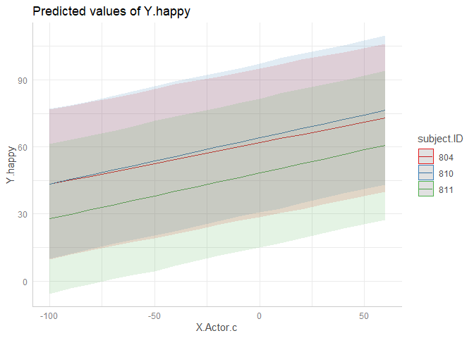<!-- -->

## 8.2 Linear mixed-effects model to estimate the effect of enacted response on happy assuming Level 1 errors follow an Autorregressive (AR(1)) model

We consider the women, and we estimate a linear mixed-effects model
assuming the Level 1 errors follow and AR(1) process.

``` r
fit.Model.10 = lme(fixed = Y.happy ~ 1 + X.Actor.c,
                  random = ~ 1 + X.Actor.c|subject.ID,
                  corr = corAR1(),
                  data = data.dyad[which(data.dyad$Gender=='M'),], na.action=na.omit, 
                  control=list(msVerbose=FALSE, maxIter=500, msMaxIter=500)) 

summary(fit.Model.10)
```

    ## Linear mixed-effects model fit by REML
    ##   Data: data.dyad[which(data.dyad$Gender == "M"), ] 
    ##        AIC      BIC    logLik
    ##   45774.94 45821.13 -22880.47
    ## 
    ## Random effects:
    ##  Formula: ~1 + X.Actor.c | subject.ID
    ##  Structure: General positive-definite, Log-Cholesky parametrization
    ##             StdDev     Corr  
    ## (Intercept) 11.5664744 (Intr)
    ## X.Actor.c    0.1801181 0.088 
    ## Residual    17.1436922       
    ## 
    ## Correlation Structure: AR(1)
    ##  Formula: ~1 | subject.ID 
    ##  Parameter estimate(s):
    ##       Phi 
    ## 0.3746919 
    ## Fixed effects:  Y.happy ~ 1 + X.Actor.c 
    ##                Value Std.Error   DF  t-value p-value
    ## (Intercept) 63.04149  1.241241 5333 50.78908       0
    ## X.Actor.c    0.25109  0.026434 5333  9.49866       0
    ##  Correlation: 
    ##           (Intr)
    ## X.Actor.c 0.059 
    ## 
    ## Standardized Within-Group Residuals:
    ##         Min          Q1         Med          Q3         Max 
    ## -4.56349832 -0.50025726  0.09552875  0.61481281  3.11810604 
    ## 
    ## Number of Observations: 5428
    ## Number of Groups: 94

``` r
tab_model(fit.Model.10)
```

<table style="border-collapse:collapse; border:none;">
<tr>
<th style="border-top: double; text-align:center; font-style:normal; font-weight:bold; padding:0.2cm;  text-align:left; ">

 

</th>
<th colspan="3" style="border-top: double; text-align:center; font-style:normal; font-weight:bold; padding:0.2cm; ">

Y.happy

</th>
</tr>
<tr>
<td style=" text-align:center; border-bottom:1px solid; font-style:italic; font-weight:normal;  text-align:left; ">

Predictors

</td>
<td style=" text-align:center; border-bottom:1px solid; font-style:italic; font-weight:normal;  ">

Estimates

</td>
<td style=" text-align:center; border-bottom:1px solid; font-style:italic; font-weight:normal;  ">

CI

</td>
<td style=" text-align:center; border-bottom:1px solid; font-style:italic; font-weight:normal;  ">

p

</td>
</tr>
<tr>
<td style=" padding:0.2cm; text-align:left; vertical-align:top; text-align:left; ">

(Intercept)

</td>
<td style=" padding:0.2cm; text-align:left; vertical-align:top; text-align:center;  ">

63.04

</td>
<td style=" padding:0.2cm; text-align:left; vertical-align:top; text-align:center;  ">

60.61 – 65.47

</td>
<td style=" padding:0.2cm; text-align:left; vertical-align:top; text-align:center;  ">

<strong>\<0.001</strong>

</td>
</tr>
<tr>
<td style=" padding:0.2cm; text-align:left; vertical-align:top; text-align:left; ">

X Actor c

</td>
<td style=" padding:0.2cm; text-align:left; vertical-align:top; text-align:center;  ">

0.25

</td>
<td style=" padding:0.2cm; text-align:left; vertical-align:top; text-align:center;  ">

0.20 – 0.30

</td>
<td style=" padding:0.2cm; text-align:left; vertical-align:top; text-align:center;  ">

<strong>\<0.001</strong>

</td>
</tr>
<tr>
<td colspan="4" style="font-weight:bold; text-align:left; padding-top:.8em;">

Random Effects

</td>
</tr>
<tr>
<td style=" padding:0.2cm; text-align:left; vertical-align:top; text-align:left; padding-top:0.1cm; padding-bottom:0.1cm;">

σ<sup>2</sup>

</td>
<td style=" padding:0.2cm; text-align:left; vertical-align:top; padding-top:0.1cm; padding-bottom:0.1cm; text-align:left;" colspan="3">

293.91

</td>
</tr>
<tr>
<td style=" padding:0.2cm; text-align:left; vertical-align:top; text-align:left; padding-top:0.1cm; padding-bottom:0.1cm;">

τ<sub>00</sub> <sub>subject.ID</sub>

</td>
<td style=" padding:0.2cm; text-align:left; vertical-align:top; padding-top:0.1cm; padding-bottom:0.1cm; text-align:left;" colspan="3">

133.78

</td>
<tr>
<td style=" padding:0.2cm; text-align:left; vertical-align:top; text-align:left; padding-top:0.1cm; padding-bottom:0.1cm;">

τ<sub>11</sub> <sub>subject.ID.X.Actor.c</sub>

</td>
<td style=" padding:0.2cm; text-align:left; vertical-align:top; padding-top:0.1cm; padding-bottom:0.1cm; text-align:left;" colspan="3">

0.03

</td>
<tr>
<td style=" padding:0.2cm; text-align:left; vertical-align:top; text-align:left; padding-top:0.1cm; padding-bottom:0.1cm;">

ρ<sub>01</sub> <sub>subject.ID</sub>

</td>
<td style=" padding:0.2cm; text-align:left; vertical-align:top; padding-top:0.1cm; padding-bottom:0.1cm; text-align:left;" colspan="3">

0.09

</td>
<tr>
<td style=" padding:0.2cm; text-align:left; vertical-align:top; text-align:left; padding-top:0.1cm; padding-bottom:0.1cm;">

ICC

</td>
<td style=" padding:0.2cm; text-align:left; vertical-align:top; padding-top:0.1cm; padding-bottom:0.1cm; text-align:left;" colspan="3">

0.32

</td>
<tr>
<td style=" padding:0.2cm; text-align:left; vertical-align:top; text-align:left; padding-top:0.1cm; padding-bottom:0.1cm;">

N <sub>subject.ID</sub>

</td>
<td style=" padding:0.2cm; text-align:left; vertical-align:top; padding-top:0.1cm; padding-bottom:0.1cm; text-align:left;" colspan="3">

94

</td>
<tr>
<td style=" padding:0.2cm; text-align:left; vertical-align:top; text-align:left; padding-top:0.1cm; padding-bottom:0.1cm; border-top:1px solid;">

Observations

</td>
<td style=" padding:0.2cm; text-align:left; vertical-align:top; padding-top:0.1cm; padding-bottom:0.1cm; text-align:left; border-top:1px solid;" colspan="3">

5428

</td>
</tr>
<tr>
<td style=" padding:0.2cm; text-align:left; vertical-align:top; text-align:left; padding-top:0.1cm; padding-bottom:0.1cm;">

Marginal R<sup>2</sup> / Conditional R<sup>2</sup>

</td>
<td style=" padding:0.2cm; text-align:left; vertical-align:top; padding-top:0.1cm; padding-bottom:0.1cm; text-align:left;" colspan="3">

0.028 / 0.342

</td>
</tr>
</table>

``` r
# Plot predictions for the person-mean centered enacted response for 5 persons
ggpredict(fit.Model.10, terms = c("X.Actor.c", "subject.ID [811,810,804]"), type = "random") |> plot()
```

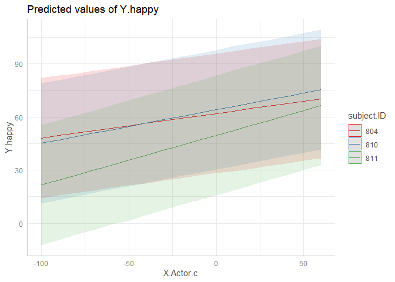<!-- -->

## 8.3 Linear mixed-effects model to estimate the effect of enacted response on happy assuming Level 1 errors are independent including moderation effects

We consider the women, and we estimate a linear mixed-effects model
assuming the Level 1 errors are independent and including moderation
effects of a time-varying dummy variable indicating whether partners
where together in the moment of the assessment.

``` r
fit.Model.11 = lme(fixed = Y.happy ~ 1 + X.Actor.c + D + X.Actor.c*D,
                  random = ~ 1 + X.Actor.c + D|subject.ID,
                  data = data.dyad[which(data.dyad$Gender=='M'),], na.action=na.omit, 
                  control=list(msVerbose=FALSE, maxIter=500, msMaxIter=500)) 

summary(fit.Model.11)
```

    ## Linear mixed-effects model fit by REML
    ##   Data: data.dyad[which(data.dyad$Gender == "M"), ] 
    ##        AIC      BIC    logLik
    ##   43965.57 44037.57 -21971.78
    ## 
    ## Random effects:
    ##  Formula: ~1 + X.Actor.c + D | subject.ID
    ##  Structure: General positive-definite, Log-Cholesky parametrization
    ##             StdDev     Corr         
    ## (Intercept) 12.0163929 (Intr) X.Act.
    ## X.Actor.c    0.2266308  0.11        
    ## D            7.0841993 -0.28  -0.30 
    ## Residual    16.4261894              
    ## 
    ## Fixed effects:  Y.happy ~ 1 + X.Actor.c + D + X.Actor.c * D 
    ##                Value Std.Error   DF  t-value p-value
    ## (Intercept) 60.11914 1.3186985 5053 45.58976       0
    ## X.Actor.c    0.18833 0.0396116 5053  4.75432       0
    ## D            4.32581 0.9238511 5053  4.68237       0
    ## X.Actor.c:D  0.19214 0.0396783 5053  4.84256       0
    ##  Correlation: 
    ##             (Intr) X.Act. D     
    ## X.Actor.c    0.086              
    ## D           -0.381 -0.167       
    ## X.Actor.c:D -0.027 -0.627  0.010
    ## 
    ## Standardized Within-Group Residuals:
    ##         Min          Q1         Med          Q3         Max 
    ## -4.87094305 -0.48430754  0.08383557  0.59187470  3.49175473 
    ## 
    ## Number of Observations: 5150
    ## Number of Groups: 94

``` r
tab_model(fit.Model.11)
```

<table style="border-collapse:collapse; border:none;">
<tr>
<th style="border-top: double; text-align:center; font-style:normal; font-weight:bold; padding:0.2cm;  text-align:left; ">

 

</th>
<th colspan="3" style="border-top: double; text-align:center; font-style:normal; font-weight:bold; padding:0.2cm; ">

Y.happy

</th>
</tr>
<tr>
<td style=" text-align:center; border-bottom:1px solid; font-style:italic; font-weight:normal;  text-align:left; ">

Predictors

</td>
<td style=" text-align:center; border-bottom:1px solid; font-style:italic; font-weight:normal;  ">

Estimates

</td>
<td style=" text-align:center; border-bottom:1px solid; font-style:italic; font-weight:normal;  ">

CI

</td>
<td style=" text-align:center; border-bottom:1px solid; font-style:italic; font-weight:normal;  ">

p

</td>
</tr>
<tr>
<td style=" padding:0.2cm; text-align:left; vertical-align:top; text-align:left; ">

(Intercept)

</td>
<td style=" padding:0.2cm; text-align:left; vertical-align:top; text-align:center;  ">

60.12

</td>
<td style=" padding:0.2cm; text-align:left; vertical-align:top; text-align:center;  ">

57.53 – 62.70

</td>
<td style=" padding:0.2cm; text-align:left; vertical-align:top; text-align:center;  ">

<strong>\<0.001</strong>

</td>
</tr>
<tr>
<td style=" padding:0.2cm; text-align:left; vertical-align:top; text-align:left; ">

X Actor c

</td>
<td style=" padding:0.2cm; text-align:left; vertical-align:top; text-align:center;  ">

0.19

</td>
<td style=" padding:0.2cm; text-align:left; vertical-align:top; text-align:center;  ">

0.11 – 0.27

</td>
<td style=" padding:0.2cm; text-align:left; vertical-align:top; text-align:center;  ">

<strong>\<0.001</strong>

</td>
</tr>
<tr>
<td style=" padding:0.2cm; text-align:left; vertical-align:top; text-align:left; ">

D

</td>
<td style=" padding:0.2cm; text-align:left; vertical-align:top; text-align:center;  ">

4.33

</td>
<td style=" padding:0.2cm; text-align:left; vertical-align:top; text-align:center;  ">

2.51 – 6.14

</td>
<td style=" padding:0.2cm; text-align:left; vertical-align:top; text-align:center;  ">

<strong>\<0.001</strong>

</td>
</tr>
<tr>
<td style=" padding:0.2cm; text-align:left; vertical-align:top; text-align:left; ">

X Actor c \* D

</td>
<td style=" padding:0.2cm; text-align:left; vertical-align:top; text-align:center;  ">

0.19

</td>
<td style=" padding:0.2cm; text-align:left; vertical-align:top; text-align:center;  ">

0.11 – 0.27

</td>
<td style=" padding:0.2cm; text-align:left; vertical-align:top; text-align:center;  ">

<strong>\<0.001</strong>

</td>
</tr>
<tr>
<td colspan="4" style="font-weight:bold; text-align:left; padding-top:.8em;">

Random Effects

</td>
</tr>
<tr>
<td style=" padding:0.2cm; text-align:left; vertical-align:top; text-align:left; padding-top:0.1cm; padding-bottom:0.1cm;">

σ<sup>2</sup>

</td>
<td style=" padding:0.2cm; text-align:left; vertical-align:top; padding-top:0.1cm; padding-bottom:0.1cm; text-align:left;" colspan="3">

269.82

</td>
</tr>
<tr>
<td style=" padding:0.2cm; text-align:left; vertical-align:top; text-align:left; padding-top:0.1cm; padding-bottom:0.1cm;">

τ<sub>00</sub> <sub>subject.ID</sub>

</td>
<td style=" padding:0.2cm; text-align:left; vertical-align:top; padding-top:0.1cm; padding-bottom:0.1cm; text-align:left;" colspan="3">

144.39

</td>
<tr>
<td style=" padding:0.2cm; text-align:left; vertical-align:top; text-align:left; padding-top:0.1cm; padding-bottom:0.1cm;">

τ<sub>11</sub> <sub>subject.ID.X.Actor.c</sub>

</td>
<td style=" padding:0.2cm; text-align:left; vertical-align:top; padding-top:0.1cm; padding-bottom:0.1cm; text-align:left;" colspan="3">

0.05

</td>
<tr>
<td style=" padding:0.2cm; text-align:left; vertical-align:top; text-align:left; padding-top:0.1cm; padding-bottom:0.1cm;">

τ<sub>11</sub> <sub>subject.ID.D</sub>

</td>
<td style=" padding:0.2cm; text-align:left; vertical-align:top; padding-top:0.1cm; padding-bottom:0.1cm; text-align:left;" colspan="3">

50.19

</td>
<tr>
<td style=" padding:0.2cm; text-align:left; vertical-align:top; text-align:left; padding-top:0.1cm; padding-bottom:0.1cm;">

ρ<sub>01</sub>

</td>
<td style=" padding:0.2cm; text-align:left; vertical-align:top; padding-top:0.1cm; padding-bottom:0.1cm; text-align:left;" colspan="3">

0.11

</td>
<tr>
<td style=" padding:0.2cm; text-align:left; vertical-align:top; text-align:left; padding-top:0.1cm; padding-bottom:0.1cm;">
</td>
<td style=" padding:0.2cm; text-align:left; vertical-align:top; padding-top:0.1cm; padding-bottom:0.1cm; text-align:left;" colspan="3">

-0.28

</td>
<tr>
<td style=" padding:0.2cm; text-align:left; vertical-align:top; text-align:left; padding-top:0.1cm; padding-bottom:0.1cm;">

ICC

</td>
<td style=" padding:0.2cm; text-align:left; vertical-align:top; padding-top:0.1cm; padding-bottom:0.1cm; text-align:left;" colspan="3">

0.37

</td>
<tr>
<td style=" padding:0.2cm; text-align:left; vertical-align:top; text-align:left; padding-top:0.1cm; padding-bottom:0.1cm;">

N <sub>subject.ID</sub>

</td>
<td style=" padding:0.2cm; text-align:left; vertical-align:top; padding-top:0.1cm; padding-bottom:0.1cm; text-align:left;" colspan="3">

94

</td>
<tr>
<td style=" padding:0.2cm; text-align:left; vertical-align:top; text-align:left; padding-top:0.1cm; padding-bottom:0.1cm; border-top:1px solid;">

Observations

</td>
<td style=" padding:0.2cm; text-align:left; vertical-align:top; padding-top:0.1cm; padding-bottom:0.1cm; text-align:left; border-top:1px solid;" colspan="3">

5150

</td>
</tr>
<tr>
<td style=" padding:0.2cm; text-align:left; vertical-align:top; text-align:left; padding-top:0.1cm; padding-bottom:0.1cm;">

Marginal R<sup>2</sup> / Conditional R<sup>2</sup>

</td>
<td style=" padding:0.2cm; text-align:left; vertical-align:top; padding-top:0.1cm; padding-bottom:0.1cm; text-align:left;" colspan="3">

0.059 / 0.403

</td>
</tr>
</table>

``` r
# Plot predictions for the person-mean centered enacted response for 5 persons
ggpredict(fit.Model.10, terms = c("X.Actor.c", "subject.ID [811,810,804]"), type = "random") |> plot()
```

<!-- -->

## 8.4 Linear mixed-effects model to estimate the autoregressive effect of happiness

Next, we estimate a multilevel AR(1) model using a linear mixed-effects
model for women.

``` r
fit.Model.12 = lme(fixed = Y.happy ~ 1 + Y.happy.lag,
                  random = ~ 1 + Y.happy.lag|subject.ID,
                  data = data.dyad[which(data.dyad$Gender=='M'),], na.action=na.omit, 
                  control=list(msVerbose=FALSE, maxIter=500, msMaxIter=500)) 

summary(fit.Model.12)
```

    ## Linear mixed-effects model fit by REML
    ##   Data: data.dyad[which(data.dyad$Gender == "M"), ] 
    ##        AIC      BIC    logLik
    ##   38257.09 38295.62 -19122.54
    ## 
    ## Random effects:
    ##  Formula: ~1 + Y.happy.lag | subject.ID
    ##  Structure: General positive-definite, Log-Cholesky parametrization
    ##             StdDev     Corr  
    ## (Intercept) 11.3325530 (Intr)
    ## Y.happy.lag  0.1560351 -0.838
    ## Residual    15.6965118       
    ## 
    ## Fixed effects:  Y.happy ~ 1 + Y.happy.lag 
    ##                Value Std.Error   DF  t-value p-value
    ## (Intercept) 35.16224 1.5045429 4454 23.37071       0
    ## Y.happy.lag  0.44760 0.0215689 4454 20.75221       0
    ##  Correlation: 
    ##             (Intr)
    ## Y.happy.lag -0.888
    ## 
    ## Standardized Within-Group Residuals:
    ##         Min          Q1         Med          Q3         Max 
    ## -5.42617148 -0.46931246  0.08405591  0.57015702  4.61786596 
    ## 
    ## Number of Observations: 4549
    ## Number of Groups: 94

``` r
tab_model(fit.Model.12)
```

<table style="border-collapse:collapse; border:none;">
<tr>
<th style="border-top: double; text-align:center; font-style:normal; font-weight:bold; padding:0.2cm;  text-align:left; ">

 

</th>
<th colspan="3" style="border-top: double; text-align:center; font-style:normal; font-weight:bold; padding:0.2cm; ">

Y.happy

</th>
</tr>
<tr>
<td style=" text-align:center; border-bottom:1px solid; font-style:italic; font-weight:normal;  text-align:left; ">

Predictors

</td>
<td style=" text-align:center; border-bottom:1px solid; font-style:italic; font-weight:normal;  ">

Estimates

</td>
<td style=" text-align:center; border-bottom:1px solid; font-style:italic; font-weight:normal;  ">

CI

</td>
<td style=" text-align:center; border-bottom:1px solid; font-style:italic; font-weight:normal;  ">

p

</td>
</tr>
<tr>
<td style=" padding:0.2cm; text-align:left; vertical-align:top; text-align:left; ">

(Intercept)

</td>
<td style=" padding:0.2cm; text-align:left; vertical-align:top; text-align:center;  ">

35.16

</td>
<td style=" padding:0.2cm; text-align:left; vertical-align:top; text-align:center;  ">

32.21 – 38.11

</td>
<td style=" padding:0.2cm; text-align:left; vertical-align:top; text-align:center;  ">

<strong>\<0.001</strong>

</td>
</tr>
<tr>
<td style=" padding:0.2cm; text-align:left; vertical-align:top; text-align:left; ">

Y happy lag

</td>
<td style=" padding:0.2cm; text-align:left; vertical-align:top; text-align:center;  ">

0.45

</td>
<td style=" padding:0.2cm; text-align:left; vertical-align:top; text-align:center;  ">

0.41 – 0.49

</td>
<td style=" padding:0.2cm; text-align:left; vertical-align:top; text-align:center;  ">

<strong>\<0.001</strong>

</td>
</tr>
<tr>
<td colspan="4" style="font-weight:bold; text-align:left; padding-top:.8em;">

Random Effects

</td>
</tr>
<tr>
<td style=" padding:0.2cm; text-align:left; vertical-align:top; text-align:left; padding-top:0.1cm; padding-bottom:0.1cm;">

σ<sup>2</sup>

</td>
<td style=" padding:0.2cm; text-align:left; vertical-align:top; padding-top:0.1cm; padding-bottom:0.1cm; text-align:left;" colspan="3">

246.38

</td>
</tr>
<tr>
<td style=" padding:0.2cm; text-align:left; vertical-align:top; text-align:left; padding-top:0.1cm; padding-bottom:0.1cm;">

τ<sub>00</sub> <sub>subject.ID</sub>

</td>
<td style=" padding:0.2cm; text-align:left; vertical-align:top; padding-top:0.1cm; padding-bottom:0.1cm; text-align:left;" colspan="3">

128.43

</td>
<tr>
<td style=" padding:0.2cm; text-align:left; vertical-align:top; text-align:left; padding-top:0.1cm; padding-bottom:0.1cm;">

τ<sub>11</sub> <sub>subject.ID.Y.happy.lag</sub>

</td>
<td style=" padding:0.2cm; text-align:left; vertical-align:top; padding-top:0.1cm; padding-bottom:0.1cm; text-align:left;" colspan="3">

0.02

</td>
<tr>
<td style=" padding:0.2cm; text-align:left; vertical-align:top; text-align:left; padding-top:0.1cm; padding-bottom:0.1cm;">

ρ<sub>01</sub> <sub>subject.ID</sub>

</td>
<td style=" padding:0.2cm; text-align:left; vertical-align:top; padding-top:0.1cm; padding-bottom:0.1cm; text-align:left;" colspan="3">

-0.84

</td>
<tr>
<td style=" padding:0.2cm; text-align:left; vertical-align:top; text-align:left; padding-top:0.1cm; padding-bottom:0.1cm;">

ICC

</td>
<td style=" padding:0.2cm; text-align:left; vertical-align:top; padding-top:0.1cm; padding-bottom:0.1cm; text-align:left;" colspan="3">

0.17

</td>
<tr>
<td style=" padding:0.2cm; text-align:left; vertical-align:top; text-align:left; padding-top:0.1cm; padding-bottom:0.1cm;">

N <sub>subject.ID</sub>

</td>
<td style=" padding:0.2cm; text-align:left; vertical-align:top; padding-top:0.1cm; padding-bottom:0.1cm; text-align:left;" colspan="3">

94

</td>
<tr>
<td style=" padding:0.2cm; text-align:left; vertical-align:top; text-align:left; padding-top:0.1cm; padding-bottom:0.1cm; border-top:1px solid;">

Observations

</td>
<td style=" padding:0.2cm; text-align:left; vertical-align:top; padding-top:0.1cm; padding-bottom:0.1cm; text-align:left; border-top:1px solid;" colspan="3">

4549

</td>
</tr>
<tr>
<td style=" padding:0.2cm; text-align:left; vertical-align:top; text-align:left; padding-top:0.1cm; padding-bottom:0.1cm;">

Marginal R<sup>2</sup> / Conditional R<sup>2</sup>

</td>
<td style=" padding:0.2cm; text-align:left; vertical-align:top; padding-top:0.1cm; padding-bottom:0.1cm; text-align:left;" colspan="3">

0.234 / 0.361

</td>
</tr>
</table>

# 9 Estimate longitudinal actor and partner interdependence model (L-APIM)

We estimate the longitudinal APIM using ESM data.

## 9.1 L-APIM for distinguishable partners

We estimate the L-APIM using linear mixed-effects models for
distinguishable partners.

``` r
fit.Model.13 = lme(fixed = Y.happy ~ -1 + Female + Female:X.Actor.c  + Female:X.Partner.c  + 
                  Male + Male:X.Actor.c + Male:X.Partner.c,
                  random = ~ -1 + Female + Male |dyad.ID, 
                  correlation = corCompSymm(form = ~1|dyad.ID/Obs),
                  weights = varIdent(form = ~1|Gender),
                  data = data.dyad, na.action=na.omit, 
                  control=list(msVerbose=FALSE, maxIter=500, msMaxIter=500)) 

summary(fit.Model.13)
```

    ## Linear mixed-effects model fit by REML
    ##   Data: data.dyad 
    ##        AIC      BIC    logLik
    ##   88628.18 88715.06 -44302.09
    ## 
    ## Random effects:
    ##  Formula: ~-1 + Female + Male | dyad.ID
    ##  Structure: General positive-definite, Log-Cholesky parametrization
    ##          StdDev   Corr  
    ## Female   11.83800 Female
    ## Male     11.85367 0.351 
    ## Residual 18.05502       
    ## 
    ## Correlation Structure: Compound symmetry
    ##  Formula: ~1 | dyad.ID/Obs 
    ##  Parameter estimate(s):
    ##       Rho 
    ## 0.2263809 
    ## Variance function:
    ##  Structure: Different standard deviations per stratum
    ##  Formula: ~1 | Gender 
    ##  Parameter estimates:
    ##         F         M 
    ## 1.0000000 0.9429955 
    ## Fixed effects:  Y.happy ~ -1 + Female + Female:X.Actor.c + Female:X.Partner.c +      Male + Male:X.Actor.c + Male:X.Partner.c 
    ##                       Value Std.Error    DF  t-value p-value
    ## Female             62.42505 1.2470215 10204 50.05932       0
    ## Male               63.02523 1.2457716 10204 50.59132       0
    ## Female:X.Actor.c    0.34897 0.0176373 10204 19.78607       0
    ## Female:X.Partner.c  0.08547 0.0178220 10204  4.79579       0
    ## X.Actor.c:Male      0.28383 0.0168072 10204 16.88750       0
    ## X.Partner.c:Male    0.14460 0.0166336 10204  8.69306       0
    ##  Correlation: 
    ##                    Female Male   F:X.A. F:X.P. X.A.:M
    ## Male                0.346                            
    ## Female:X.Actor.c    0.000  0.000                     
    ## Female:X.Partner.c  0.001  0.000 -0.131              
    ## X.Actor.c:Male      0.000  0.001 -0.030  0.226       
    ## X.Partner.c:Male    0.000  0.000  0.226 -0.030 -0.131
    ## 
    ## Standardized Within-Group Residuals:
    ##         Min          Q1         Med          Q3         Max 
    ## -4.77735205 -0.53067129  0.06530498  0.63679587  4.09250772 
    ## 
    ## Number of Observations: 10303
    ## Number of Groups: 94

``` r
tab_model(fit.Model.13)
```

<table style="border-collapse:collapse; border:none;">
<tr>
<th style="border-top: double; text-align:center; font-style:normal; font-weight:bold; padding:0.2cm;  text-align:left; ">

 

</th>
<th colspan="3" style="border-top: double; text-align:center; font-style:normal; font-weight:bold; padding:0.2cm; ">

Y.happy

</th>
</tr>
<tr>
<td style=" text-align:center; border-bottom:1px solid; font-style:italic; font-weight:normal;  text-align:left; ">

Predictors

</td>
<td style=" text-align:center; border-bottom:1px solid; font-style:italic; font-weight:normal;  ">

Estimates

</td>
<td style=" text-align:center; border-bottom:1px solid; font-style:italic; font-weight:normal;  ">

CI

</td>
<td style=" text-align:center; border-bottom:1px solid; font-style:italic; font-weight:normal;  ">

p

</td>
</tr>
<tr>
<td style=" padding:0.2cm; text-align:left; vertical-align:top; text-align:left; ">

Female

</td>
<td style=" padding:0.2cm; text-align:left; vertical-align:top; text-align:center;  ">

62.43

</td>
<td style=" padding:0.2cm; text-align:left; vertical-align:top; text-align:center;  ">

59.98 – 64.87

</td>
<td style=" padding:0.2cm; text-align:left; vertical-align:top; text-align:center;  ">

<strong>\<0.001</strong>

</td>
</tr>
<tr>
<td style=" padding:0.2cm; text-align:left; vertical-align:top; text-align:left; ">

Male

</td>
<td style=" padding:0.2cm; text-align:left; vertical-align:top; text-align:center;  ">

63.03

</td>
<td style=" padding:0.2cm; text-align:left; vertical-align:top; text-align:center;  ">

60.58 – 65.47

</td>
<td style=" padding:0.2cm; text-align:left; vertical-align:top; text-align:center;  ">

<strong>\<0.001</strong>

</td>
</tr>
<tr>
<td style=" padding:0.2cm; text-align:left; vertical-align:top; text-align:left; ">

Female \* X Actor c

</td>
<td style=" padding:0.2cm; text-align:left; vertical-align:top; text-align:center;  ">

0.35

</td>
<td style=" padding:0.2cm; text-align:left; vertical-align:top; text-align:center;  ">

0.31 – 0.38

</td>
<td style=" padding:0.2cm; text-align:left; vertical-align:top; text-align:center;  ">

<strong>\<0.001</strong>

</td>
</tr>
<tr>
<td style=" padding:0.2cm; text-align:left; vertical-align:top; text-align:left; ">

Female \* X Partner c

</td>
<td style=" padding:0.2cm; text-align:left; vertical-align:top; text-align:center;  ">

0.09

</td>
<td style=" padding:0.2cm; text-align:left; vertical-align:top; text-align:center;  ">

0.05 – 0.12

</td>
<td style=" padding:0.2cm; text-align:left; vertical-align:top; text-align:center;  ">

<strong>\<0.001</strong>

</td>
</tr>
<tr>
<td style=" padding:0.2cm; text-align:left; vertical-align:top; text-align:left; ">

X Actor c \* Male

</td>
<td style=" padding:0.2cm; text-align:left; vertical-align:top; text-align:center;  ">

0.28

</td>
<td style=" padding:0.2cm; text-align:left; vertical-align:top; text-align:center;  ">

0.25 – 0.32

</td>
<td style=" padding:0.2cm; text-align:left; vertical-align:top; text-align:center;  ">

<strong>\<0.001</strong>

</td>
</tr>
<tr>
<td style=" padding:0.2cm; text-align:left; vertical-align:top; text-align:left; ">

X Partner c \* Male

</td>
<td style=" padding:0.2cm; text-align:left; vertical-align:top; text-align:center;  ">

0.14

</td>
<td style=" padding:0.2cm; text-align:left; vertical-align:top; text-align:center;  ">

0.11 – 0.18

</td>
<td style=" padding:0.2cm; text-align:left; vertical-align:top; text-align:center;  ">

<strong>\<0.001</strong>

</td>
</tr>
<tr>
<td colspan="4" style="font-weight:bold; text-align:left; padding-top:.8em;">

Random Effects

</td>
</tr>
<tr>
<td style=" padding:0.2cm; text-align:left; vertical-align:top; text-align:left; padding-top:0.1cm; padding-bottom:0.1cm;">

σ<sup>2</sup>

</td>
<td style=" padding:0.2cm; text-align:left; vertical-align:top; padding-top:0.1cm; padding-bottom:0.1cm; text-align:left;" colspan="3">

325.98

</td>
</tr>
<tr>
<td style=" padding:0.2cm; text-align:left; vertical-align:top; text-align:left; padding-top:0.1cm; padding-bottom:0.1cm;">

τ<sub>00</sub>

</td>
<td style=" padding:0.2cm; text-align:left; vertical-align:top; padding-top:0.1cm; padding-bottom:0.1cm; text-align:left;" colspan="3">

 

</td>
<tr>
<td style=" padding:0.2cm; text-align:left; vertical-align:top; text-align:left; padding-top:0.1cm; padding-bottom:0.1cm;">

τ<sub>00</sub>

</td>
<td style=" padding:0.2cm; text-align:left; vertical-align:top; padding-top:0.1cm; padding-bottom:0.1cm; text-align:left;" colspan="3">

 

</td>
<tr>
<td style=" padding:0.2cm; text-align:left; vertical-align:top; text-align:left; padding-top:0.1cm; padding-bottom:0.1cm;">

τ<sub>11</sub> <sub>dyad.ID.Male</sub>

</td>
<td style=" padding:0.2cm; text-align:left; vertical-align:top; padding-top:0.1cm; padding-bottom:0.1cm; text-align:left;" colspan="3">

140.51

</td>
<tr>
<td style=" padding:0.2cm; text-align:left; vertical-align:top; text-align:left; padding-top:0.1cm; padding-bottom:0.1cm;">

ρ<sub>01</sub> <sub>dyad.ID</sub>

</td>
<td style=" padding:0.2cm; text-align:left; vertical-align:top; padding-top:0.1cm; padding-bottom:0.1cm; text-align:left;" colspan="3">

0.35

</td>
<tr>
<td style=" padding:0.2cm; text-align:left; vertical-align:top; text-align:left; padding-top:0.1cm; padding-bottom:0.1cm;">

ICC

</td>
<td style=" padding:0.2cm; text-align:left; vertical-align:top; padding-top:0.1cm; padding-bottom:0.1cm; text-align:left;" colspan="3">

0.30

</td>
<tr>
<td style=" padding:0.2cm; text-align:left; vertical-align:top; text-align:left; padding-top:0.1cm; padding-bottom:0.1cm;">

N <sub>dyad.ID</sub>

</td>
<td style=" padding:0.2cm; text-align:left; vertical-align:top; padding-top:0.1cm; padding-bottom:0.1cm; text-align:left;" colspan="3">

94

</td>
<tr>
<td style=" padding:0.2cm; text-align:left; vertical-align:top; text-align:left; padding-top:0.1cm; padding-bottom:0.1cm; border-top:1px solid;">

Observations

</td>
<td style=" padding:0.2cm; text-align:left; vertical-align:top; padding-top:0.1cm; padding-bottom:0.1cm; text-align:left; border-top:1px solid;" colspan="3">

10303

</td>
</tr>
<tr>
<td style=" padding:0.2cm; text-align:left; vertical-align:top; text-align:left; padding-top:0.1cm; padding-bottom:0.1cm;">

Marginal R<sup>2</sup> / Conditional R<sup>2</sup>

</td>
<td style=" padding:0.2cm; text-align:left; vertical-align:top; padding-top:0.1cm; padding-bottom:0.1cm; text-align:left;" colspan="3">

0.052 / 0.337

</td>
</tr>
</table>

## 9.2 L-APIM for indistinguishable partners

We estimate the L-APIM using linear mixed-effects models for
indistinguishable partners.

``` r
fit.Model.14 = lme(fixed = Y.happy ~ 1 + X.Actor.c + X.Partner.c,
                  random = list(dyad.ID = pdCompSymm(~ Gender -1)), 
                  correlation = corCompSymm(form = ~1|dyad.ID/Obs),
                  weights = varIdent(form = ~1|Gender),
                  data = data.dyad, na.action=na.omit, 
                  control=list(msVerbose=FALSE, maxIter=500, msMaxIter=500)) 

summary(fit.Model.14)
```

    ## Linear mixed-effects model fit by REML
    ##   Data: data.dyad 
    ##        AIC      BIC    logLik
    ##   88621.06 88678.98 -44302.53
    ## 
    ## Random effects:
    ##  Formula: ~Gender - 1 | dyad.ID
    ##  Structure: Compound Symmetry
    ##          StdDev   Corr 
    ## GenderF  11.82966      
    ## GenderM  11.82966 0.355
    ## Residual 18.06366      
    ## 
    ## Correlation Structure: Compound symmetry
    ##  Formula: ~1 | dyad.ID/Obs 
    ##  Parameter estimate(s):
    ##      Rho 
    ## 0.227246 
    ## Variance function:
    ##  Structure: Different standard deviations per stratum
    ##  Formula: ~1 | Gender 
    ##  Parameter estimates:
    ##        F        M 
    ## 1.000000 0.942975 
    ## Fixed effects:  Y.happy ~ 1 + X.Actor.c + X.Partner.c 
    ##                Value Std.Error    DF  t-value p-value
    ## (Intercept) 62.72811 1.0228125 10207 61.32905       0
    ## X.Actor.c    0.31511 0.0119893 10207 26.28228       0
    ## X.Partner.c  0.11667 0.0119820 10207  9.73732       0
    ##  Correlation: 
    ##             (Intr) X.Act.
    ## X.Actor.c   0.000        
    ## X.Partner.c 0.000  0.098 
    ## 
    ## Standardized Within-Group Residuals:
    ##         Min          Q1         Med          Q3         Max 
    ## -4.74277797 -0.53104361  0.06490643  0.64563509  4.23851584 
    ## 
    ## Number of Observations: 10303
    ## Number of Groups: 94

# 10 Estimate L-APIM with moderation effects

We estimate L-APIM including moderation effects of a dyad-level
time-varying variable on the actor and partner effects.

\##L-APIM for distinguishable dyads with moderation effects

``` r
# Create variables including interaction between predictor enacted response and the time-varying moderation time spend together
data.dyad$D.X.Actor.c = data.dyad$D* data.dyad$X.Actor.c
data.dyad$D.X.Partner.c = data.dyad$D* data.dyad$X.Partner.c

# Estimate L-APIM with moderation effects
fit.Model.15 = lme(fixed = Y.happy ~ -1 + Female + Female:X.Actor.c  + Female:X.Partner.c  + 
                  + Female:D + Female:D.X.Actor.c + Female:D.X.Actor.c +  
                  Male + Male:X.Actor.c + Male:X.Partner.c +
                  + Male:D + Male:D.X.Actor.c + Male:D.X.Actor.c,
                  random = ~ -1 + Female + Male |dyad.ID, 
                  correlation = corCompSymm(form = ~1|dyad.ID/Obs),
                  weights = varIdent(form = ~1|Gender),
                  data = data.dyad, na.action=na.omit, 
                  control=list(msVerbose=FALSE, maxIter=500, msMaxIter=500)) 

summary(fit.Model.15)
```

    ## Linear mixed-effects model fit by REML
    ##   Data: data.dyad 
    ##        AIC      BIC    logLik
    ##   88519.71 88635.54 -44243.86
    ## 
    ## Random effects:
    ##  Formula: ~-1 + Female + Male | dyad.ID
    ##  Structure: General positive-definite, Log-Cholesky parametrization
    ##          StdDev   Corr  
    ## Female   11.69163 Female
    ## Male     11.75162 0.328 
    ## Residual 17.89983       
    ## 
    ## Correlation Structure: Compound symmetry
    ##  Formula: ~1 | dyad.ID/Obs 
    ##  Parameter estimate(s):
    ##       Rho 
    ## 0.2141135 
    ## Variance function:
    ##  Structure: Different standard deviations per stratum
    ##  Formula: ~1 | Gender 
    ##  Parameter estimates:
    ##         F         M 
    ## 1.0000000 0.9455494 
    ## Fixed effects:  Y.happy ~ -1 + Female + Female:X.Actor.c + Female:X.Partner.c +      +Female:D + Female:D.X.Actor.c + Female:D.X.Actor.c + Male +      Male:X.Actor.c + Male:X.Partner.c + +Male:D + Male:D.X.Actor.c +      Male:D.X.Actor.c 
    ##                       Value Std.Error    DF  t-value p-value
    ## Female             59.33392 1.2832740 10200 46.23636  0.0000
    ## Male               60.57244 1.2813122 10200 47.27376  0.0000
    ## Female:X.Actor.c    0.22549 0.0303327 10200  7.43378  0.0000
    ## Female:X.Partner.c  0.07374 0.0177191 10200  4.16161  0.0000
    ## Female:D            4.82943 0.5745518 10200  8.40557  0.0000
    ## Female:D.X.Actor.c  0.17041 0.0369152 10200  4.61626  0.0000
    ## X.Actor.c:Male      0.20681 0.0273643 10200  7.55777  0.0000
    ## X.Partner.c:Male    0.13624 0.0165721 10200  8.22124  0.0000
    ## D:Male              3.83438 0.5437269 10200  7.05204  0.0000
    ## D.X.Actor.c:Male    0.10915 0.0345510 10200  3.15922  0.0016
    ##  Correlation: 
    ##                    Female Male   F:X.A. F:X.P. Feml:D F:D.X. X.A.:M X.P.:M
    ## Male                0.316                                                 
    ## Female:X.Actor.c    0.028  0.003                                          
    ## Female:X.Partner.c  0.022  0.004 -0.065                                   
    ## Female:D           -0.280 -0.057 -0.065 -0.075                            
    ## Female:D.X.Actor.c -0.022 -0.001 -0.816 -0.010  0.035                     
    ## X.Actor.c:Male      0.003  0.032  0.007  0.131 -0.011 -0.020              
    ## X.Partner.c:Male    0.004  0.017  0.124 -0.027 -0.014 -0.001 -0.061       
    ## D:Male             -0.060 -0.266 -0.009 -0.016  0.215  0.001 -0.077 -0.064
    ## D.X.Actor.c:Male   -0.001 -0.025 -0.021  0.000  0.001  0.026 -0.791 -0.020
    ##                    D:Male
    ## Male                     
    ## Female:X.Actor.c         
    ## Female:X.Partner.c       
    ## Female:D                 
    ## Female:D.X.Actor.c       
    ## X.Actor.c:Male           
    ## X.Partner.c:Male         
    ## D:Male                   
    ## D.X.Actor.c:Male    0.040
    ## 
    ## Standardized Within-Group Residuals:
    ##         Min          Q1         Med          Q3         Max 
    ## -4.81870485 -0.52908832  0.05837108  0.63816340  3.76552568 
    ## 
    ## Number of Observations: 10303
    ## Number of Groups: 94

``` r
tab_model(fit.Model.15)
```

<table style="border-collapse:collapse; border:none;">
<tr>
<th style="border-top: double; text-align:center; font-style:normal; font-weight:bold; padding:0.2cm;  text-align:left; ">

 

</th>
<th colspan="3" style="border-top: double; text-align:center; font-style:normal; font-weight:bold; padding:0.2cm; ">

Y.happy

</th>
</tr>
<tr>
<td style=" text-align:center; border-bottom:1px solid; font-style:italic; font-weight:normal;  text-align:left; ">

Predictors

</td>
<td style=" text-align:center; border-bottom:1px solid; font-style:italic; font-weight:normal;  ">

Estimates

</td>
<td style=" text-align:center; border-bottom:1px solid; font-style:italic; font-weight:normal;  ">

CI

</td>
<td style=" text-align:center; border-bottom:1px solid; font-style:italic; font-weight:normal;  ">

p

</td>
</tr>
<tr>
<td style=" padding:0.2cm; text-align:left; vertical-align:top; text-align:left; ">

Female

</td>
<td style=" padding:0.2cm; text-align:left; vertical-align:top; text-align:center;  ">

59.33

</td>
<td style=" padding:0.2cm; text-align:left; vertical-align:top; text-align:center;  ">

56.82 – 61.85

</td>
<td style=" padding:0.2cm; text-align:left; vertical-align:top; text-align:center;  ">

<strong>\<0.001</strong>

</td>
</tr>
<tr>
<td style=" padding:0.2cm; text-align:left; vertical-align:top; text-align:left; ">

Male

</td>
<td style=" padding:0.2cm; text-align:left; vertical-align:top; text-align:center;  ">

60.57

</td>
<td style=" padding:0.2cm; text-align:left; vertical-align:top; text-align:center;  ">

58.06 – 63.08

</td>
<td style=" padding:0.2cm; text-align:left; vertical-align:top; text-align:center;  ">

<strong>\<0.001</strong>

</td>
</tr>
<tr>
<td style=" padding:0.2cm; text-align:left; vertical-align:top; text-align:left; ">

Female \* X Actor c

</td>
<td style=" padding:0.2cm; text-align:left; vertical-align:top; text-align:center;  ">

0.23

</td>
<td style=" padding:0.2cm; text-align:left; vertical-align:top; text-align:center;  ">

0.17 – 0.28

</td>
<td style=" padding:0.2cm; text-align:left; vertical-align:top; text-align:center;  ">

<strong>\<0.001</strong>

</td>
</tr>
<tr>
<td style=" padding:0.2cm; text-align:left; vertical-align:top; text-align:left; ">

Female \* X Partner c

</td>
<td style=" padding:0.2cm; text-align:left; vertical-align:top; text-align:center;  ">

0.07

</td>
<td style=" padding:0.2cm; text-align:left; vertical-align:top; text-align:center;  ">

0.04 – 0.11

</td>
<td style=" padding:0.2cm; text-align:left; vertical-align:top; text-align:center;  ">

<strong>\<0.001</strong>

</td>
</tr>
<tr>
<td style=" padding:0.2cm; text-align:left; vertical-align:top; text-align:left; ">

Female \* D

</td>
<td style=" padding:0.2cm; text-align:left; vertical-align:top; text-align:center;  ">

4.83

</td>
<td style=" padding:0.2cm; text-align:left; vertical-align:top; text-align:center;  ">

3.70 – 5.96

</td>
<td style=" padding:0.2cm; text-align:left; vertical-align:top; text-align:center;  ">

<strong>\<0.001</strong>

</td>
</tr>
<tr>
<td style=" padding:0.2cm; text-align:left; vertical-align:top; text-align:left; ">

Female \* D X Actor c

</td>
<td style=" padding:0.2cm; text-align:left; vertical-align:top; text-align:center;  ">

0.17

</td>
<td style=" padding:0.2cm; text-align:left; vertical-align:top; text-align:center;  ">

0.10 – 0.24

</td>
<td style=" padding:0.2cm; text-align:left; vertical-align:top; text-align:center;  ">

<strong>\<0.001</strong>

</td>
</tr>
<tr>
<td style=" padding:0.2cm; text-align:left; vertical-align:top; text-align:left; ">

X Actor c \* Male

</td>
<td style=" padding:0.2cm; text-align:left; vertical-align:top; text-align:center;  ">

0.21

</td>
<td style=" padding:0.2cm; text-align:left; vertical-align:top; text-align:center;  ">

0.15 – 0.26

</td>
<td style=" padding:0.2cm; text-align:left; vertical-align:top; text-align:center;  ">

<strong>\<0.001</strong>

</td>
</tr>
<tr>
<td style=" padding:0.2cm; text-align:left; vertical-align:top; text-align:left; ">

X Partner c \* Male

</td>
<td style=" padding:0.2cm; text-align:left; vertical-align:top; text-align:center;  ">

0.14

</td>
<td style=" padding:0.2cm; text-align:left; vertical-align:top; text-align:center;  ">

0.10 – 0.17

</td>
<td style=" padding:0.2cm; text-align:left; vertical-align:top; text-align:center;  ">

<strong>\<0.001</strong>

</td>
</tr>
<tr>
<td style=" padding:0.2cm; text-align:left; vertical-align:top; text-align:left; ">

D \* Male

</td>
<td style=" padding:0.2cm; text-align:left; vertical-align:top; text-align:center;  ">

3.83

</td>
<td style=" padding:0.2cm; text-align:left; vertical-align:top; text-align:center;  ">

2.77 – 4.90

</td>
<td style=" padding:0.2cm; text-align:left; vertical-align:top; text-align:center;  ">

<strong>\<0.001</strong>

</td>
</tr>
<tr>
<td style=" padding:0.2cm; text-align:left; vertical-align:top; text-align:left; ">

D X Actor c \* Male

</td>
<td style=" padding:0.2cm; text-align:left; vertical-align:top; text-align:center;  ">

0.11

</td>
<td style=" padding:0.2cm; text-align:left; vertical-align:top; text-align:center;  ">

0.04 – 0.18

</td>
<td style=" padding:0.2cm; text-align:left; vertical-align:top; text-align:center;  ">

<strong>0.002</strong>

</td>
</tr>
<tr>
<td colspan="4" style="font-weight:bold; text-align:left; padding-top:.8em;">

Random Effects

</td>
</tr>
<tr>
<td style=" padding:0.2cm; text-align:left; vertical-align:top; text-align:left; padding-top:0.1cm; padding-bottom:0.1cm;">

σ<sup>2</sup>

</td>
<td style=" padding:0.2cm; text-align:left; vertical-align:top; padding-top:0.1cm; padding-bottom:0.1cm; text-align:left;" colspan="3">

320.40

</td>
</tr>
<tr>
<td style=" padding:0.2cm; text-align:left; vertical-align:top; text-align:left; padding-top:0.1cm; padding-bottom:0.1cm;">

τ<sub>00</sub>

</td>
<td style=" padding:0.2cm; text-align:left; vertical-align:top; padding-top:0.1cm; padding-bottom:0.1cm; text-align:left;" colspan="3">

 

</td>
<tr>
<td style=" padding:0.2cm; text-align:left; vertical-align:top; text-align:left; padding-top:0.1cm; padding-bottom:0.1cm;">

τ<sub>00</sub>

</td>
<td style=" padding:0.2cm; text-align:left; vertical-align:top; padding-top:0.1cm; padding-bottom:0.1cm; text-align:left;" colspan="3">

 

</td>
<tr>
<td style=" padding:0.2cm; text-align:left; vertical-align:top; text-align:left; padding-top:0.1cm; padding-bottom:0.1cm;">

τ<sub>11</sub> <sub>dyad.ID.Male</sub>

</td>
<td style=" padding:0.2cm; text-align:left; vertical-align:top; padding-top:0.1cm; padding-bottom:0.1cm; text-align:left;" colspan="3">

138.10

</td>
<tr>
<td style=" padding:0.2cm; text-align:left; vertical-align:top; text-align:left; padding-top:0.1cm; padding-bottom:0.1cm;">

ρ<sub>01</sub> <sub>dyad.ID</sub>

</td>
<td style=" padding:0.2cm; text-align:left; vertical-align:top; padding-top:0.1cm; padding-bottom:0.1cm; text-align:left;" colspan="3">

0.33

</td>
<tr>
<td style=" padding:0.2cm; text-align:left; vertical-align:top; text-align:left; padding-top:0.1cm; padding-bottom:0.1cm;">

ICC

</td>
<td style=" padding:0.2cm; text-align:left; vertical-align:top; padding-top:0.1cm; padding-bottom:0.1cm; text-align:left;" colspan="3">

0.30

</td>
<tr>
<td style=" padding:0.2cm; text-align:left; vertical-align:top; text-align:left; padding-top:0.1cm; padding-bottom:0.1cm;">

N <sub>dyad.ID</sub>

</td>
<td style=" padding:0.2cm; text-align:left; vertical-align:top; padding-top:0.1cm; padding-bottom:0.1cm; text-align:left;" colspan="3">

94

</td>
<tr>
<td style=" padding:0.2cm; text-align:left; vertical-align:top; text-align:left; padding-top:0.1cm; padding-bottom:0.1cm; border-top:1px solid;">

Observations

</td>
<td style=" padding:0.2cm; text-align:left; vertical-align:top; padding-top:0.1cm; padding-bottom:0.1cm; text-align:left; border-top:1px solid;" colspan="3">

10303

</td>
</tr>
<tr>
<td style=" padding:0.2cm; text-align:left; vertical-align:top; text-align:left; padding-top:0.1cm; padding-bottom:0.1cm;">

Marginal R<sup>2</sup> / Conditional R<sup>2</sup>

</td>
<td style=" padding:0.2cm; text-align:left; vertical-align:top; padding-top:0.1cm; padding-bottom:0.1cm; text-align:left;" colspan="3">

0.063 / 0.344

</td>
</tr>
</table>

## 10.1 L-APIM for indistinguishable dyads with moderation effects

``` r
fit.Model.16 = lme(fixed = Y.happy ~ 1 + X.Actor.c + X.Partner.c +
                  + D + D.X.Actor.c + D.X.Partner.c,
                  random = list(dyad.ID = pdCompSymm(~ Gender -1)), 
                  correlation = corCompSymm(form = ~1|dyad.ID/Obs),
                  weights = varIdent(form = ~1|Gender),
                  data = data.dyad, na.action=na.omit, 
                  control=list(msVerbose=FALSE, maxIter=500, msMaxIter=500)) 

summary(fit.Model.16)
```

    ## Linear mixed-effects model fit by REML
    ##   Data: data.dyad 
    ##        AIC      BIC    logLik
    ##   88494.62 88574.26 -44236.31
    ## 
    ## Random effects:
    ##  Formula: ~Gender - 1 | dyad.ID
    ##  Structure: Compound Symmetry
    ##          StdDev   Corr 
    ## GenderF  11.69559      
    ## GenderM  11.69559 0.338
    ## Residual 17.87489      
    ## 
    ## Correlation Structure: Compound symmetry
    ##  Formula: ~1 | dyad.ID/Obs 
    ##  Parameter estimate(s):
    ##       Rho 
    ## 0.2140127 
    ## Variance function:
    ##  Structure: Different standard deviations per stratum
    ##  Formula: ~1 | Gender 
    ##  Parameter estimates:
    ##         F         M 
    ## 1.0000000 0.9471027 
    ## Fixed effects:  Y.happy ~ 1 + X.Actor.c + X.Partner.c + +D + D.X.Actor.c + D.X.Partner.c 
    ##                  Value Std.Error    DF  t-value p-value
    ## (Intercept)   59.86932 1.0414303 10204 57.48759  0.0000
    ## X.Actor.c      0.20713 0.0204554 10204 10.12602  0.0000
    ## X.Partner.c    0.02943 0.0205126 10204  1.43458  0.1514
    ## D              4.36701 0.4352674 10204 10.03294  0.0000
    ## D.X.Actor.c    0.15175 0.0256247 10204  5.92203  0.0000
    ## D.X.Partner.c  0.11877 0.0256425 10204  4.63171  0.0000
    ##  Correlation: 
    ##               (Intr) X.Act. X.Prt. D      D.X.A.
    ## X.Actor.c      0.031                            
    ## X.Partner.c    0.031  0.109                     
    ## D             -0.262 -0.077 -0.076              
    ## D.X.Actor.c   -0.023 -0.812 -0.088  0.038       
    ## D.X.Partner.c -0.023 -0.088 -0.813  0.038  0.097
    ## 
    ## Standardized Within-Group Residuals:
    ##         Min          Q1         Med          Q3         Max 
    ## -4.81437775 -0.52893676  0.05914612  0.64125756  3.75156307 
    ## 
    ## Number of Observations: 10303
    ## Number of Groups: 94

# 11 Estimate vector autoregressive model (VAR(1)) for dyadic partners

We estimate a VAR(1)-based models for the partners using linear
mixed-effects models.

## 11.1 VAR(1) for distinguishable dyads

``` r
fit.Model.17 = lme(fixed = Y.happy ~ -1 + Female + 
                  Female:Y.Actor.lag + Female:Y.Partner.lag + 
                  Male + Male:Y.Actor.lag + Male:Y.Partner.lag,
                  random = ~ -1 + Female + Male |dyad.ID, 
                  correlation = corCompSymm(form = ~1|dyad.ID/Obs),
                  weights = varIdent(form = ~1|Gender),
                  data = data.dyad, na.action=na.omit, 
                  control=list(msVerbose=FALSE, maxIter=500, msMaxIter=500)) 

summary(fit.Model.17)
```

    ## Linear mixed-effects model fit by REML
    ##   Data: data.dyad 
    ##        AIC      BIC    logLik
    ##   72617.95 72702.65 -36296.97
    ## 
    ## Random effects:
    ##  Formula: ~-1 + Female + Male | dyad.ID
    ##  Structure: General positive-definite, Log-Cholesky parametrization
    ##          StdDev    Corr  
    ## Female    6.103995 Female
    ## Male      6.316127 0.042 
    ## Residual 16.587331       
    ## 
    ## Correlation Structure: Compound symmetry
    ##  Formula: ~1 | dyad.ID/Obs 
    ##  Parameter estimate(s):
    ##       Rho 
    ## 0.1814789 
    ## Variance function:
    ##  Structure: Different standard deviations per stratum
    ##  Formula: ~1 | Gender 
    ##  Parameter estimates:
    ##         F         M 
    ## 1.0000000 0.9601722 
    ## Fixed effects:  Y.happy ~ -1 + Female + Female:Y.Actor.lag + Female:Y.Partner.lag +      Male + Male:Y.Actor.lag + Male:Y.Partner.lag 
    ##                          Value Std.Error   DF  t-value p-value
    ## Female               28.483855 1.2664571 8497 22.49098       0
    ## Male                 29.911782 1.2388790 8497 24.14423       0
    ## Female:Y.Actor.lag    0.456698 0.0136888 8497 33.36291       0
    ## Female:Y.Partner.lag  0.093657 0.0146641 8497  6.38683       0
    ## Y.Actor.lag:Male      0.439102 0.0141337 8497 31.06775       0
    ## Y.Partner.lag:Male    0.092962 0.0131854 8497  7.05037       0
    ##  Correlation: 
    ##                      Female Male   F:Y.A. F:Y.P. Y.A.:M
    ## Male                  0.136                            
    ## Female:Y.Actor.lag   -0.473 -0.079                     
    ## Female:Y.Partner.lag -0.544 -0.090 -0.272              
    ## Y.Actor.lag:Male     -0.091 -0.530 -0.048  0.169       
    ## Y.Partner.lag:Male   -0.080 -0.462  0.171 -0.048 -0.278
    ## 
    ## Standardized Within-Group Residuals:
    ##         Min          Q1         Med          Q3         Max 
    ## -5.68638978 -0.48207390  0.07434082  0.59426129  4.03303254 
    ## 
    ## Number of Observations: 8596
    ## Number of Groups: 94

``` r
tab_model(fit.Model.17)
```

<table style="border-collapse:collapse; border:none;">
<tr>
<th style="border-top: double; text-align:center; font-style:normal; font-weight:bold; padding:0.2cm;  text-align:left; ">

 

</th>
<th colspan="3" style="border-top: double; text-align:center; font-style:normal; font-weight:bold; padding:0.2cm; ">

Y.happy

</th>
</tr>
<tr>
<td style=" text-align:center; border-bottom:1px solid; font-style:italic; font-weight:normal;  text-align:left; ">

Predictors

</td>
<td style=" text-align:center; border-bottom:1px solid; font-style:italic; font-weight:normal;  ">

Estimates

</td>
<td style=" text-align:center; border-bottom:1px solid; font-style:italic; font-weight:normal;  ">

CI

</td>
<td style=" text-align:center; border-bottom:1px solid; font-style:italic; font-weight:normal;  ">

p

</td>
</tr>
<tr>
<td style=" padding:0.2cm; text-align:left; vertical-align:top; text-align:left; ">

Female

</td>
<td style=" padding:0.2cm; text-align:left; vertical-align:top; text-align:center;  ">

28.48

</td>
<td style=" padding:0.2cm; text-align:left; vertical-align:top; text-align:center;  ">

26.00 – 30.97

</td>
<td style=" padding:0.2cm; text-align:left; vertical-align:top; text-align:center;  ">

<strong>\<0.001</strong>

</td>
</tr>
<tr>
<td style=" padding:0.2cm; text-align:left; vertical-align:top; text-align:left; ">

Male

</td>
<td style=" padding:0.2cm; text-align:left; vertical-align:top; text-align:center;  ">

29.91

</td>
<td style=" padding:0.2cm; text-align:left; vertical-align:top; text-align:center;  ">

27.48 – 32.34

</td>
<td style=" padding:0.2cm; text-align:left; vertical-align:top; text-align:center;  ">

<strong>\<0.001</strong>

</td>
</tr>
<tr>
<td style=" padding:0.2cm; text-align:left; vertical-align:top; text-align:left; ">

Female \* Y Actor lag

</td>
<td style=" padding:0.2cm; text-align:left; vertical-align:top; text-align:center;  ">

0.46

</td>
<td style=" padding:0.2cm; text-align:left; vertical-align:top; text-align:center;  ">

0.43 – 0.48

</td>
<td style=" padding:0.2cm; text-align:left; vertical-align:top; text-align:center;  ">

<strong>\<0.001</strong>

</td>
</tr>
<tr>
<td style=" padding:0.2cm; text-align:left; vertical-align:top; text-align:left; ">

Female \* Y Partner lag

</td>
<td style=" padding:0.2cm; text-align:left; vertical-align:top; text-align:center;  ">

0.09

</td>
<td style=" padding:0.2cm; text-align:left; vertical-align:top; text-align:center;  ">

0.06 – 0.12

</td>
<td style=" padding:0.2cm; text-align:left; vertical-align:top; text-align:center;  ">

<strong>\<0.001</strong>

</td>
</tr>
<tr>
<td style=" padding:0.2cm; text-align:left; vertical-align:top; text-align:left; ">

Y Actor lag \* Male

</td>
<td style=" padding:0.2cm; text-align:left; vertical-align:top; text-align:center;  ">

0.44

</td>
<td style=" padding:0.2cm; text-align:left; vertical-align:top; text-align:center;  ">

0.41 – 0.47

</td>
<td style=" padding:0.2cm; text-align:left; vertical-align:top; text-align:center;  ">

<strong>\<0.001</strong>

</td>
</tr>
<tr>
<td style=" padding:0.2cm; text-align:left; vertical-align:top; text-align:left; ">

Y Partner lag \* Male

</td>
<td style=" padding:0.2cm; text-align:left; vertical-align:top; text-align:center;  ">

0.09

</td>
<td style=" padding:0.2cm; text-align:left; vertical-align:top; text-align:center;  ">

0.07 – 0.12

</td>
<td style=" padding:0.2cm; text-align:left; vertical-align:top; text-align:center;  ">

<strong>\<0.001</strong>

</td>
</tr>
<tr>
<td colspan="4" style="font-weight:bold; text-align:left; padding-top:.8em;">

Random Effects

</td>
</tr>
<tr>
<td style=" padding:0.2cm; text-align:left; vertical-align:top; text-align:left; padding-top:0.1cm; padding-bottom:0.1cm;">

σ<sup>2</sup>

</td>
<td style=" padding:0.2cm; text-align:left; vertical-align:top; padding-top:0.1cm; padding-bottom:0.1cm; text-align:left;" colspan="3">

275.14

</td>
</tr>
<tr>
<td style=" padding:0.2cm; text-align:left; vertical-align:top; text-align:left; padding-top:0.1cm; padding-bottom:0.1cm;">

τ<sub>00</sub>

</td>
<td style=" padding:0.2cm; text-align:left; vertical-align:top; padding-top:0.1cm; padding-bottom:0.1cm; text-align:left;" colspan="3">

 

</td>
<tr>
<td style=" padding:0.2cm; text-align:left; vertical-align:top; text-align:left; padding-top:0.1cm; padding-bottom:0.1cm;">

τ<sub>00</sub>

</td>
<td style=" padding:0.2cm; text-align:left; vertical-align:top; padding-top:0.1cm; padding-bottom:0.1cm; text-align:left;" colspan="3">

 

</td>
<tr>
<td style=" padding:0.2cm; text-align:left; vertical-align:top; text-align:left; padding-top:0.1cm; padding-bottom:0.1cm;">

τ<sub>11</sub> <sub>dyad.ID.Male</sub>

</td>
<td style=" padding:0.2cm; text-align:left; vertical-align:top; padding-top:0.1cm; padding-bottom:0.1cm; text-align:left;" colspan="3">

39.89

</td>
<tr>
<td style=" padding:0.2cm; text-align:left; vertical-align:top; text-align:left; padding-top:0.1cm; padding-bottom:0.1cm;">

ρ<sub>01</sub> <sub>dyad.ID</sub>

</td>
<td style=" padding:0.2cm; text-align:left; vertical-align:top; padding-top:0.1cm; padding-bottom:0.1cm; text-align:left;" colspan="3">

0.04

</td>
<tr>
<td style=" padding:0.2cm; text-align:left; vertical-align:top; text-align:left; padding-top:0.1cm; padding-bottom:0.1cm;">

ICC

</td>
<td style=" padding:0.2cm; text-align:left; vertical-align:top; padding-top:0.1cm; padding-bottom:0.1cm; text-align:left;" colspan="3">

0.12

</td>
<tr>
<td style=" padding:0.2cm; text-align:left; vertical-align:top; text-align:left; padding-top:0.1cm; padding-bottom:0.1cm;">

N <sub>dyad.ID</sub>

</td>
<td style=" padding:0.2cm; text-align:left; vertical-align:top; padding-top:0.1cm; padding-bottom:0.1cm; text-align:left;" colspan="3">

94

</td>
<tr>
<td style=" padding:0.2cm; text-align:left; vertical-align:top; text-align:left; padding-top:0.1cm; padding-bottom:0.1cm; border-top:1px solid;">

Observations

</td>
<td style=" padding:0.2cm; text-align:left; vertical-align:top; padding-top:0.1cm; padding-bottom:0.1cm; text-align:left; border-top:1px solid;" colspan="3">

8596

</td>
</tr>
<tr>
<td style=" padding:0.2cm; text-align:left; vertical-align:top; text-align:left; padding-top:0.1cm; padding-bottom:0.1cm;">

Marginal R<sup>2</sup> / Conditional R<sup>2</sup>

</td>
<td style=" padding:0.2cm; text-align:left; vertical-align:top; padding-top:0.1cm; padding-bottom:0.1cm; text-align:left;" colspan="3">

0.262 / 0.353

</td>
</tr>
</table>

## 11.2 VAR(1) Model for indistinguishable dyads

``` r
fit.Model.18 = fit.Model.2 = lme(fixed = Y.happy ~ 1 + Y.Actor.lag + Y.Partner.lag,
                  random = list(dyad.ID = pdCompSymm(~ Gender -1)), 
                  correlation = corCompSymm(form = ~1|dyad.ID/Obs),
                  weights = varIdent(form = ~1|Gender),
                  data = data.dyad, na.action=na.omit, 
                  control=list(msVerbose=FALSE, maxIter=500, msMaxIter=500)) 

summary(fit.Model.18)
```

    ## Linear mixed-effects model fit by REML
    ##   Data: data.dyad 
    ##        AIC      BIC    logLik
    ##   72600.49 72656.96 -36292.24
    ## 
    ## Random effects:
    ##  Formula: ~Gender - 1 | dyad.ID
    ##  Structure: Compound Symmetry
    ##          StdDev    Corr
    ## GenderF   6.186447     
    ## GenderM   6.186447 0.05
    ## Residual 16.580557     
    ## 
    ## Correlation Structure: Compound symmetry
    ##  Formula: ~1 | dyad.ID/Obs 
    ##  Parameter estimate(s):
    ##       Rho 
    ## 0.1813624 
    ## Variance function:
    ##  Structure: Different standard deviations per stratum
    ##  Formula: ~1 | Gender 
    ##  Parameter estimates:
    ##         F         M 
    ## 1.0000000 0.9608526 
    ## Fixed effects:  Y.happy ~ 1 + Y.Actor.lag + Y.Partner.lag 
    ##                   Value Std.Error   DF  t-value p-value
    ## (Intercept)   29.195838 0.9412369 8500 31.01859       0
    ## Y.Actor.lag    0.448422 0.0095934 8500 46.74298       0
    ## Y.Partner.lag  0.092802 0.0095642 8500  9.70300       0
    ##  Correlation: 
    ##               (Intr) Y.Act.
    ## Y.Actor.lag   -0.566       
    ## Y.Partner.lag -0.564 -0.110
    ## 
    ## Standardized Within-Group Residuals:
    ##         Min          Q1         Med          Q3         Max 
    ## -5.69242918 -0.48201831  0.07417099  0.59343946  4.06217998 
    ## 
    ## Number of Observations: 8596
    ## Number of Groups: 94

## 11.3 VAR(1) for distinguishable dyads with moderation effects

This model incorporates interaction effects between the lagged
predictors of the two partners and a time-varying predictor. The model
allows estimating moderation effects in the auto- and cross-regressive
effects.

``` r
# Create variables including interaction between lagged predictor and the time-varying moderation time spend together
data.dyad$D.Y.Actor.lag = data.dyad$D*data.dyad$Y.Actor.lag
data.dyad$D.Y.Partner.lag = data.dyad$D*data.dyad$Y.Partner.lag

# Estimate VAR(1) model
fit.Model.19 = lme(fixed = Y.happy ~ -1 + Female + 
                  Female:Y.Actor.lag + Female:Y.Partner.lag + 
                  Female:D + Female:D.Y.Actor.lag + Female:D.Y.Partner.lag +
                  Male + Male:Y.Actor.lag + Male:Y.Partner.lag +
                  Male:D + Male:D.Y.Actor.lag + Male:D.Y.Partner.lag,
                  random = ~ -1 + Female + Male |dyad.ID, 
                  correlation = corCompSymm(form = ~1|dyad.ID/Obs),
                  weights = varIdent(form = ~1|Gender),
                  data = data.dyad, na.action=na.omit, 
                  control=list(msVerbose=FALSE, maxIter=500, msMaxIter=500)) 

summary(fit.Model.19)
```

    ## Linear mixed-effects model fit by REML
    ##   Data: data.dyad 
    ##        AIC      BIC    logLik
    ##   70291.66 70418.14 -35127.83
    ## 
    ## Random effects:
    ##  Formula: ~-1 + Female + Male | dyad.ID
    ##  Structure: General positive-definite, Log-Cholesky parametrization
    ##          StdDev    Corr  
    ## Female    5.997208 Female
    ## Male      6.340239 0.017 
    ## Residual 16.393312       
    ## 
    ## Correlation Structure: Compound symmetry
    ##  Formula: ~1 | dyad.ID/Obs 
    ##  Parameter estimate(s):
    ##       Rho 
    ## 0.1792322 
    ## Variance function:
    ##  Structure: Different standard deviations per stratum
    ##  Formula: ~1 | Gender 
    ##  Parameter estimates:
    ##         F         M 
    ## 1.0000000 0.9667957 
    ## Fixed effects:  Y.happy ~ -1 + Female + Female:Y.Actor.lag + Female:Y.Partner.lag +      Female:D + Female:D.Y.Actor.lag + Female:D.Y.Partner.lag +      Male + Male:Y.Actor.lag + Male:Y.Partner.lag + Male:D + Male:D.Y.Actor.lag +      Male:D.Y.Partner.lag 
    ##                            Value Std.Error   DF   t-value p-value
    ## Female                 30.409093 1.8844468 8228 16.136880  0.0000
    ## Male                   30.548583 1.8439558 8228 16.566874  0.0000
    ## Female:Y.Actor.lag      0.480722 0.0221902 8228 21.663765  0.0000
    ## Female:Y.Partner.lag    0.002169 0.0221770 8228  0.097820  0.9221
    ## Female:D               -2.164813 2.1325014 8228 -1.015152  0.3101
    ## Female:D.Y.Actor.lag   -0.054652 0.0264488 8228 -2.066331  0.0388
    ## Female:D.Y.Partner.lag  0.146864 0.0273841 8228  5.363116  0.0000
    ## Y.Actor.lag:Male        0.451559 0.0214866 8228 21.015812  0.0000
    ## Y.Partner.lag:Male      0.045689 0.0214972 8228  2.125358  0.0336
    ## D:Male                  0.197127 2.0642681 8228  0.095495  0.9239
    ## D.Y.Actor.lag:Male     -0.032031 0.0265058 8228 -1.208454  0.2269
    ## D.Y.Partner.lag:Male    0.066684 0.0255946 8228  2.605405  0.0092
    ##  Correlation: 
    ##                        Female Male   F:Y.A. F:Y.P. Feml:D F:D.Y.A F:D.Y.P
    ## Male                    0.157                                            
    ## Female:Y.Actor.lag     -0.588 -0.102                                     
    ## Female:Y.Partner.lag   -0.607 -0.106 -0.142                              
    ## Female:D               -0.738 -0.130  0.486  0.498                       
    ## Female:D.Y.Actor.lag    0.463  0.081 -0.782  0.101 -0.576                
    ## Female:D.Y.Partner.lag  0.454  0.080  0.101 -0.744 -0.631 -0.209         
    ## Y.Actor.lag:Male       -0.107 -0.600 -0.024  0.175  0.089  0.018  -0.132 
    ## Y.Partner.lag:Male     -0.104 -0.582  0.176 -0.024  0.086 -0.139   0.018 
    ## D:Male                 -0.131 -0.729  0.086  0.089  0.177 -0.102  -0.112 
    ## D.Y.Actor.lag:Male      0.081  0.449  0.018 -0.132 -0.112 -0.037   0.177 
    ## D.Y.Partner.lag:Male    0.082  0.457 -0.139  0.018 -0.102  0.178  -0.037 
    ##                        Y.A.:M Y.P.:M D:Male D.Y.A.
    ## Male                                              
    ## Female:Y.Actor.lag                                
    ## Female:Y.Partner.lag                              
    ## Female:D                                          
    ## Female:D.Y.Actor.lag                              
    ## Female:D.Y.Partner.lag                            
    ## Y.Actor.lag:Male                                  
    ## Y.Partner.lag:Male     -0.142                     
    ## D:Male                  0.497  0.485              
    ## D.Y.Actor.lag:Male     -0.743  0.101 -0.631       
    ## D.Y.Partner.lag:Male    0.101 -0.781 -0.576 -0.209
    ## 
    ## Standardized Within-Group Residuals:
    ##         Min          Q1         Med          Q3         Max 
    ## -5.74554990 -0.49382616  0.07164591  0.59296796  4.15742434 
    ## 
    ## Number of Observations: 8333
    ## Number of Groups: 94

``` r
tab_model(fit.Model.19)
```

<table style="border-collapse:collapse; border:none;">
<tr>
<th style="border-top: double; text-align:center; font-style:normal; font-weight:bold; padding:0.2cm;  text-align:left; ">

 

</th>
<th colspan="3" style="border-top: double; text-align:center; font-style:normal; font-weight:bold; padding:0.2cm; ">

Y.happy

</th>
</tr>
<tr>
<td style=" text-align:center; border-bottom:1px solid; font-style:italic; font-weight:normal;  text-align:left; ">

Predictors

</td>
<td style=" text-align:center; border-bottom:1px solid; font-style:italic; font-weight:normal;  ">

Estimates

</td>
<td style=" text-align:center; border-bottom:1px solid; font-style:italic; font-weight:normal;  ">

CI

</td>
<td style=" text-align:center; border-bottom:1px solid; font-style:italic; font-weight:normal;  ">

p

</td>
</tr>
<tr>
<td style=" padding:0.2cm; text-align:left; vertical-align:top; text-align:left; ">

Female

</td>
<td style=" padding:0.2cm; text-align:left; vertical-align:top; text-align:center;  ">

30.41

</td>
<td style=" padding:0.2cm; text-align:left; vertical-align:top; text-align:center;  ">

26.72 – 34.10

</td>
<td style=" padding:0.2cm; text-align:left; vertical-align:top; text-align:center;  ">

<strong>\<0.001</strong>

</td>
</tr>
<tr>
<td style=" padding:0.2cm; text-align:left; vertical-align:top; text-align:left; ">

Male

</td>
<td style=" padding:0.2cm; text-align:left; vertical-align:top; text-align:center;  ">

30.55

</td>
<td style=" padding:0.2cm; text-align:left; vertical-align:top; text-align:center;  ">

26.93 – 34.16

</td>
<td style=" padding:0.2cm; text-align:left; vertical-align:top; text-align:center;  ">

<strong>\<0.001</strong>

</td>
</tr>
<tr>
<td style=" padding:0.2cm; text-align:left; vertical-align:top; text-align:left; ">

Female \* Y Actor lag

</td>
<td style=" padding:0.2cm; text-align:left; vertical-align:top; text-align:center;  ">

0.48

</td>
<td style=" padding:0.2cm; text-align:left; vertical-align:top; text-align:center;  ">

0.44 – 0.52

</td>
<td style=" padding:0.2cm; text-align:left; vertical-align:top; text-align:center;  ">

<strong>\<0.001</strong>

</td>
</tr>
<tr>
<td style=" padding:0.2cm; text-align:left; vertical-align:top; text-align:left; ">

Female \* Y Partner lag

</td>
<td style=" padding:0.2cm; text-align:left; vertical-align:top; text-align:center;  ">

0.00

</td>
<td style=" padding:0.2cm; text-align:left; vertical-align:top; text-align:center;  ">

-0.04 – 0.05

</td>
<td style=" padding:0.2cm; text-align:left; vertical-align:top; text-align:center;  ">

0.922

</td>
</tr>
<tr>
<td style=" padding:0.2cm; text-align:left; vertical-align:top; text-align:left; ">

Female \* D

</td>
<td style=" padding:0.2cm; text-align:left; vertical-align:top; text-align:center;  ">

-2.16

</td>
<td style=" padding:0.2cm; text-align:left; vertical-align:top; text-align:center;  ">

-6.35 – 2.02

</td>
<td style=" padding:0.2cm; text-align:left; vertical-align:top; text-align:center;  ">

0.310

</td>
</tr>
<tr>
<td style=" padding:0.2cm; text-align:left; vertical-align:top; text-align:left; ">

Female \* D Y Actor lag

</td>
<td style=" padding:0.2cm; text-align:left; vertical-align:top; text-align:center;  ">

-0.05

</td>
<td style=" padding:0.2cm; text-align:left; vertical-align:top; text-align:center;  ">

-0.11 – -0.00

</td>
<td style=" padding:0.2cm; text-align:left; vertical-align:top; text-align:center;  ">

<strong>0.039</strong>

</td>
</tr>
<tr>
<td style=" padding:0.2cm; text-align:left; vertical-align:top; text-align:left; ">

Female \* D Y Partner lag

</td>
<td style=" padding:0.2cm; text-align:left; vertical-align:top; text-align:center;  ">

0.15

</td>
<td style=" padding:0.2cm; text-align:left; vertical-align:top; text-align:center;  ">

0.09 – 0.20

</td>
<td style=" padding:0.2cm; text-align:left; vertical-align:top; text-align:center;  ">

<strong>\<0.001</strong>

</td>
</tr>
<tr>
<td style=" padding:0.2cm; text-align:left; vertical-align:top; text-align:left; ">

Y Actor lag \* Male

</td>
<td style=" padding:0.2cm; text-align:left; vertical-align:top; text-align:center;  ">

0.45

</td>
<td style=" padding:0.2cm; text-align:left; vertical-align:top; text-align:center;  ">

0.41 – 0.49

</td>
<td style=" padding:0.2cm; text-align:left; vertical-align:top; text-align:center;  ">

<strong>\<0.001</strong>

</td>
</tr>
<tr>
<td style=" padding:0.2cm; text-align:left; vertical-align:top; text-align:left; ">

Y Partner lag \* Male

</td>
<td style=" padding:0.2cm; text-align:left; vertical-align:top; text-align:center;  ">

0.05

</td>
<td style=" padding:0.2cm; text-align:left; vertical-align:top; text-align:center;  ">

0.00 – 0.09

</td>
<td style=" padding:0.2cm; text-align:left; vertical-align:top; text-align:center;  ">

<strong>0.034</strong>

</td>
</tr>
<tr>
<td style=" padding:0.2cm; text-align:left; vertical-align:top; text-align:left; ">

D \* Male

</td>
<td style=" padding:0.2cm; text-align:left; vertical-align:top; text-align:center;  ">

0.20

</td>
<td style=" padding:0.2cm; text-align:left; vertical-align:top; text-align:center;  ">

-3.85 – 4.24

</td>
<td style=" padding:0.2cm; text-align:left; vertical-align:top; text-align:center;  ">

0.924

</td>
</tr>
<tr>
<td style=" padding:0.2cm; text-align:left; vertical-align:top; text-align:left; ">

D Y Actor lag \* Male

</td>
<td style=" padding:0.2cm; text-align:left; vertical-align:top; text-align:center;  ">

-0.03

</td>
<td style=" padding:0.2cm; text-align:left; vertical-align:top; text-align:center;  ">

-0.08 – 0.02

</td>
<td style=" padding:0.2cm; text-align:left; vertical-align:top; text-align:center;  ">

0.227

</td>
</tr>
<tr>
<td style=" padding:0.2cm; text-align:left; vertical-align:top; text-align:left; ">

D Y Partner lag \* Male

</td>
<td style=" padding:0.2cm; text-align:left; vertical-align:top; text-align:center;  ">

0.07

</td>
<td style=" padding:0.2cm; text-align:left; vertical-align:top; text-align:center;  ">

0.02 – 0.12

</td>
<td style=" padding:0.2cm; text-align:left; vertical-align:top; text-align:center;  ">

<strong>0.009</strong>

</td>
</tr>
<tr>
<td colspan="4" style="font-weight:bold; text-align:left; padding-top:.8em;">

Random Effects

</td>
</tr>
<tr>
<td style=" padding:0.2cm; text-align:left; vertical-align:top; text-align:left; padding-top:0.1cm; padding-bottom:0.1cm;">

σ<sup>2</sup>

</td>
<td style=" padding:0.2cm; text-align:left; vertical-align:top; padding-top:0.1cm; padding-bottom:0.1cm; text-align:left;" colspan="3">

268.74

</td>
</tr>
<tr>
<td style=" padding:0.2cm; text-align:left; vertical-align:top; text-align:left; padding-top:0.1cm; padding-bottom:0.1cm;">

τ<sub>00</sub>

</td>
<td style=" padding:0.2cm; text-align:left; vertical-align:top; padding-top:0.1cm; padding-bottom:0.1cm; text-align:left;" colspan="3">

 

</td>
<tr>
<td style=" padding:0.2cm; text-align:left; vertical-align:top; text-align:left; padding-top:0.1cm; padding-bottom:0.1cm;">

τ<sub>00</sub>

</td>
<td style=" padding:0.2cm; text-align:left; vertical-align:top; padding-top:0.1cm; padding-bottom:0.1cm; text-align:left;" colspan="3">

 

</td>
<tr>
<td style=" padding:0.2cm; text-align:left; vertical-align:top; text-align:left; padding-top:0.1cm; padding-bottom:0.1cm;">

τ<sub>11</sub> <sub>dyad.ID.Male</sub>

</td>
<td style=" padding:0.2cm; text-align:left; vertical-align:top; padding-top:0.1cm; padding-bottom:0.1cm; text-align:left;" colspan="3">

40.20

</td>
<tr>
<td style=" padding:0.2cm; text-align:left; vertical-align:top; text-align:left; padding-top:0.1cm; padding-bottom:0.1cm;">

ρ<sub>01</sub> <sub>dyad.ID</sub>

</td>
<td style=" padding:0.2cm; text-align:left; vertical-align:top; padding-top:0.1cm; padding-bottom:0.1cm; text-align:left;" colspan="3">

0.02

</td>
<tr>
<td style=" padding:0.2cm; text-align:left; vertical-align:top; text-align:left; padding-top:0.1cm; padding-bottom:0.1cm;">

ICC

</td>
<td style=" padding:0.2cm; text-align:left; vertical-align:top; padding-top:0.1cm; padding-bottom:0.1cm; text-align:left;" colspan="3">

0.12

</td>
<tr>
<td style=" padding:0.2cm; text-align:left; vertical-align:top; text-align:left; padding-top:0.1cm; padding-bottom:0.1cm;">

N <sub>dyad.ID</sub>

</td>
<td style=" padding:0.2cm; text-align:left; vertical-align:top; padding-top:0.1cm; padding-bottom:0.1cm; text-align:left;" colspan="3">

94

</td>
<tr>
<td style=" padding:0.2cm; text-align:left; vertical-align:top; text-align:left; padding-top:0.1cm; padding-bottom:0.1cm; border-top:1px solid;">

Observations

</td>
<td style=" padding:0.2cm; text-align:left; vertical-align:top; padding-top:0.1cm; padding-bottom:0.1cm; text-align:left; border-top:1px solid;" colspan="3">

8333

</td>
</tr>
<tr>
<td style=" padding:0.2cm; text-align:left; vertical-align:top; text-align:left; padding-top:0.1cm; padding-bottom:0.1cm;">

Marginal R<sup>2</sup> / Conditional R<sup>2</sup>

</td>
<td style=" padding:0.2cm; text-align:left; vertical-align:top; padding-top:0.1cm; padding-bottom:0.1cm; text-align:left;" colspan="3">

0.275 / 0.365

</td>
</tr>
</table>

## 11.4 VAR(1) Model for indistinguishable dyads with moderation effects

``` r
fit.Model.20 = fit.Model.2 = lme(fixed = Y.happy ~ 1 + Y.Actor.lag + Y.Partner.lag + 
                  D + D.Y.Actor.lag + D.Y.Partner.lag,
                  random = list(dyad.ID = pdCompSymm(~ Gender -1)), 
                  correlation = corCompSymm(form = ~1|dyad.ID/Obs),
                  weights = varIdent(form = ~1|Gender),
                  data = data.dyad, na.action=na.omit, 
                  control=list(msVerbose=FALSE, maxIter=500, msMaxIter=500)) 

summary(fit.Model.20)
```

    ## Linear mixed-effects model fit by REML
    ##   Data: data.dyad 
    ##        AIC      BIC    logLik
    ##   70267.46 70344.76 -35122.73
    ## 
    ## Random effects:
    ##  Formula: ~Gender - 1 | dyad.ID
    ##  Structure: Compound Symmetry
    ##          StdDev    Corr 
    ## GenderF   6.149968      
    ## GenderM   6.149968 0.031
    ## Residual 16.388263      
    ## 
    ## Correlation Structure: Compound symmetry
    ##  Formula: ~1 | dyad.ID/Obs 
    ##  Parameter estimate(s):
    ##       Rho 
    ## 0.1788796 
    ## Variance function:
    ##  Structure: Different standard deviations per stratum
    ##  Formula: ~1 | Gender 
    ##  Parameter estimates:
    ##         F         M 
    ## 1.0000000 0.9677423 
    ## Fixed effects:  Y.happy ~ 1 + Y.Actor.lag + Y.Partner.lag + D + D.Y.Actor.lag +      D.Y.Partner.lag 
    ##                     Value Std.Error   DF   t-value p-value
    ## (Intercept)     30.468482 1.4180257 8234 21.486552  0.0000
    ## Y.Actor.lag      0.466729 0.0152414 8234 30.622515  0.0000
    ## Y.Partner.lag    0.023313 0.0152416 8234  1.529555  0.1262
    ## D               -0.831104 1.6058916 8234 -0.517534  0.6048
    ## D.Y.Actor.lag   -0.043226 0.0183377 8234 -2.357204  0.0184
    ## D.Y.Partner.lag  0.104420 0.0183159 8234  5.701050  0.0000
    ##  Correlation: 
    ##                 (Intr) Y.Act. Y.Prt. D      D.Y.A.
    ## Y.Actor.lag     -0.658                            
    ## Y.Partner.lag   -0.658  0.035                     
    ## D               -0.742  0.542  0.542              
    ## D.Y.Actor.lag    0.510 -0.769 -0.036 -0.669       
    ## D.Y.Partner.lag  0.510 -0.037 -0.770 -0.668 -0.031
    ## 
    ## Standardized Within-Group Residuals:
    ##         Min          Q1         Med          Q3         Max 
    ## -5.77349921 -0.49387880  0.07457649  0.59239824  4.20974901 
    ## 
    ## Number of Observations: 8333
    ## Number of Groups: 94

# 12 References

<div id="refs" class="references csl-bib-body hanging-indent">

<div id="ref-laurenceau2012analyzing" class="csl-entry">

Laurenceau, Jean-Philippe, and Niall Bolger. 2012. “Analyzing Diary and
Intensive Longitudinal Data from Dyads.” *Handbook of Research Methods
for Studying Daily Life*, 407–22.

</div>

<div id="ref-sels2019all" class="csl-entry">

Sels, Laura, Eva Ceulemans, and Peter Kuppens. 2019. “All’s Well That
Ends Well? A Test of the Peak-End Rule in Couples’ Conflict
Discussions.” *European Journal of Social Psychology* 49 (4): 794–806.

</div>

</div>
